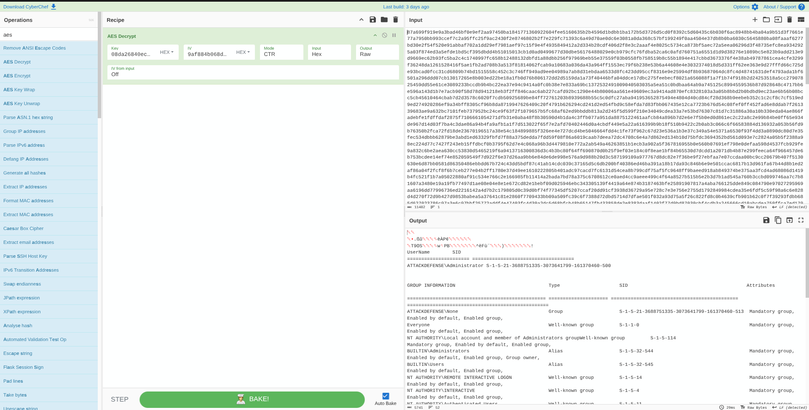

# INE Skill Dive — Advanced Threat Analysis

> **Platform:** INE Skill Dive\
> **Category:** Advanced Threat Analysis / Network Forensics\
> **Status:** ✅ Completed\
> **Focus:** Havoc C2 Traffic Analysis

---

## 🎯 Lab Objective

The objective of this lab is to analyze malicious network traffic from a PCAP file, identify indicators of compromise, determine the C2 framework being used, recover the cryptographic parameters, and decrypt encrypted C2 communications.

The lab covers:

- Network traffic analysis with Wireshark
- HTTP and C2 traffic investigation
- Malicious executable identification
- C2 beaconing detection
- Havoc C2 framework identification
- AES key and IV extraction
- AES-CTR decryption
- Analysis of decrypted command output
- Identification of attacker activity and access level

---

# 1. Open the PCAP in Wireshark

Access the Windows machine provided by the lab.

Start Wireshark and open:

```text
mal01.pcapng
```

The PCAP contains network traffic associated with a suspected compromised Windows host.

---

# 2. Investigate HTTP Traffic

Apply the following Wireshark filter:

```text
http
```

A suspicious HTTP GET request can be observed for:

```text
/checkmate.exe
```

The request originates from:

```text
10.0.0.156
```

and retrieves the executable from:

```text
10.0.0.155
```

Downloading an executable over HTTP is suspicious and requires further investigation.

Right-click the packet and select:

**Follow → HTTP Stream**

### Key Indicators

Several useful indicators can be identified from the HTTP stream.

### 1. PowerShell User-Agent

```text
WindowsPowerShell/5.1.17763.1432
```

This indicates that the executable download was performed through PowerShell.

### 2. Python SimpleHTTP Server

```text
SimpleHTTP/0.6 Python/3.12.8
```

The server is using Python's lightweight SimpleHTTP server.

### 3. Executable Content Type

```text
application/x-msdos-program
```

This confirms that the transferred object is a Windows executable.

### 4. Internal Communication

The communication occurs between:

```text
10.0.0.156
10.0.0.155
```

### 5. Non-standard HTTP Port

The server is listening on:

```text
8000
```

instead of the standard HTTP port 80.

---

# 3. Extract and Analyze `checkmate.exe`

In Wireshark, navigate to:

**File → Export Objects → HTTP**

Select:

```text
checkmate.exe
```

and save it to the Desktop.

Calculate the MD5 hash using PowerShell:

```powershell
cd Desktop
Get-FileHash -Algorithm MD5 checkmate.exe
```

Copy the resulting hash and search for it on VirusTotal.

The lab notes that the hash returned no results, suggesting that the executable may be previously unknown or custom-built.

---

# 4. Identify C2 Beaconing

After the executable download, several HTTP POST requests and `200 OK` responses can be observed between:

```text
10.0.0.156
10.0.0.155
```

Apply the following filter:

```text
http && ip.addr==10.0.0.155 && ip.addr==10.0.0.156
```

Then open:

**Statistics → I/O Graphs**

Configure the graph so that only the filtered traffic is displayed.

The traffic shows communication occurring approximately every:

```text
2 seconds
```

### What is Beaconing?

Beaconing is periodic communication from a compromised system to a C2 server.

A compromised host may repeatedly contact the C2 server to:

- Check for new commands
- Send information
- Maintain communication
- Receive further instructions

The regular 2-second communication pattern is therefore an important indicator of possible C2 activity.

---

# 5. Identify the C2 Framework

Examine the first POST request from the compromised host after the executable was downloaded and potentially executed.

The beginning of the relevant data contains:

```text
deadbeef
```

These magic bytes are associated with **Havoc C2**.

The framework can be confirmed by examining the `Defines.h` file in the Havoc C2 repository.

Reference:

```text
https://github.com/HavocFramework/Havoc/blob/main/payloads/Demon/include/common/Defines.h
```

Therefore, the C2 framework identified in this traffic is:

```text
Havoc C2
```

---

# 6. Extract the AES Key and IV

Havoc C2 encrypts its communication.

The AES key and IV can be recovered from the initial POST request.

Copy the packet bytes as a Hex Dump.

The relevant packet contains:

```text
de ad be ef
```

The extraction process is:

```text
Find deadbeef
      ↓
Skip 12 bytes
      ↓
Next 32 bytes = AES Key
      ↓
Next 16 bytes = AES IV
```

### Relevant Hex Data

The AES key bytes are:

```text
08 da 26 84 0e c4 d8 c2 3e 32 5e ea e6 ea e6 48
f6 5a 2c d0 48 50 6e 64 32 dc d2 c4 76 86 d6 8a
```

Removing the spaces gives:

```text
08da26840ec4d8c23e325eeae6eae648f65a2cd048506e6432dcd2c47686d68a
```

The following 16 bytes are the IV:

```text
9af884b068dc38d02ca6b2ca2c8e9682
```

### Recovered Cryptographic Parameters

```text
AES Key:
08da26840ec4d8c23e325eeae6eae648f65a2cd048506e6432dcd2c47686d68a

AES IV:
9af884b068dc38d02ca6b2ca2c8e9682

Mode:
CTR
```

> 

---

# 7. Identify the Encrypted Command Output

After the initial POST request, subsequent POST requests and responses have relatively fixed lengths.

After several exchanges, a sudden increase in the POST request size can be observed.

This can indicate that the C2 implant has returned the output of a command executed on the compromised system.

Double-click the relevant packet and expand:

**Hypertext Transfer Protocol**

Right-click:

**File Data → Copy → Value**

The copied value contains the encrypted C2 data.

---

# 8. Configure CyberChef

Open CyberChef:

```text
https://gchq.github.io/CyberChef/
```

Paste the copied File Data into the **Input** section.

Add:

```text
AES Decrypt
```

to the Recipe.

Configure the operation using the recovered values.

### Key

```text
08da26840ec4d8c23e325eeae6eae648f65a2cd048506e6432dcd2c47686d68a
```

### IV

```text
9af884b068dc38d02ca6b2ca2c8e9682
```

### Mode

```text
CTR
```

Havoc C2 uses AES in CTR mode for this communication.

The encryption mode can be confirmed by examining the `AesCrypt.h` file in the Havoc C2 repository.

Reference:

```text
https://github.com/HavocFramework/Havoc/blob/ea3646e055eb1612dcc956130fd632029dbf0b86/payloads/Demon/include/crypt/AesCrypt.h
```

---

# 9. Remove the C2 Header

Initially, the CyberChef output still appears as garbage.

This occurs because the input contains additional header data.

Remove exactly:

```text
20 bytes
```

from the beginning of the input.

Because one byte is represented by two hexadecimal characters, this corresponds to:

```text
40 hexadecimal characters
```

After removing the 20-byte header, the decrypted output becomes readable.

---

# 10. Analyze the Decrypted Output

The decrypted content contains the output of:

```text
whoami /all
```

The output identifies the user as:

```text
ATTACKDEFENSE\Administrator
```

with SID:

```text
S-1-5-21-3688751335-3073641799-161370460-500
```

The output also shows a high mandatory integrity level and enabled privileges including:

```text
SeImpersonatePrivilege
SeCreateGlobalPrivilege
```

This provides useful evidence about the security context of the compromised system.

---

# 🔎 Key Findings

| Finding | Result |
|---|---|
| Compromised Host | `10.0.0.156` |
| C2 / Server Host | `10.0.0.155` |
| Downloaded Executable | `checkmate.exe` |
| Server Port | `8000` |
| C2 Framework | `Havoc C2` |
| Magic Bytes | `deadbeef` |
| Beacon Interval | Approximately 2 seconds |
| Encryption | AES |
| AES Mode | CTR |
| AES Key | `08da26840ec4d8c23e325eeae6eae648f65a2cd048506e6432dcd2c47686d68a` |
| AES IV | `9af884b068dc38d02ca6b2ca2c8e9682` |
| Decrypted Command | `whoami /all` |
| Account | `ATTACKDEFENSE\Administrator` |

---

# 🧠 Key Lessons

## 1. HTTP Can Reveal C2 Activity

Even when the actual C2 payload is encrypted, HTTP metadata can reveal useful indicators such as:

- Source and destination IP addresses
- HTTP methods
- Requested resources
- User-Agent
- Server type
- Ports
- Request frequency
- Packet sizes

---

## 2. Beaconing Is an Important C2 Indicator

Regular communication at predictable intervals can indicate automated C2 beaconing.

In this lab, the traffic occurred approximately every:

```text
2 seconds
```

---

## 3. Magic Bytes Can Identify Frameworks

The presence of:

```text
deadbeef
```

provided a useful signature for identifying the traffic as **Havoc C2**.

---

## 4. Encrypted Traffic Can Still Contain Recoverable Evidence

The C2 traffic was encrypted, but the initial packet exposed the cryptographic parameters required for analysis.

The extraction process was:

```text
deadbeef
   ↓
Skip 12 bytes
   ↓
32 bytes → AES Key
   ↓
16 bytes → AES IV
```

---

## 5. Packet Analysis Can Reveal Attacker Activity

After recovering the encryption parameters and decrypting the C2 traffic, the analyst was able to identify:

```text
whoami /all
```

This provided information about the compromised account and its security context.

---

# 🏁 Conclusion

This lab demonstrated a complete network-forensics workflow for investigating malicious C2 traffic.

The investigation progressed from:

```text
HTTP Traffic
     ↓
Suspicious Executable
     ↓
C2 Beaconing
     ↓
Havoc C2 Identification
     ↓
AES Key + IV Extraction
     ↓
AES-CTR Decryption
     ↓
Command Output
     ↓
Compromised Account Analysis
```

The analysis showed how packet-level evidence can be used to identify C2 behavior, determine the framework involved, recover cryptographic parameters, and reveal attacker activity from encrypted communications.

---

# ⚡ Quick Command / Filter Reference

## Wireshark

```text
http
```

```text
http && ip.addr==10.0.0.155 && ip.addr==10.0.0.156
```

## PowerShell

```powershell
cd Desktop
Get-FileHash -Algorithm MD5 checkmate.exe
```

## CyberChef

```text
AES Decrypt
```

```text
Key  → 08da26840ec4d8c23e325eeae6eae648f65a2cd048506e6432dcd2c47686d68a
IV   → 9af884b068dc38d02ca6b2ca2c8e9682
Mode → CTR
```

Remove:

```text
20 bytes / 40 hexadecimal characters
```

from the beginning of the encrypted input.

---

## References

- Havoc C2:
  `https://github.com/HavocFramework/Havoc`

- Havoc `Defines.h`:
  `https://github.com/HavocFramework/Havoc/blob/main/payloads/Demon/include/common/Defines.h`

- Havoc `AesCrypt.h`:
  `https://github.com/HavocFramework/Havoc/blob/ea3646e055eb1612dcc956130fd632029dbf0b86/payloads/Demon/include/crypt/AesCrypt.h`

- CyberChef:
  `https://gchq.github.io/CyberChef/`
