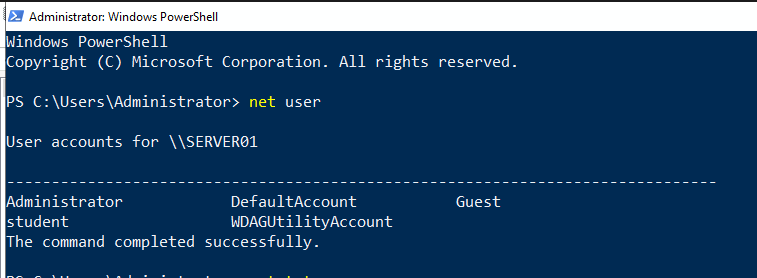
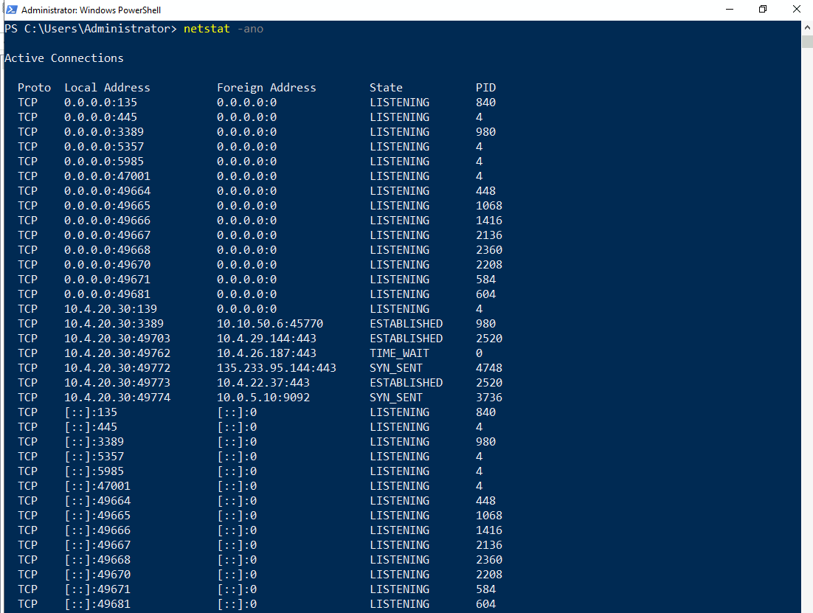
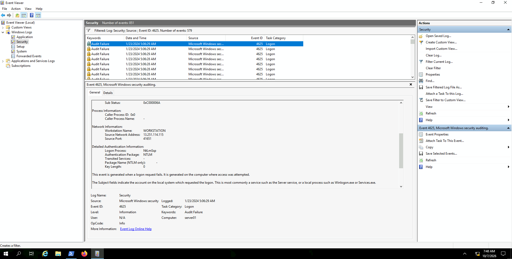
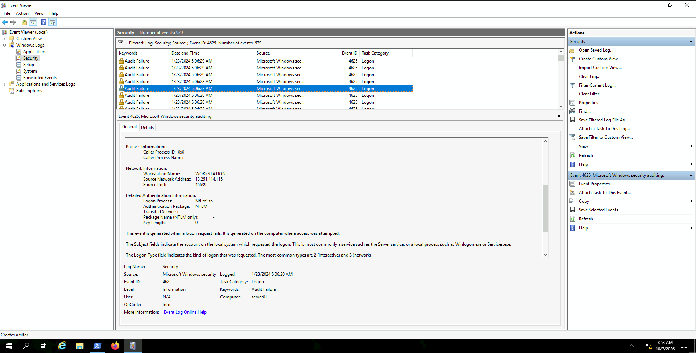
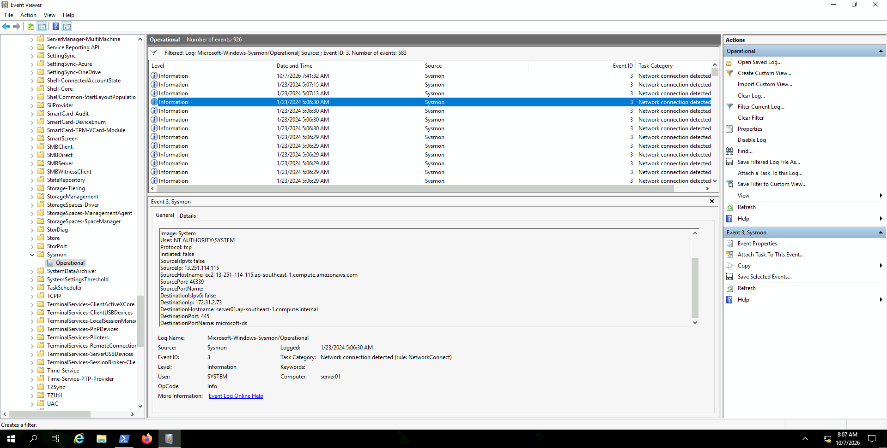
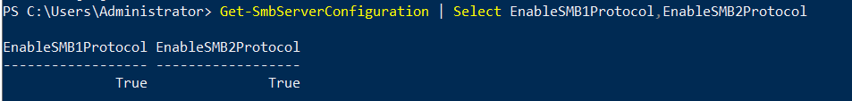
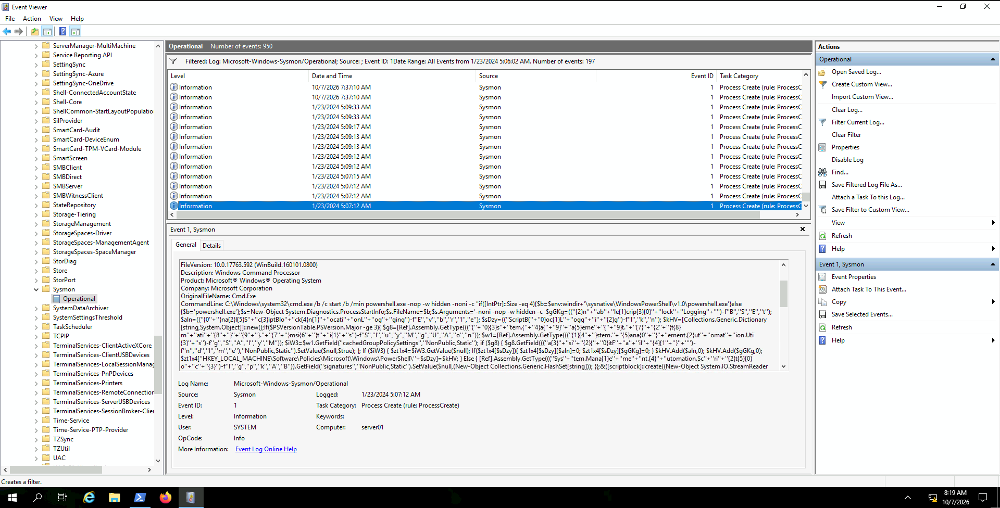
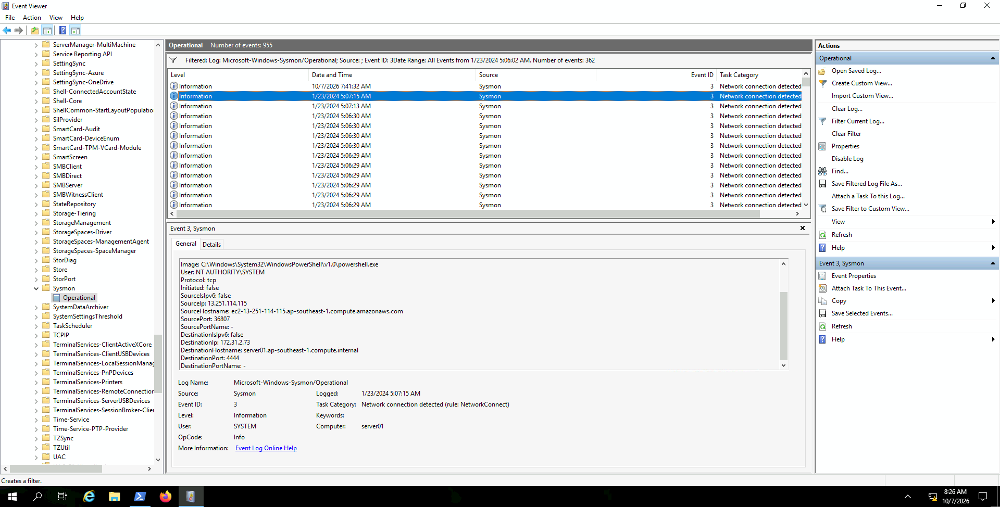

# Detecting Incidents in Internet-Facing Environments

> **INE Lab Walkthrough — Windows Incident Response**

## 🎯 Objective

Investigate suspicious activity on an internet-facing Windows machine and determine:

- The source of the attack
- Whether an account was compromised
- Which Windows service was targeted
- What malicious activity occurred after compromise
- Whether the attacker established a reverse shell

---

## 🧪 Lab Environment

The investigation is performed on a Windows GUI machine using:

- **Windows Event Viewer**
- **Sysmon**
- **PowerShell**
- **Command Prompt**

### Investigation Flow

```text
Failed Logins
     ↓
Successful Administrator Login
     ↓
SMB Activity
     ↓
Obfuscated PowerShell
     ↓
Suspicious Service Activity
     ↓
Network Connection / Port 4444
     ↓
Possible Reverse Shell
```

---

# 1. Identify Windows Users

First, identify the user accounts configured on the system.

### Command

```cmd
net user
```

### Result

The machine contains five user accounts:

```text
Administrator
DefaultAccount
Guest
student
WDAGUtilityAccount
```

### Evidence



---

# 2. Check Active Network Connections

Next, check the network services and connections exposed by the Windows system.

### Command

```cmd
netstat -ano
```

### Important Ports

| Port | Service | Description |
|---:|---|---|
| 135 | RPC | Windows Remote Procedure Call |
| 445 | SMB | Server Message Block |
| 3389 | RDP | Remote Desktop Protocol |
| 5985 | WinRM | Windows Remote Management over HTTP |

Port **445** is particularly important because SMB is involved in the subsequent investigation.

### Evidence



---

# 3. Investigate Failed Logins

Open:

```text
Event Viewer
└── Windows Logs
    └── Security
```

Filter the Security log for:

```text
Event ID: 4625
```

## What is Event ID 4625?

**Windows Security Event ID 4625** indicates a failed logon attempt.

The investigation shows a very large number of failed authentication attempts.

The events reveal the following source IP:

```text
13.251.114.115
```

The screenshot shows repeated failed authentication attempts originating from this address.

### Evidence



### Finding

A high volume of failed authentication attempts from the same external IP is consistent with **brute-force or password-guessing activity**.

---

# 4. Confirm Successful Authentication

Failed authentication alone does not prove that the attacker gained access.

Next, investigate successful logons.

Filter the Security log for:

```text
Event ID: 4624
```

## What is Event ID 4624?

**Windows Security Event ID 4624** indicates a successful logon.

The investigation shows successful authentication associated with the attacker IP:

```text
13.251.114.115
```

The compromised account is:

```text
Administrator
```

### Evidence



### Finding

The combination of:

```text
4625 → repeated failed logins
4624 → successful Administrator login
```

provides strong evidence that the attacker obtained valid credentials for the Administrator account.

---

# 5. Investigate SMB Network Activity with Sysmon

Open:

```text
Event Viewer
└── Applications and Services Logs
    └── Microsoft
        └── Windows
            └── Sysmon
                └── Operational
```

Filter for:

```text
Event ID: 3
```

## What is Sysmon Event ID 3?

**Sysmon Event ID 3** records network connections.

A relevant event shows:

```text
Source IP:       13.251.114.115
Destination IP:  172.31.2.73
Destination Port: 445
Destination Name: microsoft-ds
```

Port **445** is associated with SMB.

### Evidence



### Finding

The attacker IP established a network connection to the Windows machine over TCP/445, providing evidence of SMB-related activity.

---

# 6. Check SMB Protocol Configuration

Use PowerShell to determine which SMB versions are enabled.

### Command

```powershell
Get-SmbServerConfiguration | Select EnableSMB1Protocol,EnableSMB2Protocol
```

### Result

```text
EnableSMB1Protocol    True
EnableSMB2Protocol    True
```

### Evidence



### Finding

Both SMBv1 and SMBv2 are enabled.

SMBv1 is an obsolete protocol and is generally discouraged in modern environments because of its security weaknesses. Its presence increases the attack surface of the system.

> **Note:** SMB being enabled is not itself evidence of compromise. It becomes relevant here because the attack investigation shows activity against TCP/445.

---

# 7. Investigate Process Creation

Return to:

```text
Sysmon
└── Operational
```

Filter for:

```text
Event ID: 1
```

## What is Sysmon Event ID 1?

**Sysmon Event ID 1** records process creation.

The investigation reveals:

```text
powershell.exe
```

being executed with a long, obfuscated command line.

### Evidence



### Why is this suspicious?

PowerShell is a legitimate Windows administration tool, but attackers commonly abuse it for:

- Command execution
- Payload execution
- Downloading tools
- Persistence
- Remote access
- Command-and-control activity

In this investigation, the PowerShell execution occurs immediately after the successful Administrator authentication, making it particularly suspicious.

---

# 8. Establish the Attack Timeline

The successful Administrator authentication occurs at approximately:

```text
01/23/2024 05:07:11 AM
```

The suspicious PowerShell process appears around:

```text
01/23/2024 05:07:12 AM
```

This creates an important timeline:

```text
05:06+
   ↓
Repeated failed authentication attempts
   ↓
SMB activity over TCP/445
   ↓
05:07:11
   ↓
Successful Administrator authentication
   ↓
05:07:12
   ↓
Obfuscated PowerShell execution
```

The close timing between the successful login and PowerShell execution strongly supports the hypothesis that the attacker performed actions immediately after obtaining valid credentials.

---

# 9. Investigate Suspicious Service Activity

After identifying the PowerShell execution, continue investigating events around the compromise timestamp.

Look for:

- Registry modifications
- Service creation
- Process creation
- `services.exe`
- `cmd.exe`
- Unusual service names

The investigation identifies suspicious service-related activity involving:

```text
DnpNkcjh
```

Further Windows System log investigation identifies a service named:

```text
hfoEZgSkTTSgOQXv
```

These unusual service names are strong indicators of suspicious service-based execution.

> **Important:** A suspicious service name alone does not identify the exact tool used. It must be correlated with process, registry, and network events.

---

# 10. Investigate Port 4444

Return to Sysmon Event ID 3 and investigate network connections after the successful Administrator login.

A relevant event shows:

```text
Image:            powershell.exe
Source IP:        13.251.114.115
Destination Port: 4444
```

### Evidence



### Finding

A PowerShell-associated network connection involving TCP/4444 was observed after the account compromise.

Port **4444** is commonly used in penetration-testing and reverse-shell scenarios. However, the port number alone does not prove the use of a specific tool.

When correlated with:

- Compromised Administrator credentials
- Obfuscated PowerShell
- Suspicious service activity
- Network activity on TCP/4444

the evidence is consistent with the establishment of a **reverse-shell / command-and-control connection**.

---

# 11. Attack Timeline

The complete investigation can be summarized as:

```text
                    ATTACKER
                13.251.114.115
                       │
                       ▼
             Repeated failed logins
                 Event ID 4625
                       │
                       ▼
            Successful Administrator
                 Event ID 4624
                       │
                       ▼
                SMB connection
                  TCP/445
                       │
                       ▼
             Obfuscated PowerShell
                Sysmon Event 1
                       │
                       ▼
             Suspicious service
             DnpNkcjh / hfoEZgSkTTSgOQXv
                       │
                       ▼
             Network connection
                  TCP/4444
                       │
                       ▼
             Possible reverse shell
```

---

# 12. Indicators of Compromise

| Indicator | Finding |
|---|---|
| Attacker IP | `13.251.114.115` |
| Failed login | Windows Event `4625` |
| Successful login | Windows Event `4624` |
| Compromised account | `Administrator` |
| SMB | TCP `445` |
| SMBv1 | Enabled |
| Process creation | Sysmon Event `1` |
| Suspicious process | `powershell.exe` |
| PowerShell activity | Obfuscated command |
| Suspicious registry/service activity | `DnpNkcjh` |
| Suspicious service | `hfoEZgSkTTSgOQXv` |
| Network connection | Sysmon Event `3` |
| Suspicious destination port | TCP `4444` |

---

# 13. Key SOC Concepts Learned

## Windows Security Events

```text
4625 → Failed Logon
4624 → Successful Logon
```

## Sysmon Events

```text
1  → Process Creation
3  → Network Connection
11 → File Creation
12 → Registry Object Created/Deleted
13 → Registry Value Set
22 → DNS Query
```

The most important events for this investigation were:

```text
4625 → Who was trying to log in?
4624 → Did the attacker succeed?
Sysmon 1 → What did they execute?
Sysmon 3 → Where did the system communicate?
```

---

# 14. Conclusion

The investigation identified a security compromise originating from:

```text
13.251.114.115
```

The attacker generated a large number of failed authentication attempts before successfully authenticating to the **Administrator** account.

The investigation then identified SMB activity over TCP/445, followed by the execution of an obfuscated PowerShell command. Suspicious service activity was subsequently identified, followed by a network connection involving TCP/4444.

The combined evidence is consistent with the following attack chain:

```text
Credential Brute Force
        ↓
Administrator Account Compromise
        ↓
SMB-Based Activity
        ↓
PowerShell Execution
        ↓
Service-Based Execution
        ↓
Reverse Shell / C2 Activity
```

The evidence is also consistent with **PsExec-style service execution**, potentially involving tools such as Metasploit or Impacket. However, the exact tool cannot be conclusively identified from these events alone.

---

# 🧠 Quick Takeaway

The most important lesson from this lab is **event correlation**.

A SOC analyst should not investigate each event in isolation.

Instead:

```text
4625
Failed login
    ↓
4624
Successful login
    ↓
Sysmon 1
Process executed
    ↓
Sysmon 3
Network connection
    ↓
System/Registry logs
Service created
    ↓
Build the attack timeline
```

That's how individual Windows logs become a complete incident story.

---

## 📚 References

- Windows Security Event ID `4624` — Successful Logon
- Windows Security Event ID `4625` — Failed Logon
- Sysmon Event ID `1` — Process Creation
- Sysmon Event ID `3` — Network Connection
- Microsoft SMB / Windows networking documentation
- PsExec-style remote service execution techniques
