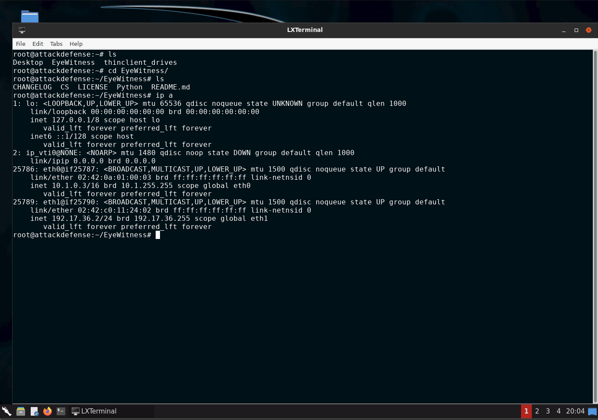
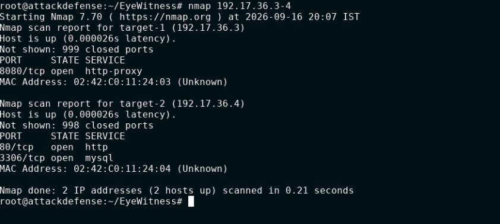
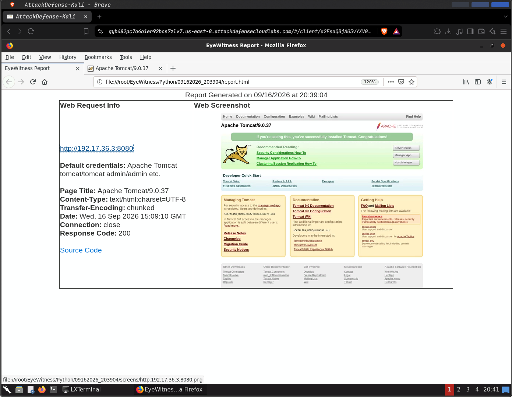
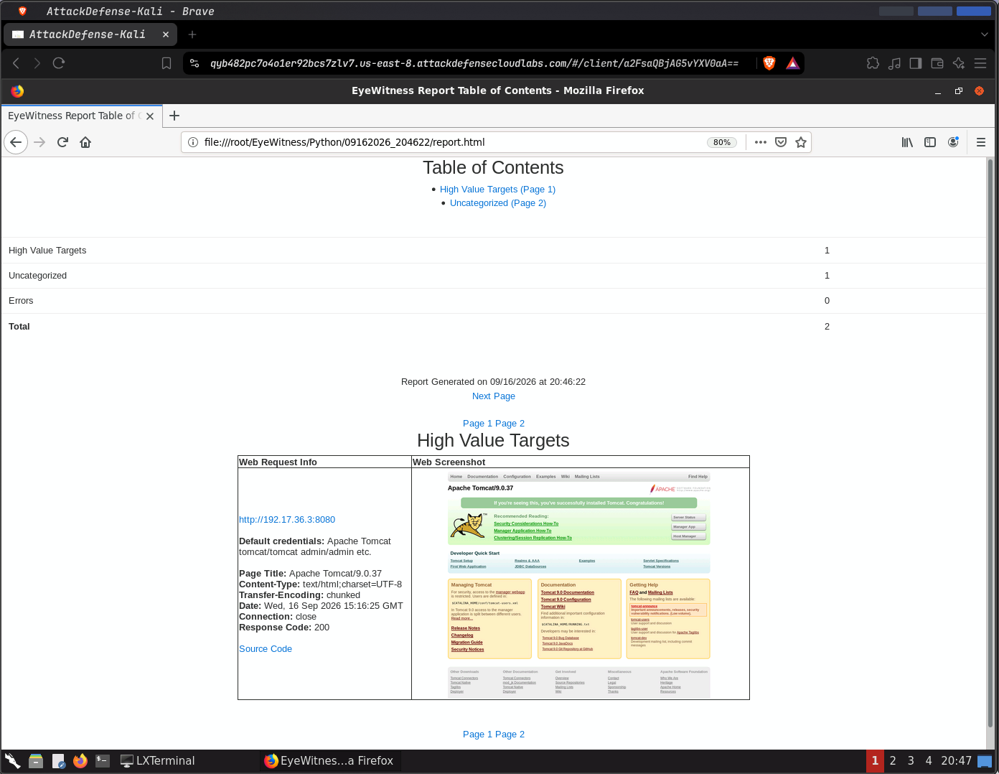
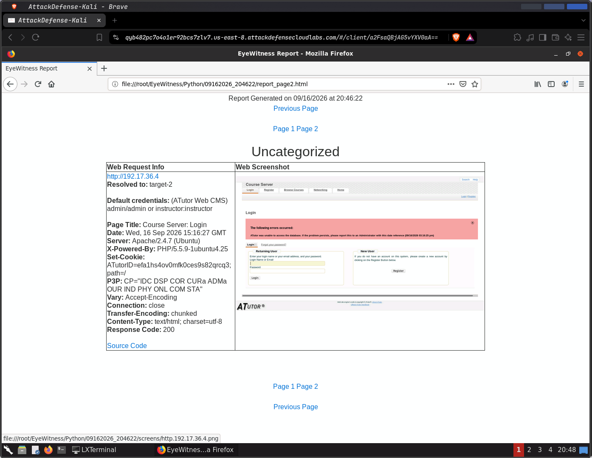
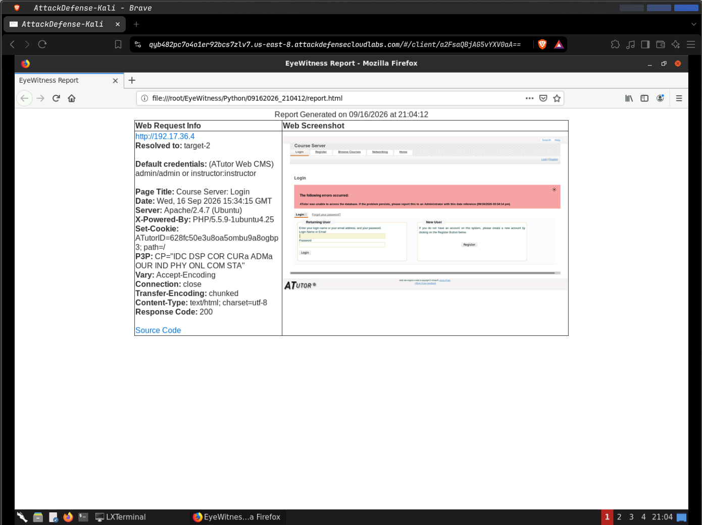
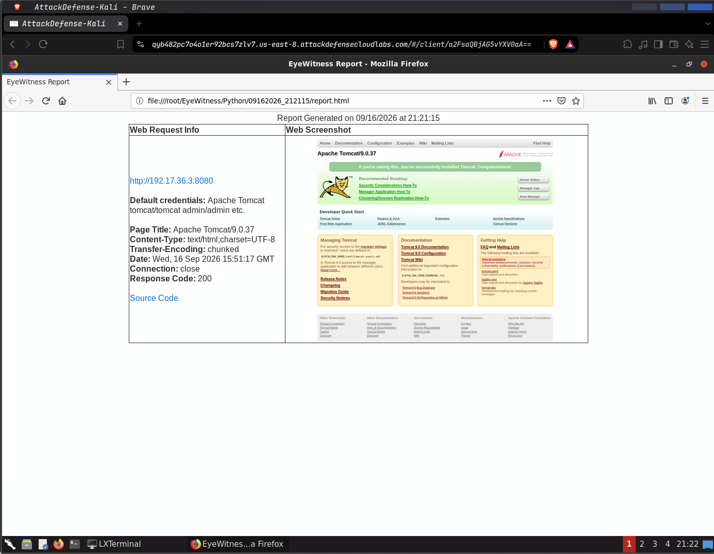

# 🔎 INE Skill Dive --- Intro to EyeWitness

> **Lab:** Intro to EyeWitness\
> **Platform:** INE Skill Dive / AttackDefense\
> **Category:** Network Pentesting --- Reconnaissance\
> **Estimated Time:** 30 minutes\
> **Focus:** Web reconnaissance, screenshot-based enumeration,
> application fingerprinting, HTTP information, hostname resolution, and
> EyeWitness automation.

------------------------------------------------------------------------

## 📌 Lab Overview

This lab introduces **EyeWitness**, a reconnaissance tool that can
analyze web applications and generate useful visual and textual
evidence.

The main objective is to use EyeWitness to determine more information
about web applications running on the lab targets.

### What we will learn

By the end of the lab, we will understand how to:

-   Identify the Kali machine's IP address
-   Discover target services with Nmap
-   Scan a single web application with EyeWitness
-   Scan multiple web applications from a URL list
-   Handle slow web applications with timeouts and retries
-   Save EyeWitness results to a custom directory
-   Resolve IP addresses to hostnames
-   Use Nmap XML output as EyeWitness input
-   Change the HTTP User-Agent
-   Run EyeWitness without interactive prompts
-   Add request jitter
-   Understand EyeWitness application signatures
-   Understand how signatures can identify applications such as ATutor

> ⚠️ **Lab scope:** Perform the activity only against the targets
> provided by the authorized INE/AttackDefense lab. The lab instructions
> explicitly identify the gateway separately and state not to attack it.

------------------------------------------------------------------------

# 🗺️ Lab Network

The lab instructions use the following pattern:

``` text
Kali     → 192.X.Y.2
Gateway  → 192.X.Y.1
Target 1 → 192.X.Y.3
Target 2 → 192.X.Y.4
```

In this lab instance, the actual values were:

``` text
Kali     → 192.17.36.2
Gateway  → 192.17.36.1
Target 1 → 192.17.36.3
Target 2 → 192.17.36.4
```

The gateway was **not** included in the target scan.

------------------------------------------------------------------------

# 1. 🖥️ Identify the Kali IP Address

Before scanning anything, first determine which network interface is
connected to the lab network.

### Command

``` bash
ip a
```

### What the command does

`ip a` is short for:

``` bash
ip address
```

It displays:

-   Network interfaces
-   Interface state
-   MAC addresses
-   IPv4 addresses
-   IPv6 addresses
-   Network prefixes

### Our result

The important interface was `eth1`:

``` text
eth1
inet 192.17.36.2/24
```

Therefore:

``` text
Kali IP = 192.17.36.2
```

From the lab's addressing pattern, this gives us:

``` text
X = 17
Y = 36
```

So the target addresses become:

``` text
192.17.36.3
192.17.36.4
```



------------------------------------------------------------------------

# 2. 🔍 Discover Open Services with Nmap

Now that we know the target IP addresses, perform an initial service
discovery scan.

### Command

``` bash
nmap 192.17.36.3-4
```

### Breaking down the command

``` text
nmap
  ↓
Nmap scanner

192.17.36.3-4
  ↓
Scan both 192.17.36.3 and 192.17.36.4
```

### Results

The scan discovered:

  Target                  Port State   Service
  --------------- ------------ ------- --------------
  `192.17.36.3`     `8080/tcp` open    `http-proxy`
  `192.17.36.4`       `80/tcp` open    `http`
  `192.17.36.4`     `3306/tcp` open    `mysql`

### What this tells us

We now have two web services to investigate:

``` text
192.17.36.3:8080
192.17.36.4:80
```

Target 2 also exposes:

``` text
192.17.36.4:3306
```

which Nmap identifies as MySQL.

The initial scan is reconnaissance: we are determining **what services
are exposed before investigating the applications behind them**.



------------------------------------------------------------------------

# 3. 👁️ Start EyeWitness

The EyeWitness installation is available under:

``` bash
~/EyeWitness/
```

Move into the Python directory:

``` bash
cd ~/EyeWitness/Python/
```

Check the directory if needed:

``` bash
ls
```

The lab walkthrough uses `EyeWitness.py` from this directory.

------------------------------------------------------------------------

# 4. 🎯 Scan a Single Web Target

Nmap showed that Target 1 has a web service on port `8080`.

### Command

``` bash
./EyeWitness.py --single 192.17.36.3:8080
```

### What does `--single` mean?

It tells EyeWitness that we want to analyze **one target**.

The target includes the port because the web service is running on
`8080` rather than the default HTTP port `80`.

``` text
Target:
192.17.36.3:8080
```

### EyeWitness result

EyeWitness successfully accessed the application and generated a report.

The application was identified as:

``` text
Apache Tomcat/9.0.37
```

The report showed:

``` text
Response Code: 200
```

and displayed information associated with the Apache Tomcat signature,
including reported default credentials.

### Important interpretation

EyeWitness reporting credentials does **not automatically prove that
those credentials work**.

Treat signature-derived credentials as reconnaissance information that
would require authorized validation.

### What did EyeWitness give us?

Instead of only knowing:

``` text
192.17.36.3:8080 → open
```

we now know:

``` text
192.17.36.3:8080
        ↓
Apache Tomcat/9.0.37
        ↓
HTTP response information
        ↓
Screenshot
        ↓
Signature-based identification
```



------------------------------------------------------------------------

# 5. 📋 Scan Multiple Web Applications

Instead of scanning each web application individually, EyeWitness can
read targets from a file.

Create:

``` bash
nano urls.txt
```

Add:

``` text
192.17.36.3:8080
192.17.36.4
```

Save the file and verify it:

``` bash
cat urls.txt
```

### Why use a URL list?

It lets us provide multiple web targets to EyeWitness at once.

``` text
urls.txt
   │
   ├── 192.17.36.3:8080
   │
   └── 192.17.36.4
             ↓
        EyeWitness
```

### Command

``` bash
./EyeWitness.py -f urls.txt --web
```

### Option explanation

``` text
-f urls.txt
    ↓
Read targets from urls.txt

--web
    ↓
Analyze web applications
```



------------------------------------------------------------------------

# 6. 📊 Examine the Multi-Target Report

EyeWitness generated a report containing information for both targets.

The report showed:

``` text
Total → 2
Errors → 0
```

### Target 1

``` text
http://192.17.36.3:8080
Apache Tomcat/9.0.37
Response Code: 200
```

### Target 2

``` text
http://192.17.36.4
ATutor Web CMS
Page Title: Course Server: Login
```

The Target 2 report also exposed HTTP information such as:

``` text
Server: Apache/2.4.7 (Ubuntu)
X-Powered-By: PHP/5.5.9-1ubuntu4.25
Response Code: 200
```

EyeWitness also reported credentials associated with the ATutor
signature.

Again, these should be treated as **signature-based reconnaissance
findings**, not automatically verified credentials.



------------------------------------------------------------------------

# 7. ⏱️ Handling Slow Web Targets

A web target may respond slowly enough that EyeWitness reaches its
timeout before completing the screenshot.

EyeWitness provides timeout and retry controls for this situation.

### Command

``` bash
./EyeWitness.py -f urls.txt --web --timeout 45 --max-retries 1
```

### Options

``` text
--timeout 45
    ↓
Allow up to 45 seconds for the operation

--max-retries 1
    ↓
Limit retries to one
```

### Why this matters

A timeout does not necessarily mean:

``` text
Target = offline
```

It can also mean:

``` text
Target
  ↓
Responds slowly
  ↓
EyeWitness reaches its timeout
  ↓
Screenshot fails
```

Increasing the timeout gives the target more time to respond.

### Result

Our scan completed successfully:

``` text
Errors → 0
Total  → 2
```


------------------------------------------------------------------------

# 8. 📁 Save Results to a Custom Directory

By default, EyeWitness creates its output in its normal report location.

We can specify a custom output directory with `-d`.

### Create the directory

``` bash
mkdir -p /tmp/ew-out
```

### Run EyeWitness

``` bash
./EyeWitness.py -f urls.txt --web --timeout 45 --max-retries 1 -d /tmp/ew-out
```

### Check the output

``` bash
ls -lah /tmp/ew-out
```

### Open the generated report

``` bash
firefox /tmp/ew-out/report.html
```

### Important distinction

The `-d` option changes **only the output location**.

It does not change:

``` text
Targets
Scanning mode
Timeout
Retry behavior
```

Conceptually:

``` text
EyeWitness
    │
    ├── scan configuration
    │
    └── -d /tmp/ew-out
               ↓
        Save results here
```

------------------------------------------------------------------------

# 9. 🌐 Resolve an IP Address to a Hostname

EyeWitness can also attempt to resolve an IP address to a hostname.

### Command

``` bash
./EyeWitness.py --resolve --single 192.17.36.4 --timeout 3
```

### Options

``` text
--resolve
    ↓
Attempt hostname resolution

--single
    ↓
Analyze one target

--timeout 3
    ↓
Use a 3-second timeout
```

### Result

The target resolved to:

``` text
192.17.36.4 → target-2
```

### Why is this useful?

An IP address tells us **where** the host is.

A hostname can provide additional context for reporting:

``` text
192.17.36.4
     ↓
target-2
```

This becomes especially useful when many systems are being investigated.



------------------------------------------------------------------------

# 10. 📦 Generate Nmap XML Output

EyeWitness can use Nmap's XML output as an input source.

Instead of manually entering every web target, Nmap can save scan
information in XML.

### Command

``` bash
nmap --top-ports 20 192.17.36.0/28 -oX out.xml
```

### Breaking it down

``` text
--top-ports 20
    ↓
Scan the top 20 common ports

192.17.36.0/28
    ↓
Scan the lab subnet used in the exercise

-oX out.xml
    ↓
Save the Nmap results as XML
```

The resulting file is:

``` text
out.xml
```

### Inspect it

``` bash
vim out.xml
```

or:

``` bash
cat out.xml
```

The important idea is that XML provides a structured format that another
tool can consume.

------------------------------------------------------------------------

# 11. 🔗 Nmap XML → EyeWitness

Now pass the Nmap XML directly to EyeWitness.

### Command

``` bash
./EyeWitness.py -x out.xml --web
```

### What does `-x` do?

It tells EyeWitness to use the Nmap XML file as its input.

The workflow becomes:

``` text
Nmap
  │
  │ Discover hosts/services
  ▼
out.xml
  │
  │ Structured scan results
  ▼
EyeWitness
  │
  ├── Web screenshots
  ├── HTTP information
  └── Application identification
```

### Why is this useful?

This demonstrates **tool chaining**.

Instead of:

``` text
Run Nmap
    ↓
Read results manually
    ↓
Create URL list
    ↓
Run EyeWitness
```

we can work toward:

``` text
Nmap
 ↓
XML
 ↓
EyeWitness
```

This approach becomes increasingly useful when reconnaissance contains
many hosts and services.

------------------------------------------------------------------------

# 12. 🪪 Customize the HTTP User-Agent

EyeWitness can send requests using a specified User-Agent.

### Command

``` bash
./EyeWitness.py --single 192.17.36.3:8080 --user-agent "Mozilla/4.0"
```

### What is a User-Agent?

A web request can contain a header such as:

``` text
User-Agent: Mozilla/4.0
```

The User-Agent describes the client making the HTTP request.

EyeWitness allows us to customize this value when performing authorized
analysis.

### Concept

``` text
EyeWitness
     │
     │ HTTP request
     │ User-Agent: Mozilla/4.0
     ▼
192.17.36.3:8080
```

The screenshot/report still identified:

``` text
Apache Tomcat/9.0.37
Response Code: 200
```



------------------------------------------------------------------------

# 13. 🤖 Run EyeWitness Without Interactive Prompts

EyeWitness can normally ask whether the generated report should be
opened.

For automation, interactive prompts are inconvenient.

### Command

``` bash
./EyeWitness.py --single 192.17.36.3:8080 -d /tmp/ew-out --no-prompt
```

### What does `--no-prompt` do?

It prevents the interactive report-opening prompt.

Conceptually:

``` text
Normal:
Scan
 ↓
Generate report
 ↓
Ask user
 ↓
Continue


--no-prompt:
Scan
 ↓
Generate report
 ↓
Continue automatically
```

### Why is this useful?

Automation scripts should ideally not stop and wait for a human to press
a key.

For example:

``` text
Recon script
     ↓
Nmap
     ↓
EyeWitness
     ↓
Generate report
     ↓
Continue to next task
```

------------------------------------------------------------------------

# 14. ⏳ Add Request Jitter

EyeWitness can introduce randomized delays between requests.

### Command

``` bash
./EyeWitness.py -f urls.txt --web --timeout 45 --jitter 10
```

### What is jitter?

Jitter introduces variation into request timing.

Conceptually:

``` text
Request 1
    ↓
Variable delay
    ↓
Request 2
    ↓
Variable delay
    ↓
Request 3
```

The purpose of this lab step is to understand the option and how request
timing can be controlled during authorized reconnaissance.

------------------------------------------------------------------------

# 15. 🧬 EyeWitness Signatures

This is one of the most important concepts in the lab.

EyeWitness uses a collection of **signatures** to recognize web
applications.

The signatures are stored in:

``` text
signatures.txt
```

### Inspect the file

``` bash
ls
```

Then:

``` bash
vim signatures.txt
```

### What is a signature?

A signature is a set of characteristics that can identify a particular
web application.

A simplified example:

``` text
Application
     ↓
Expected strings / patterns
     ↓
Check target response
     ↓
Patterns match
     ↓
Application identified
```

This explains why EyeWitness was able to identify:

``` text
Apache Tomcat
ATutor
```

instead of giving us only a screenshot.

------------------------------------------------------------------------

# 16. 🧪 Understanding the ATutor Signature

The walkthrough demonstrates the ATutor signature.

The signature checks for these strings:

``` text
ATutor
form_login_action
/search.php
```

EyeWitness checks the target page/source for these indicators.

If the required strings match:

``` text
ATutor
   +
form_login_action
   +
/search.php
   ↓
ATutor signature matched
   ↓
Application detected
```

EyeWitness can then display information associated with that signature,
including reported default credentials.

### Why this matters

This is an example of **application fingerprinting**.

You can think of it as:

``` text
Web page
   ↓
Unique characteristics
   ↓
Signature matching
   ↓
Application fingerprint
```

------------------------------------------------------------------------

# 17. 🔬 What We Discovered

## Target 1

``` text
IP:
192.17.36.3

Port:
8080/tcp

Application:
Apache Tomcat/9.0.37

HTTP:
200 OK
```

EyeWitness also reported credentials associated with its Tomcat
signature.

------------------------------------------------------------------------

## Target 2

``` text
IP:
192.17.36.4

Hostname:
target-2

Ports:
80/tcp
3306/tcp

Web Application:
ATutor Web CMS

Page:
Course Server: Login

Web Server:
Apache/2.4.7 (Ubuntu)

Technology:
PHP/5.5.9-1ubuntu4.25

HTTP:
200 OK
```

EyeWitness reported credentials associated with the ATutor signature.

------------------------------------------------------------------------

# 18. 🧠 The Complete Recon Workflow

The entire lab can be understood as a chain:

``` text
                ┌─────────────┐
                │    ip a     │
                │ Find our IP │
                └──────┬──────┘
                       ↓
                ┌─────────────┐
                │    Nmap     │
                │ Find ports  │
                └──────┬──────┘
                       ↓
              ┌─────────────────┐
              │  Web Services   │
              │ 80 / 8080       │
              └────────┬────────┘
                       ↓
                ┌─────────────┐
                │ EyeWitness  │
                │ Web analysis│
                └──────┬──────┘
                       ↓
             ┌──────────────────┐
             │ Screenshots +    │
             │ HTTP information │
             └────────┬─────────┘
                      ↓
             ┌──────────────────┐
             │   Signatures     │
             │ Application ID   │
             └────────┬─────────┘
                      ↓
             ┌──────────────────┐
             │ Recon Evidence   │
             │ + Documentation  │
             └──────────────────┘
```

------------------------------------------------------------------------

# 19. 🛡️ SOC Analyst Perspective

EyeWitness is primarily a reconnaissance tool, but the information it
produces can also be valuable from a defensive perspective.

A SOC analyst can reason about the result as:

``` text
Asset
  ↓
Exposed service
  ↓
Application
  ↓
Technology/version
  ↓
Configuration clues
  ↓
Evidence
  ↓
Investigation
  ↓
Remediation
```

For example:

``` text
192.17.36.3
     ↓
8080/tcp
     ↓
Apache Tomcat/9.0.37
     ↓
Default Tomcat page exposed
     ↓
Potential configuration concern
     ↓
Investigate and harden
```

The important transferable skill is not memorizing EyeWitness syntax.

It is learning how to connect:

> **Asset → Service → Application → Evidence → Security Implication**

------------------------------------------------------------------------

# 20. 🧰 EyeWitness Command Cheat Sheet

  Task                      Command
  ------------------------- ---------------------------------------------
  Find local IP             `ip a`
  Scan targets              `nmap 192.17.36.3-4`
  Scan one web target       `./EyeWitness.py --single 192.17.36.3:8080`
  Scan URL list             `./EyeWitness.py -f urls.txt --web`
  Increase timeout          `--timeout 45`
  Limit retries             `--max-retries 1`
  Custom output directory   `-d /tmp/ew-out`
  Resolve hostname          `--resolve`
  Generate Nmap XML         `nmap ... -oX out.xml`
  Use Nmap XML              `./EyeWitness.py -x out.xml --web`
  Change User-Agent         `--user-agent "Mozilla/4.0"`
  Disable prompts           `--no-prompt`
  Add jitter                `--jitter 10`
  Inspect signatures        `vim signatures.txt`
  Open report               `firefox /tmp/ew-out/report.html`

------------------------------------------------------------------------

# 21. ✅ Lab Completion Checklist

-   [x] Identified Kali's IP address
-   [x] Identified the lab target addresses
-   [x] Performed Nmap service discovery
-   [x] Identified HTTP services
-   [x] Identified the MySQL service on Target 2
-   [x] Scanned Target 1 with EyeWitness
-   [x] Identified Apache Tomcat
-   [x] Created a URL list
-   [x] Scanned multiple targets with EyeWitness
-   [x] Identified ATutor
-   [x] Reviewed HTTP response information
-   [x] Tested timeout handling
-   [x] Controlled retry behavior
-   [x] Used a custom output directory
-   [x] Resolved `192.17.36.4` to `target-2`
-   [x] Generated Nmap XML output
-   [x] Passed Nmap XML to EyeWitness
-   [x] Used a custom User-Agent
-   [x] Used `--no-prompt`
-   [x] Used request jitter
-   [x] Inspected EyeWitness signatures
-   [x] Understood the ATutor signature mechanism
-   [x] Connected reconnaissance findings to SOC/security analysis

------------------------------------------------------------------------

# 22. 📝 Key Takeaways

### 1. Nmap finds the attack surface

``` text
IP → Ports → Services
```

### 2. EyeWitness adds application-level information

``` text
Web service → Screenshot → HTTP information → Application
```

### 3. Signatures enable application fingerprinting

``` text
Response characteristics → Signature match → Application identification
```

### 4. Tool chaining makes reconnaissance more efficient

``` text
Nmap → XML → EyeWitness
```

### 5. Reconnaissance produces evidence

A useful reconnaissance result is more than:

``` text
Port 8080 is open.
```

A richer result is:

``` text
192.17.36.3:8080
        ↓
Apache Tomcat/9.0.37
        ↓
HTTP 200
        ↓
Screenshot captured
        ↓
Application signature matched
        ↓
Potential configuration information identified
```

------------------------------------------------------------------------

# 🎓 Final Lab Summary

The **Intro to EyeWitness** lab demonstrated how web reconnaissance can
progress from basic network discovery to application-level
identification.

We started with:

``` text
ip a
```

to understand our lab network.

Then:

``` text
Nmap
```

identified the exposed services.

After discovering web services, we used:

``` text
EyeWitness
```

to capture screenshots and collect HTTP information.

EyeWitness identified:

``` text
Apache Tomcat/9.0.37
ATutor Web CMS
```

We then explored practical EyeWitness features such as:

``` text
Timeouts
Retries
Custom output directories
Hostname resolution
Nmap XML input
User-Agent customization
--no-prompt
Jitter
Signatures
```

The most important concept from the lab is the overall workflow:

``` text
        DISCOVER
           ↓
        ENUMERATE
           ↓
         IDENTIFY
           ↓
         CAPTURE
           ↓
        CORRELATE
           ↓
        DOCUMENT
```

That workflow is useful far beyond this individual tool.

------------------------------------------------------------------------

## 📚 References

-   EyeWitness project: https://github.com/FortyNorthSecurity/EyeWitness
-   EyeWitness Usage Guide:
    https://www.christophertruncer.com/eyewitness-usage-guide/

------------------------------------------------------------------------

## 🏁 Lab Status

**Completed ✅**

**Main skill gained:** Web reconnaissance and application fingerprinting
with EyeWitness.

**Primary tools:** Nmap + EyeWitness

**Key applications identified:** Apache Tomcat 9.0.37 + ATutor Web CMS
