# Introduction to Wazuh — INE Skill Dive Lab Walkthrough

**Category:** Cybersecurity / SOC  
**Difficulty:** Novice  
**Estimated time:** 30 minutes  
**Platform:** INE Skill Dive  
**Objective:** Configure Wazuh agents on Ubuntu and Windows endpoints, simulate authentication brute-force activity in the isolated lab, and investigate the resulting alerts in the Wazuh dashboard.

> **Lab safety:** Run the attack-simulation commands only against the assigned INE lab targets for which you have authorization. Do not reuse these commands against public IPs, other people's systems, or networks outside the lab. Lab IP addresses can change when the environment restarts.

---

## 1. Lab Environment

The INE environment provides four machines:

| Machine | Role | IP address observed in this run |
|---|---|---|
| Attacker Machine | Runs Hydra for the lab simulations | Assigned by INE |
| SOC Machine | Hosts Wazuh manager and dashboard | `10.4.20.228` |
| Target Ubuntu Machine | Linux endpoint monitored by Wazuh | `10.4.27.213` |
| Target Windows Machine | Windows endpoint monitored by Wazuh | `10.4.22.160` |

**Important:** Use the SOC Manager IP reachable from the targets. In this run, the SOC machine showed `10.4.20.228`; the example guide's `10.0.18.138` belongs to a different lab instance. Recheck `ip addr` on the SOC machine whenever the lab is restarted.

### Screenshot 1 — INE lab overview
<!-- Screenshot placeholder: introduction_to_wazuh.png -->

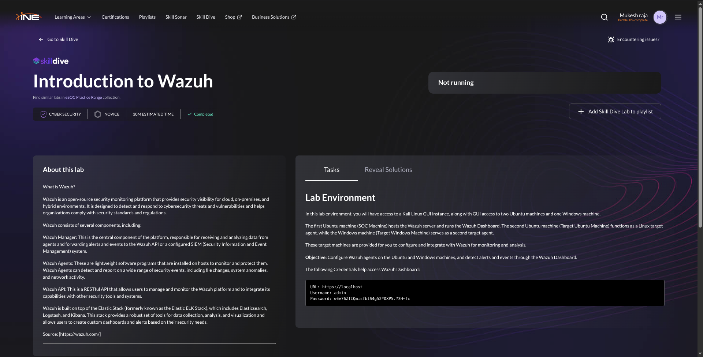

---

## 2. Open the Wazuh Dashboard

1. Start the lab from the INE Skill Dive page.
2. Select the **SOC Machine** tab.
3. Open Firefox and browse to:

   ```text
   https://localhost
   ```

4. Accept the lab's certificate warning if prompted.
5. Sign in with the credentials displayed in the INE lab instructions.
6. Open the Wazuh overview page.

Initially, the dashboard may show **0 agents**. That is expected before the endpoints are enrolled.

> Do not publish lab passwords or credentials in a public walkthrough. The credentials shown in the lab environment may be temporary.

### Screenshot 2 — Initial Wazuh dashboard
<!-- Screenshot placeholder: zerodevice.png -->

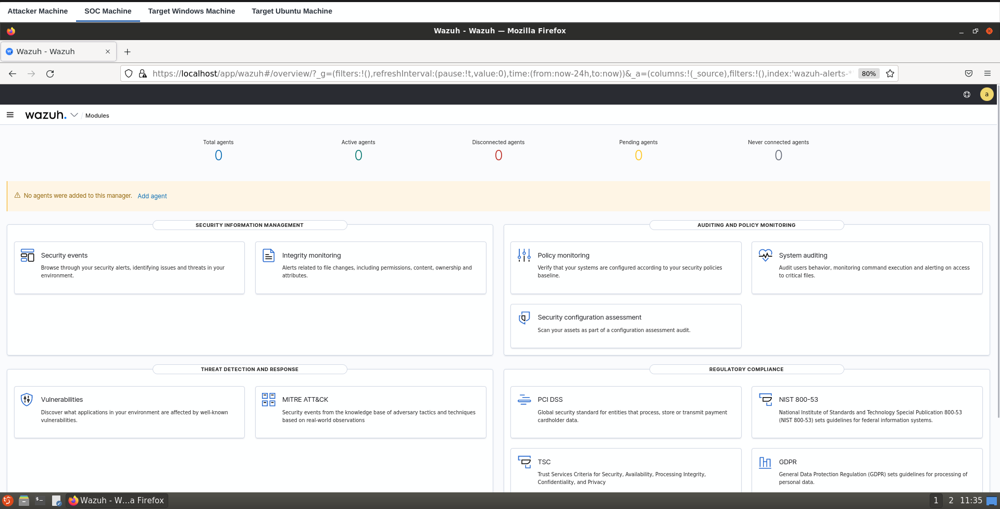

---

## 3. Configure the Ubuntu Wazuh Agent

### 3.1 Find the SOC Manager IP

On the **SOC Machine**, open a terminal and run:

```bash
ip addr
```

Find the IPv4 address on the active network interface. In this run, the SOC machine showed:

```text
10.4.20.228/20
```

Use `10.4.20.228` as `MANAGER_IP` for this run, provided the target machine can reach it.

### Screenshot 3 — SOC Manager IP
<!-- Screenshot placeholder: ip_socmachine.png -->

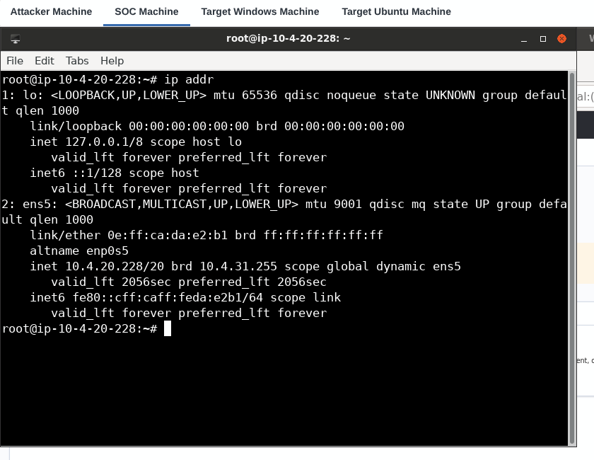

### 3.2 Set the manager address on Ubuntu

Switch to the **Target Ubuntu Machine** tab. The Wazuh agent is already installed in this lab. Replace the placeholder in its configuration:

```bash
sudo sed -i 's/MANAGER_IP/10.4.20.228/g' /var/ossec/etc/ossec.conf
```

If the lab terminal is already running as `root`, `sudo` may be omitted.

Check the server configuration:

```bash
grep -A5 '<server>' /var/ossec/etc/ossec.conf
```

Confirm that the `<address>` value points to the current SOC Manager IP. If the file does not contain the literal `MANAGER_IP` placeholder, inspect the `<server>` section and edit the existing address rather than blindly rerunning the substitution.

### 3.3 Start and check the agent

```bash
/etc/init.d/wazuh-agent start
/etc/init.d/wazuh-agent status
```

The lab output should indicate that the Wazuh agent components are running.

Check the Ubuntu target's address:

```bash
ip addr
```

In this run, the Target Ubuntu Machine was `10.4.27.213`.

### Screenshot 4 — Ubuntu agent status and IP address
<!-- Screenshot placeholder: wz_agent_ubuntu.png -->

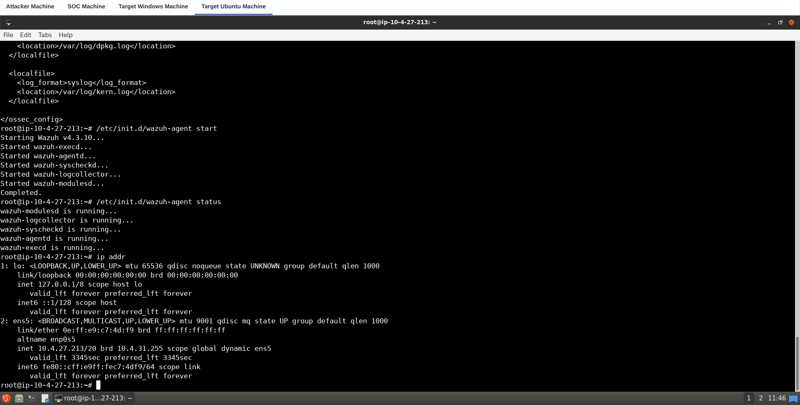

---

## 4. Verify Ubuntu Enrollment in Wazuh

Return to the **SOC Machine** and refresh the Wazuh dashboard. Open the agent list and check that the Ubuntu endpoint appears as **Active**.

Verify that the listed IP matches the Target Ubuntu Machine. If the agent does not appear, allow a short time for enrollment and check the manager address and connectivity before continuing.

---

## 5. View MITRE ATT&CK Activity for Ubuntu

1. Select the Ubuntu agent in the Wazuh dashboard.
2. Open **More → MITRE ATT&CK** (the exact menu label can vary by dashboard version).
3. Select **Framework**.
4. Enable **Hide techniques with no alerts** to focus on techniques with recorded detections.

This view maps detected activity to MITRE ATT&CK tactics and techniques. The framework view only shows detections that were actually logged and matched by the configured rules.

---

## 6. Simulate SSH Brute-Force Activity Against Ubuntu

> **Authorized lab exercise only:** The following command makes repeated SSH login attempts against the assigned Target Ubuntu Machine. Do not change the target to an unrelated system.

Switch to the **Attacker Machine**, open a terminal, and run the command against the current Ubuntu target IP:

```bash
hydra -l root -P /root/Desktop/wordlists/passwords.txt ssh://10.4.27.213
```

Hydra reports whether a password from the supplied wordlist succeeds. A successful credential test in this exercise means the lab's SSH service accepted one of the supplied passwords; it does not mean Wazuh failed to detect the activity.

### Screenshot 5 — SSH brute-force simulation
<!-- Screenshot placeholder: bruteforce_ubuntu.png -->

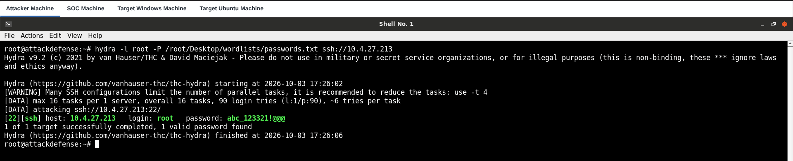

---

## 7. Investigate Ubuntu Alerts in Wazuh

1. Return to the **SOC Machine**.
2. Open the Ubuntu agent's **MITRE ATT&CK** view or the dashboard's **Events / Threat Hunting** view.
3. Refresh the event results and use a time range that includes the simulation.
4. Inspect authentication failures and any alert describing multiple failed logins or a successful login following failures.
5. Expand an event to inspect its fields, timestamp, source/target information, rule description, and rule ID.

Depending on the Wazuh version and event data, related Linux SSH/PAM detections may include rule IDs such as `5710`, `5712`, `5503`, or `5504`. Treat the event details in the current lab as the source of truth; not every rule will fire in every run.

### Screenshot 6 — Ubuntu brute-force alerts
<!-- Screenshot placeholders: ubuntu_bruteforce_wz_dashboard1.png and ubuntu_bruteforce_wz_dashboard2.png -->

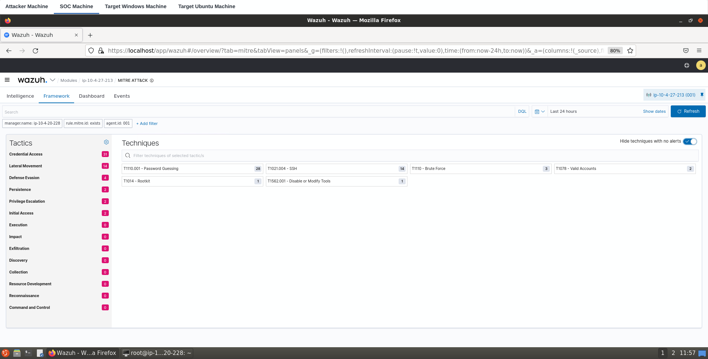

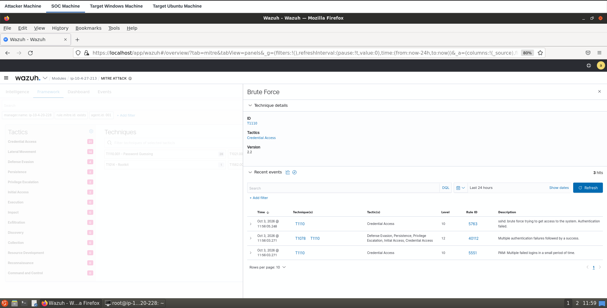

---

## 8. Configure the Windows Wazuh Agent

### 8.1 Confirm the Windows target IP

Switch to the **Target Windows Machine** tab and open PowerShell. Run:

```powershell
ipconfig
```

In this run, the Windows target's IPv4 address was `10.4.22.160`.

### Screenshot 7 — Windows target IP
<!-- Screenshot placeholder: win_agent_ip.png -->

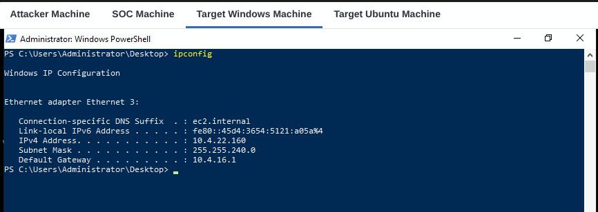

### 8.2 Install the agent

The lab provides `wazuh-agent.msi` on the Windows Desktop. Open **PowerShell as Administrator**, then run:

```powershell
cd "$HOME\Desktop"
```

Install the agent and point it at the current SOC Manager IP:

```powershell
msiexec.exe /i wazuh-agent.msi /q WAZUH_MANAGER="10.4.20.228" WAZUH_REGISTRATION_SERVER="10.4.20.228" WAZUH_AGENT_GROUP="default"
```

Wait for the installer to finish. The `/q` switch suppresses most installer UI, so the command may return without a visible success message.

### 8.3 Start and verify the Windows service

Try:

```powershell
Start-Service -Name WazuhSvc
```

Then verify:

```powershell
Get-Service -Name WazuhSvc
```

The expected service status is `Running`.

#### If PowerShell says the service does not exist

Do not assume the agent is installed. Check whether the MSI exists and whether Windows Installer returned an error:

```powershell
Test-Path "$HOME\Desktop\wazuh-agent.msi"
Get-Service *wazuh*
```

Check the installed application entry in **Settings → Apps** or **Control Panel → Programs and Features**. If the MSI installation failed, rerun it from an elevated PowerShell window and inspect the Windows Installer log. For example:

```powershell
msiexec.exe /i "$HOME\Desktop\wazuh-agent.msi" /L*v "$HOME\Desktop\wazuh-agent-install.log" WAZUH_MANAGER="10.4.20.228" WAZUH_REGISTRATION_SERVER="10.4.20.228" WAZUH_AGENT_GROUP="default"
```

After installation, retry `Start-Service` and `Get-Service`. If the service exists but cannot connect, confirm the manager IP and lab connectivity. Wazuh commonly uses TCP `1514` for agent communication and TCP `1515` for enrollment; the lab network and manager configuration must allow the required traffic.

### Screenshot 8 — Windows agent installation / service
<!-- Screenshot placeholder: wz_agent_windows.png -->

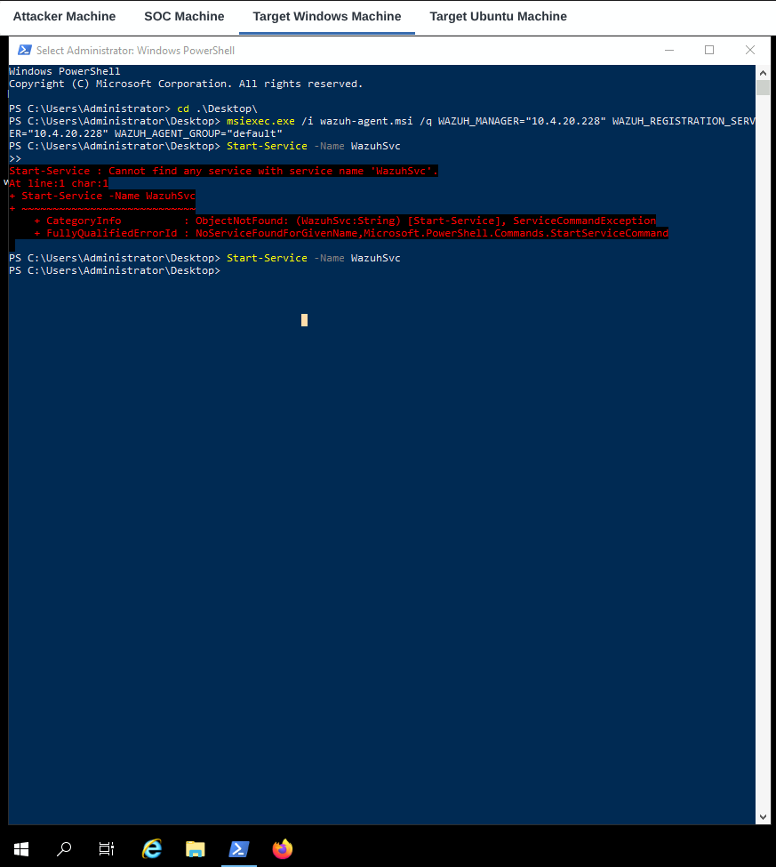

---

## 9. Verify Windows Enrollment

Return to the Wazuh dashboard on the **SOC Machine** and refresh the agent list. The Ubuntu and Windows endpoints should both appear as active once enrollment and communication complete.

Check each agent's IP address so that the Windows agent is not confused with the Ubuntu agent. If Windows is missing or disconnected, revisit the service checks in Step 8 and verify the manager address used during installation.

---

## 10. Simulate RDP Brute-Force Activity Against Windows

> **Authorized lab exercise only:** Run this only from the supplied Attacker Machine against the assigned Target Windows Machine in the INE environment.

On the **Attacker Machine**, run:

```bash
hydra -l Administrator -P /root/Desktop/wordlists/passwords.txt rdp://10.4.22.160
```

Use the current Windows target IP if it differs from the address recorded above. The RDP test may cause the remote desktop session to disconnect or become temporarily unavailable; reconnect through the INE environment if needed.

### Screenshot 9 — RDP brute-force simulation
<!-- Screenshot placeholder: bruteforce_win.png -->

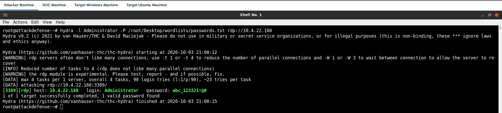

---

## 11. Investigate Windows Alerts in Wazuh

1. Switch to the **SOC Machine**.
2. Open the Windows agent and navigate to **More → MITRE ATT&CK**, or use the **Events / Threat Hunting** view.
3. Set the time range to include the simulation and click **Refresh**.
4. Inspect failed logon events and any alert describing multiple authentication failures followed by a success.
5. Expand the event to review the rule description, timestamp, affected endpoint, and available source details.

Depending on the Wazuh version and the events produced, Windows RDP authentication alerts may include rule IDs such as `60122` or `60204`. Confirm the actual rule ID and event details in your dashboard.

### Screenshot 10 — Windows brute-force detections
<!-- Screenshot placeholder: win_bruteforce_wz_dashboard.png -->

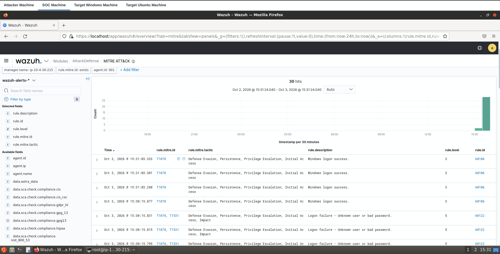

### What the alerts mean

- **Repeated logon failures:** Several authentication attempts failed in a short period.
- **Multiple failures followed by success:** The logs show failed attempts followed by a successful authentication. Investigate whether the successful login was expected.
- **MITRE ATT&CK mapping:** Brute-force activity can map to **T1110 — Brute Force**. A successful authentication may also be associated with other techniques depending on the event and the rules that matched.

An alert is evidence to investigate, not proof by itself that a host was compromised. Correlate the timestamp, account, source, target, and surrounding events.

---

## 12. Troubleshooting Checklist

### Agent does not appear in the dashboard

- Confirm that the Wazuh agent service is running on the endpoint.
- Confirm that the endpoint configuration points to the current SOC Manager IP.
- Refresh the dashboard and use a time range that includes the current activity.
- Confirm that the lab's network permits the required Wazuh communication and enrollment ports.
- Review the agent logs:
  - Ubuntu: `/var/ossec/logs/ossec.log`
  - Windows: typically under `C:\Program Files (x86)\ossec-agent\ossec.log` for this installation layout.

### Windows reports `Cannot find any service with service name 'WazuhSvc'`

- Verify that `wazuh-agent.msi` exists on the Desktop.
- Run the MSI from an elevated PowerShell window.
- Check whether installation completed successfully.
- Use the MSI verbose log command in Step 8 to diagnose installer errors.
- Only start the service after the agent is installed.

### Agent is installed but not connecting

- Recheck the manager address in the agent configuration.
- Confirm that the address belongs to the current SOC machine, not an IP copied from a different lab instance.
- Confirm connectivity and the required lab firewall rules.
- Inspect the agent log for connection, enrollment, or authentication errors.

### Alerts do not appear after the simulation

- Confirm the correct agent is active.
- Confirm the attack was directed at the monitored target's current IP.
- Expand the time range and refresh.
- Check the endpoint's authentication logs and the Wazuh agent log.
- Remember that alert generation depends on the logs collected and the rules available in the lab.

---

## 13. Results

Use this checklist to record the result of the lab run:

- [ ] Opened the Wazuh dashboard on the SOC machine.
- [ ] Configured and started the Ubuntu agent.
- [ ] Verified the Ubuntu agent in the dashboard.
- [ ] Generated SSH authentication events in the isolated lab.
- [ ] Investigated Ubuntu alerts and their MITRE ATT&CK mapping.
- [ ] Installed and started the Windows agent.
- [ ] Verified the Windows agent in the dashboard.
- [ ] Generated RDP authentication events in the isolated lab.
- [ ] Investigated Windows alerts in Wazuh.
- [ ] Captured screenshots and recorded the observed rule IDs.

## Conclusion

In this lab, Wazuh was used to monitor Linux and Windows endpoints from a central SOC dashboard. After agent configuration and enrollment, controlled SSH and RDP authentication simulations generated events that could be reviewed in Wazuh. The exercise demonstrates the basic SOC workflow: onboard endpoints, generate or observe security telemetry, review alerts, map detections to MITRE ATT&CK, and investigate the underlying event details.

## References

- [INE Skill Dive — Introduction to Wazuh](https://ine.com/) — lab environment and task instructions.
- [Wazuh documentation — Proof of Concept guide](https://documentation.wazuh.com/current/proof-of-concept-guide/index.html)
- [Wazuh documentation — Detecting a brute-force attack](https://documentation.wazuh.com/current/proof-of-concept-guide/detect-brute-force-attack.html)

---

## Screenshot file organization

The screenshots are organized in the `screenshots/` directory relative to this Markdown file:

```text
Introduction_to_Wazuh/
├── Introduction_to_Wazuh_Walkthrough.md
└── screenshots/
    ├── introduction_to_wazuh.png
    ├── zerodevice.png
    ├── ip_socmachine.png
    ├── wz_agent_ubuntu.png
    ├── bruteforce_ubuntu.png
    ├── ubuntu_bruteforce_wz_dashboard1.png
    ├── ubuntu_bruteforce_wz_dashboard2.png
    ├── win_agent_ip.png
    ├── wz_agent_windows.png
    ├── bruteforce_win.png
    └── win_bruteforce_wz_dashboard.png
```
