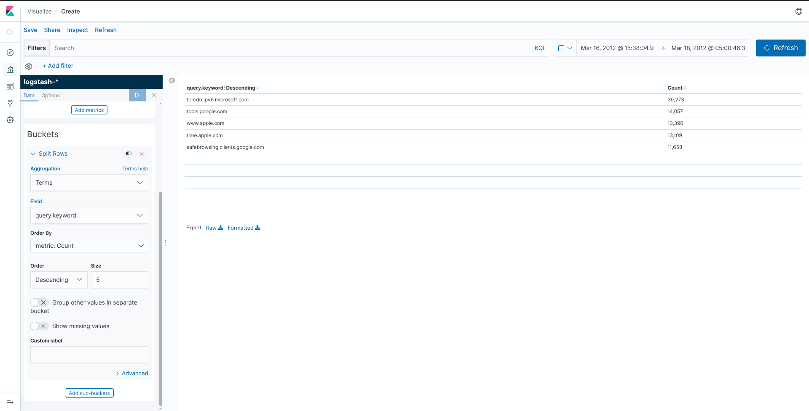
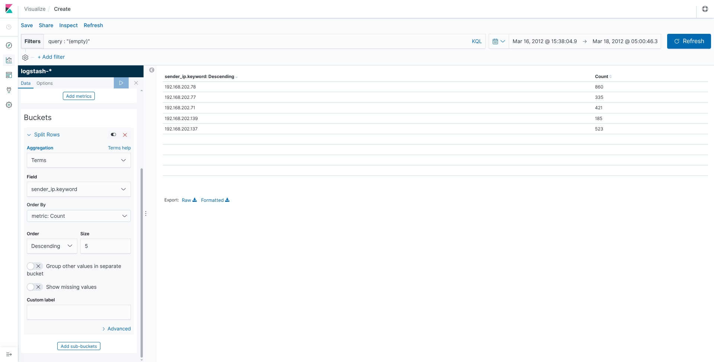
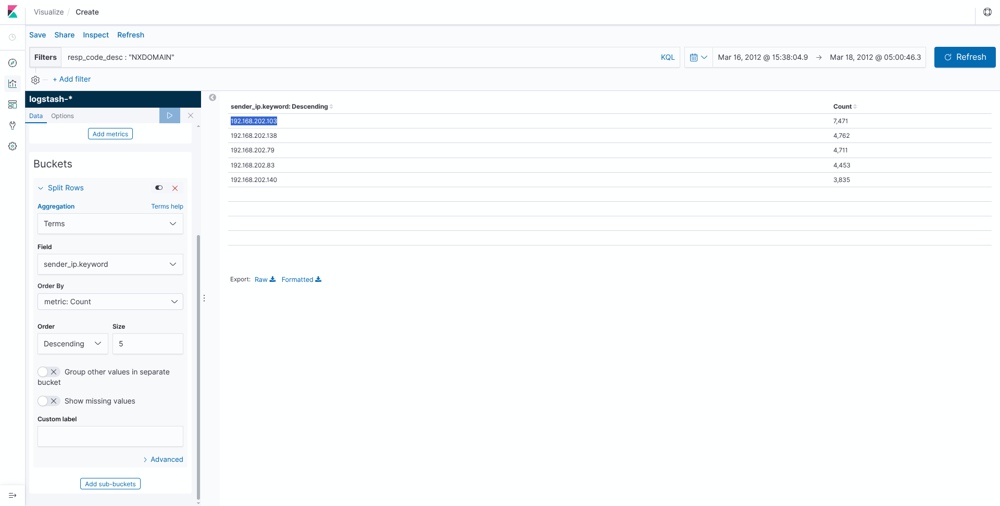
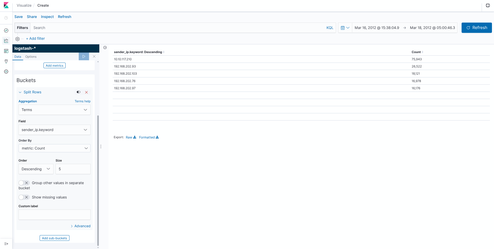
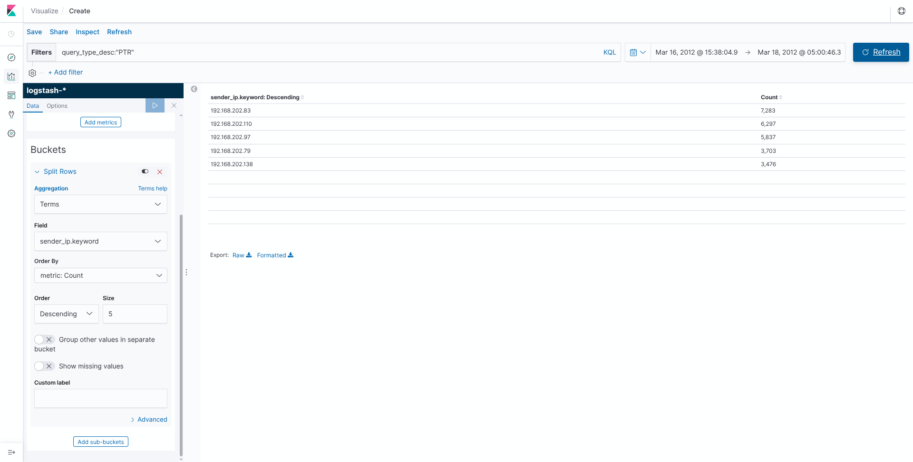
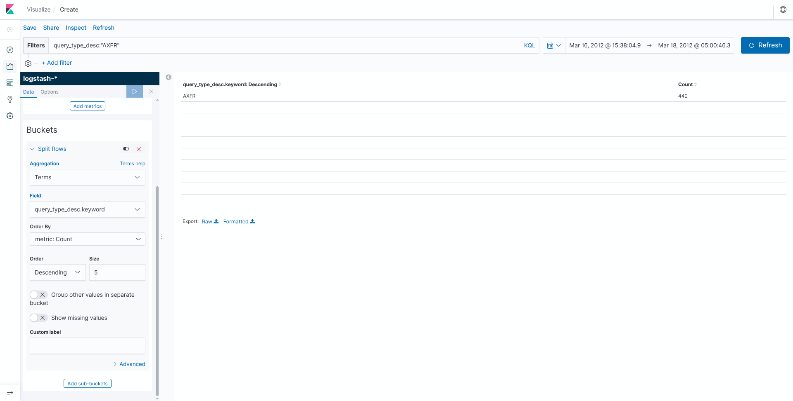
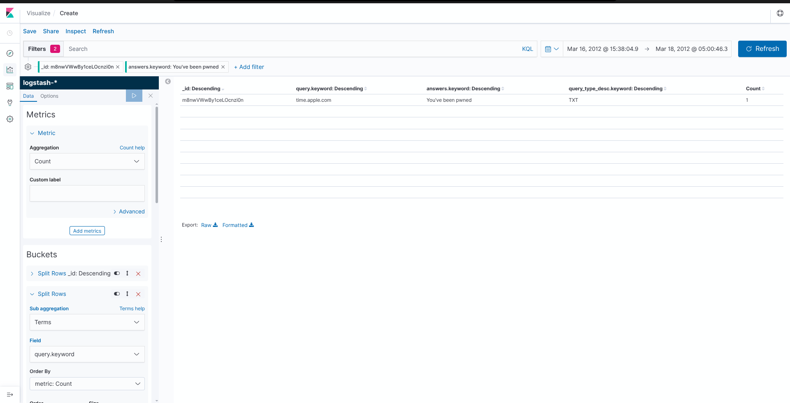
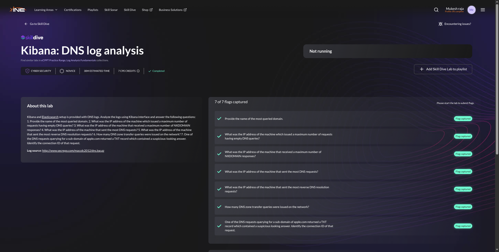

# Kibana: DNS Log Analysis — INE Lab Walkthrough

> **Platform:** INE Skill Dive  
> **Lab:** Kibana: DNS log analysis  
> **Category:** Cyber Security  
> **Level:** Novice  
> **Estimated Time:** 30 minutes  
> **Dataset:** MACCDC 2012 DNS logs

## 📌 Overview

This lab provides DNS logs in Elasticsearch/Kibana and requires analyzing them with Kibana filters and aggregations.

### Skills Practiced
- Kibana Discover
- Kibana Visualize / Data Table
- KQL filtering
- Terms and Count aggregations
- DNS log analysis
- NXDOMAIN analysis
- Reverse DNS / PTR analysis
- DNS zone-transfer detection
- Suspicious TXT-record investigation

## 🧰 Important Fields

| Field | Purpose |
|---|---|
| `query` | DNS query/domain |
| `query_type_desc` | DNS query type |
| `resp_code_desc` | DNS response code |
| `sender_ip` | Source IP |
| `target_ip` | Destination IP |
| `answers` | DNS response |
| `_id` | Log document/connection identifier |

---

# 1️⃣ Most Queried Domain

**Question:** Provide the name of the most queried domain.

### Configuration

```text
Aggregation: Terms
Field: query.keyword
Order By: metric: Count
Order: Descending
Size: 5
```

### Result

| Domain | Count |
|---|---:|
| **teredo.ipv6.microsoft.com** | **39,273** |
| tools.google.com | 14,057 |
| www.apple.com | 13,390 |
| time.apple.com | 13,109 |
| safebrowsing.clients.google.com | 11,658 |



### 🎯 Answer

```text
teredo.ipv6.microsoft.com
```

---

# 2️⃣ Maximum Empty DNS Queries

**Question:** What was the IP address of the machine which issued a maximum number of requests having empty DNS queries?

### Filter

```kql
query:"(empty)"
```

### Configuration

```text
Aggregation: Terms
Field: sender_ip.keyword
Order By: metric: Count
Order: Descending
Size: 5
```

### Result

```text
192.168.202.78    860
```



### 🎯 Answer

```text
192.168.202.78
```

---

# 3️⃣ Maximum NXDOMAIN Responses

**Question:** What was the IP address of the machine that received a maximum number of NXDOMAIN responses?

### Filter

```kql
resp_code_desc:"NXDOMAIN"
```

### Configuration

```text
Aggregation: Terms
Field: sender_ip.keyword
Order By: metric: Count
Order: Descending
Size: 5
```

### Result

```text
192.168.202.103    7,471
```



### 🎯 Answer

```text
192.168.202.103
```

> **Note:** The lab's accepted result is obtained by grouping the NXDOMAIN records by `sender_ip.keyword`, as shown in the evidence screenshot.

---

# 4️⃣ Machine Sending the Most DNS Requests

**Question:** What was the IP address of the machine that sent the most DNS requests?

### Configuration

```text
Aggregation: Terms
Field: sender_ip.keyword
Order By: metric: Count
Order: Descending
Size: 5
```

### Result

| Sender IP | Count |
|---|---:|
| **10.10.117.210** | **75,943** |
| 192.168.202.93 | 26,522 |
| 192.168.202.103 | 18,121 |
| 192.168.202.76 | 16,978 |
| 192.168.202.97 | 16,176 |



### 🎯 Answer

```text
10.10.117.210
```

---

# 5️⃣ Most Reverse DNS Resolution Requests

**Question:** What was the IP address of the machine that sent the most reverse DNS resolution requests?

Reverse DNS lookups commonly use the **PTR** record type.

### Filter

```kql
query_type_desc:"PTR"
```

### Configuration

```text
Aggregation: Terms
Field: sender_ip.keyword
Order By: metric: Count
Order: Descending
Size: 5
```

### Result

| Sender IP | PTR Count |
|---|---:|
| **192.168.202.83** | **7,283** |
| 192.168.202.110 | 6,297 |
| 192.168.202.97 | 5,837 |
| 192.168.202.79 | 3,703 |
| 192.168.202.138 | 3,476 |



### 🎯 Answer

```text
192.168.202.83
```

---

# 6️⃣ DNS Zone Transfer Queries

**Question:** How many DNS zone transfer queries were issued on the network?

DNS zone transfers use the **AXFR** query type.

### Filter

```kql
query_type_desc:"AXFR"
```

### Metric

```text
Aggregation: Count
```

### Result

```text
AXFR    440
```



### 🎯 Answer

```text
440
```

---

# 7️⃣ Suspicious TXT Record

**Question:** One of the DNS requests querying for a sub-domain of apple.com returned a TXT record which contained a suspicious-looking answer. Identify the connection ID of that request.

The suspicious request returned:

```text
Query:       time.apple.com
Query Type:  TXT
Answer:      You've been pwned
```

The corresponding connection/document ID was:

```text
CmjiklOm3bnHgctw
```



### 🎯 Answer

```text
CmjiklOm3bnHgctw
```

---

# 🧠 Techniques Learned

## Terms Aggregation

Useful for finding the most frequent domain/IP:

```text
Aggregation: Terms
Order By: Count
Order: Descending
```

## KQL Filtering

### Empty DNS queries

```kql
query:"(empty)"
```

### NXDOMAIN

```kql
resp_code_desc:"NXDOMAIN"
```

### Reverse DNS

```kql
query_type_desc:"PTR"
```

### Zone transfers

```kql
query_type_desc:"AXFR"
```

## DNS Record Types

| Type | Purpose |
|---|---|
| `A` | IPv4 address lookup |
| `AAAA` | IPv6 address lookup |
| `PTR` | Reverse DNS lookup |
| `TXT` | Text information |
| `AXFR` | DNS zone transfer |

## NXDOMAIN

`NXDOMAIN` means the queried DNS name does not exist. A high number can be worth investigating for scanning, malware, misconfiguration, or suspicious domain-generation behavior.

## Reverse DNS

Reverse DNS maps an IP address back to a hostname and commonly uses `PTR` records under `in-addr.arpa`.

## DNS Zone Transfers

`AXFR` transfers an entire DNS zone between DNS servers. Unexpected AXFR activity can be security-relevant.

## Suspicious TXT Records

TXT records are legitimate, but they can contain unexpected or suspicious content. In this lab, the response was:

```text
You've been pwned
```

---

# 📋 Final Answers

| # | Question | Answer |
|---:|---|---|
| 1 | Most queried domain | `teredo.ipv6.microsoft.com` |
| 2 | Maximum empty DNS queries | `192.168.202.78` |
| 3 | Maximum NXDOMAIN responses | `192.168.202.103` |
| 4 | Most DNS requests | `10.10.117.210` |
| 5 | Most reverse DNS requests | `192.168.202.83` |
| 6 | DNS zone transfer queries | `440` |
| 7 | Suspicious TXT connection ID | `CmjiklOm3bnHgctw` |

---

# 🏁 Lab Completion

All **7/7 flags were successfully captured**.



---

# 💡 Key Takeaway

A practical DNS investigation in Kibana can follow this workflow:

```text
DNS Logs
   │
   ▼
Kibana Discover
   │
   ├── KQL filters
   ├── Terms aggregation
   ├── Count events
   ├── Identify abnormal DNS behavior
   └── Inspect suspicious answers
             │
             ▼
       Security Finding
```

The key lesson is that DNS logs contain more than domain names. **Query types, response codes, source IPs, and returned answers** can all provide useful indicators during SOC investigations.

## 📚 Lab Source

```text
http://www.secrepo.com/maccdc2012/dns.log.gz
```

## 🏷️ Tags

`#CyberSecurity` `#SOC` `#BlueTeam` `#Kibana` `#Elasticsearch` `#DNS` `#SIEM` `#LogAnalysis` `#ThreatHunting` `#INE` `#SkillDive`
