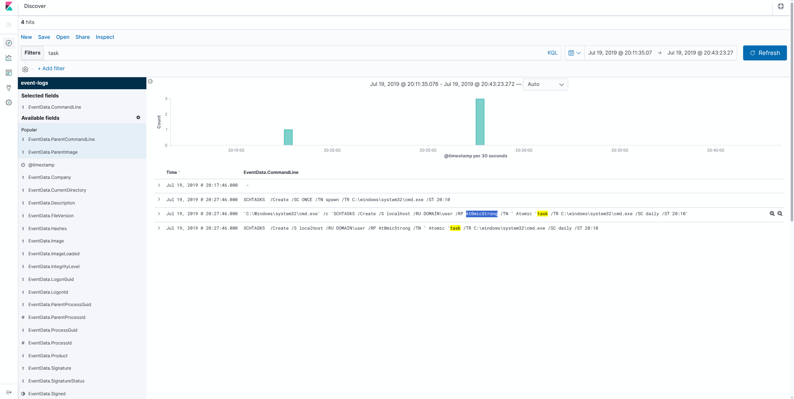
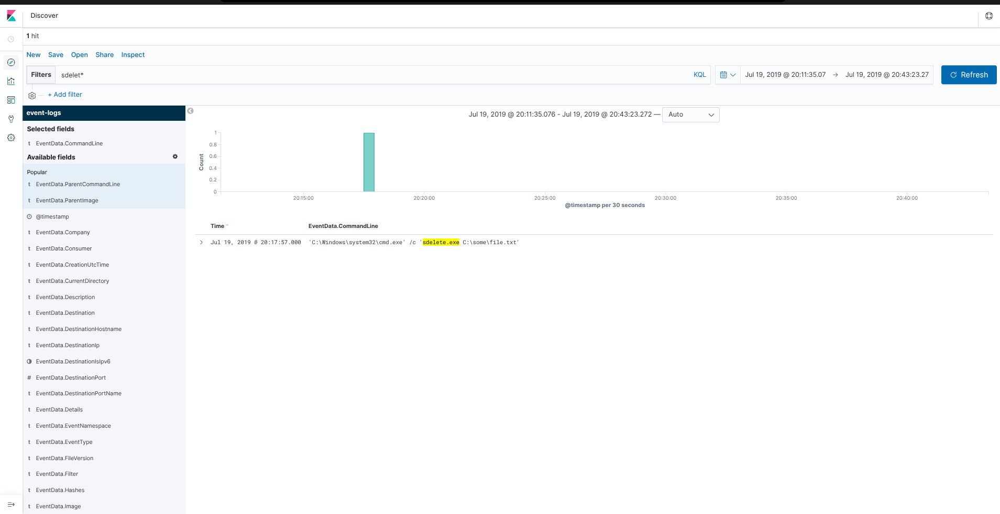
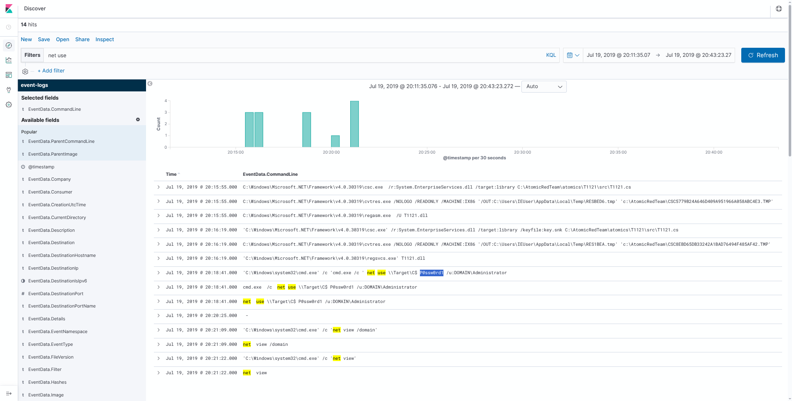
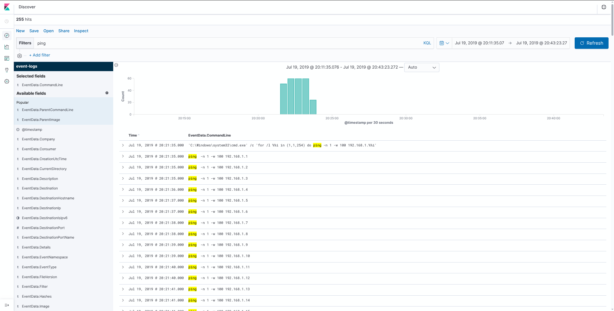
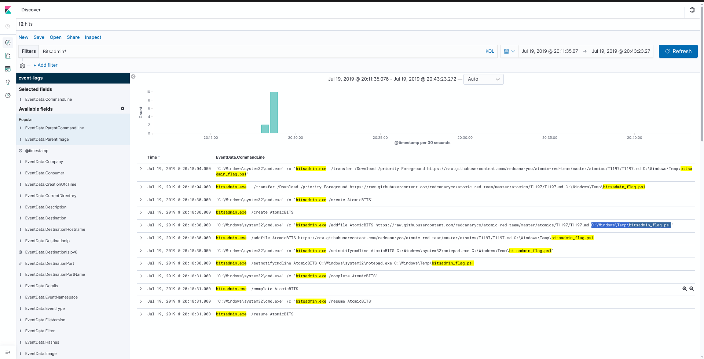

# INE Skill Dive --- Kibana: Windows Event Logs I

> **Platform:** INE Skill Dive  
> **Category:** Cybersecurity / Log Analysis  
> **Difficulty:** Novice  
> **Estimated Time:** 30 minutes  
> **Status:** ✅ Completed — 5/5 Flags  
> **Log Source:** EVTX-ATTACK-SAMPLES

---

## 🎯 Lab Objective

The objective of this lab is to analyze Windows Event Logs using **Kibana** and identify suspicious activity recorded on a Windows host.

The lab covers:

- Windows process and command-line investigation
- Scheduled task creation
- Secure file deletion using `sdelete`
- Remote shared-resource access using `net use`
- Ping sweep detection
- File downloads using `bitsadmin`
- Extracting useful evidence from Windows Event Logs
- Using Kibana Discover and KQL to investigate attacker behavior

The investigation is performed using the Windows event logs provided by the lab.

---

# 1. Understanding the Lab

Kibana provides a searchable interface for analyzing the Windows event logs collected from the lab environment.

The five investigation objectives are:

1. Find the password of the user running a scheduled task.
2. Identify the full path of a file deleted using `sdelete`.
3. Identify the password used with `net use` to access a remote shared resource.
4. Identify the subnet targeted by a ping sweep.
5. Identify the full path of a file downloaded using `bitsadmin`.

The primary field used throughout this investigation is:

```text
EventData.CommandLine
```

This field is particularly useful because many of the attack actions were executed through Windows command-line utilities.

---

# 2. Open Kibana Discover

Open the **Discover** section in Kibana.

The lab uses the:

```text
event-logs
```

data view/index.

The **Discover** interface allows us to:

- Search event logs
- Filter events using KQL
- Inspect timestamps
- View command-line arguments
- Investigate Windows process activity
- Pivot from suspicious commands to related events

---

# 3. Objective 1 — Scheduled Task

### Question

> A task was scheduled to run daily at a specific time. Provide the password of the user running that task.

## 3.1 Search for scheduled-task activity

In Kibana Discover, search for:

```kql
task
```

This returns events containing the word `task`.

The relevant event contains a scheduled task creation command.

### Command observed

```text
SCHTASKS /Create /S localhost /RU DOMAIN\user /RP At0micStrong /TN 'Atomic task' /TR C:\windows\system32\cmd.exe /SC daily /ST 20:10
```

The command shows:

- `/Create` → creates a scheduled task
- `/RU` → specifies the account used to run the task
- `/RP` → specifies the password for that account
- `/TN` → task name
- `/TR` → command/program executed by the task
- `/SC daily` → task runs daily
- `/ST 20:10` → task starts at 20:10

The important part for the question is:

```text
/RP At0micStrong
```

Therefore, the password is:

```text
At0micStrong
```



---

# 4. Objective 2 — Secure File Deletion

### Question

> A `.txt` file had been deleted securely using the `sdelete` utility. Provide the full path of the file.

## 4.1 Search for `sdelete`

In Kibana Discover, search for:

```kql
sdelete*
```

The relevant event shows:

```text
'C:\Windows\system32\cmd.exe' /c 'sdelete.exe C:\some\file.txt'
```

The command executed:

```text
sdelete.exe C:\some\file.txt
```

The `sdelete` utility is commonly used to securely delete files by overwriting their contents before removal.

The important portion is the file path:

```text
C:\some\file.txt
```

Therefore, the answer is:

```text
C:\some\file.txt
```



---

# 5. Objective 3 — Remote Shared Resource

### Question

> The host machine connected to a shared resource on a remote machine, as Administrator, using the `net use` command. Provide the password used to connect to that remote machine.

## 5.1 Search for `net use`

In Kibana Discover, search for:

```kql
net use
```

The relevant events show:

```text
C:\Windows\system32\cmd.exe /c 'cmd.exe /c net use \\Target\C$ P@ssw0rd1 /u:DOMAIN\Administrator'
```

The command can be broken down as:

```text
net use \\Target\C$ P@ssw0rd1 /u:DOMAIN\Administrator
```

Where:

- `net use` → connects to a network share
- `\\Target\C$` → accesses the administrative `C$` share on the remote host
- `P@ssw0rd1` → password supplied for authentication
- `/u:DOMAIN\Administrator` → specifies the account

The password used for the remote connection was:

```text
P@ssw0rd1
```

Therefore, the answer is:

```text
P@ssw0rd1
```



---

# 6. Objective 4 — Ping Sweep

### Question

> A ping sweep attack had been launched by the host machine against a network. What was the subnet address of that network? Provide the answer in CIDR notation.

## 6.1 Search for ping activity

In Kibana Discover, search for:

```kql
ping
```

The results show many individual ping commands.

The important parent command is:

```text
'C:\Windows\system32\cmd.exe' /c 'for /l %%i in (1,1,254) do ping -n 1 -w 100 192.168.1.%%i'
```

This command uses a `for /l` loop to iterate from:

```text
1
```

through:

```text
254
```

The target address is constructed as:

```text
192.168.1.%%i
```

This results in the following range:

```text
192.168.1.1
192.168.1.2
192.168.1.3
...
192.168.1.254
```

Therefore, the targeted network is:

```text
192.168.1.0/24
```

### Answer

```text
192.168.1.0/24
```



---

# 7. Objective 5 — Bitsadmin Download

### Question

> Bitsadmin tool was used to download a file from a remote server. Provide the full path of the downloaded file on the host machine.

## 7.1 Search for Bitsadmin activity

In Kibana Discover, search for:

```kql
Bitsadmin*
```

The relevant event contains:

```text
bitsadmin.exe /transfer /Download /priority Foreground https://raw.githubusercontent.com/redcanaryco/atomic-red-team/master/atomics/T1197/T1197.md C:\Windows\Temp\bitsadmin_flag.ps1
```

The command shows:

- `bitsadmin.exe` → Windows Background Intelligent Transfer Service command-line utility
- `/transfer` → creates a transfer job
- `/Download` → downloads the remote file
- `/priority Foreground` → sets foreground transfer priority
- Remote URL → source of the downloaded file
- Final argument → destination path on the host

The destination path is:

```text
C:\Windows\Temp\bitsadmin_flag.ps1
```

The same destination is also visible in the `/addfile` event:

```text
bitsadmin.exe /addfile AtomicBITS https://raw.githubusercontent.com/redcanaryco/atomic-red-team/master/atomics/T1197/T1197.md C:\Windows\Temp\bitsadmin_flag.ps1
```

Therefore, the answer is:

```text
C:\Windows\Temp\bitsadmin_flag.ps1
```



---

# 8. 🚩 Flags Captured

| # | Lab Question | Answer |
|---|---|---|
| 1 | Password of the user running the scheduled task | `At0micStrong` |
| 2 | Full path of the file deleted using `sdelete` | `C:\some\file.txt` |
| 3 | Password used with `net use` | `P@ssw0rd1` |
| 4 | Subnet targeted by the ping sweep | `192.168.1.0/24` |
| 5 | Full path of the Bitsadmin downloaded file | `C:\Windows\Temp\bitsadmin_flag.ps1` |

---

# 9. 🧠 Key Concepts Learned

## 9.1 Windows Command-Line Investigation

Windows process creation logs can contain the command line used to execute a program.

For example:

```text
cmd.exe /c ...
```

The command-line field can reveal:

- Programs executed
- Arguments supplied
- File paths
- Network resources
- Usernames
- Passwords
- Download destinations
- Scheduled task configuration

This makes command-line telemetry extremely valuable during SOC investigations.

---

## 9.2 Scheduled Task Analysis

The `schtasks` utility can be used to create and configure Windows scheduled tasks.

Example:

```text
SCHTASKS /Create /S localhost /RU DOMAIN\user /RP At0micStrong /TN 'Atomic task' /TR C:\windows\system32\cmd.exe /SC daily /ST 20:10
```

Important options include:

```text
/RU  → Run As user
/RP  → Run As password
/TN  → Task name
/TR  → Task to execute
/SC  → Schedule
/ST  → Start time
```

From a defensive perspective, unexpected scheduled tasks can be an important persistence indicator.

---

## 9.3 SDelete Investigation

`sdelete.exe` is a command-line utility that can securely delete files.

Example observed in the logs:

```text
sdelete.exe C:\some\file.txt
```

During an investigation, searching for:

```kql
sdelete*
```

can help identify secure deletion activity and the affected file path.

---

## 9.4 Network Share Investigation

The Windows `net use` command can establish connections to network shares.

Example:

```text
net use \\Target\C$ P@ssw0rd1 /u:DOMAIN\Administrator
```

Important information available from the command line includes:

```text
Remote host/share
Username
Password
Authentication context
```

Administrative shares such as:

```text
C$
ADMIN$
IPC$
```

can be particularly useful indicators when investigating lateral movement.

---

## 9.5 Ping Sweep Detection

The lab used a Windows loop to generate ICMP requests across an entire `/24` network:

```text
for /l %%i in (1,1,254) do ping -n 1 -w 100 192.168.1.%%i
```

The resulting address range is:

```text
192.168.1.1 - 192.168.1.254
```

Which corresponds to:

```text
192.168.1.0/24
```

A large number of sequential ping requests can therefore provide evidence of host discovery activity.

---

## 9.6 Bitsadmin Download Detection

`bitsadmin.exe` can perform file transfers using Windows BITS.

The lab recorded:

```text
bitsadmin.exe /transfer /Download /priority Foreground <remote-url> C:\Windows\Temp\bitsadmin_flag.ps1
```

The important investigation fields are:

```text
Remote URL
Transfer operation
Job name
Destination file
```

A useful Kibana search is:

```kql
Bitsadmin*
```

The destination path can then be extracted from the command line.

---

# 10. 🔍 Kibana Investigation Workflow

The overall investigation can be remembered as:

```text
Open Kibana Discover
        ↓
Select event-logs
        ↓
Inspect EventData.CommandLine
        ↓
Search suspicious command names
        ↓
Review matching Windows events
        ↓
Extract command arguments
        ↓
Identify attacker behavior
        ↓
Answer the lab question
```

Useful searches from this lab:

```kql
task
```

```kql
sdelete*
```

```kql
net use
```

```kql
ping
```

```kql
Bitsadmin*
```

---

# 11. Quick Reference

| Activity | Kibana Search | Important Evidence |
|---|---|---|
| Scheduled Task | `task` | `SCHTASKS`, `/RU`, `/RP`, `/TN`, `/SC`, `/ST` |
| Secure Deletion | `sdelete*` | `sdelete.exe`, target file path |
| Network Share | `net use` | Remote share, username, password |
| Ping Sweep | `ping` | Sequential IP addresses / sweep command |
| Bitsadmin | `Bitsadmin*` | Remote URL and local destination |

---

# 12. Complete Investigation Flow

```text
Windows Event Logs
        ↓
Kibana Discover
        ↓
EventData.CommandLine
        ↓
Search for suspicious utilities
        ↓
┌──────────────────────────┐
│ SCHTASKS                 │
│ SDELETE                  │
│ NET USE                  │
│ PING                     │
│ BITSADMIN                │
└──────────────────────────┘
        ↓
Analyze command arguments
        ↓
Extract credentials / paths / network information
        ↓
Validate evidence
        ↓
Capture 5 flags
```

---

# 13. 🛡️ Defensive Takeaways

## Monitor command-line activity

SOC teams should monitor process creation and command-line telemetry where possible.

Important utilities to investigate include:

```text
schtasks.exe
sdelete.exe
net.exe
ping.exe
bitsadmin.exe
```

The presence of one of these utilities is not automatically malicious. The surrounding context, command arguments, user, host, timestamp, and execution chain should be considered.

## Investigate unusual scheduled tasks

Look for:

- Unexpected task names
- Suspicious executable paths
- Unusual execution times
- Unexpected accounts
- Commands launched from temporary directories

## Monitor administrative share access

Unexpected access to:

```text
C$
ADMIN$
IPC$
```

can warrant investigation, especially when combined with unusual credentials or remote execution activity.

## Detect network discovery

Sequential ICMP requests across many addresses can indicate network discovery or host enumeration.

## Investigate BITS transfers

BITS can be abused to transfer files while blending into legitimate Windows functionality.

Look for:

- Unusual remote URLs
- Unexpected BITS jobs
- Downloads into temporary directories
- Suspicious scripts or executables
- Unusual parent processes

---

# 14. 🏁 Lab Completion

**Kibana: Windows Event Logs I — ✅ 5/5 Flags Captured**

The lab demonstrated how Windows Event Logs can reveal attacker activity through command-line telemetry.

The key methodology was:

```text
Log Collection
      ↓
Kibana Discover
      ↓
Command-Line Searching
      ↓
Event Investigation
      ↓
Command Reconstruction
      ↓
Behavior Identification
      ↓
Evidence Extraction
      ↓
Flag Capture
```

### Most important takeaway

> **A single command-line event can contain enough information to reconstruct what an attacker attempted to do, what account they used, what resource they accessed, and where files were written.**

---

## References

- **INE Skill Dive:** Kibana: Windows Event Logs I
- **Log source:** EVTX-ATTACK-SAMPLES
- **Formatting reference:** Automated Git Repo Recovery walkthrough supplied for this documentation style.
