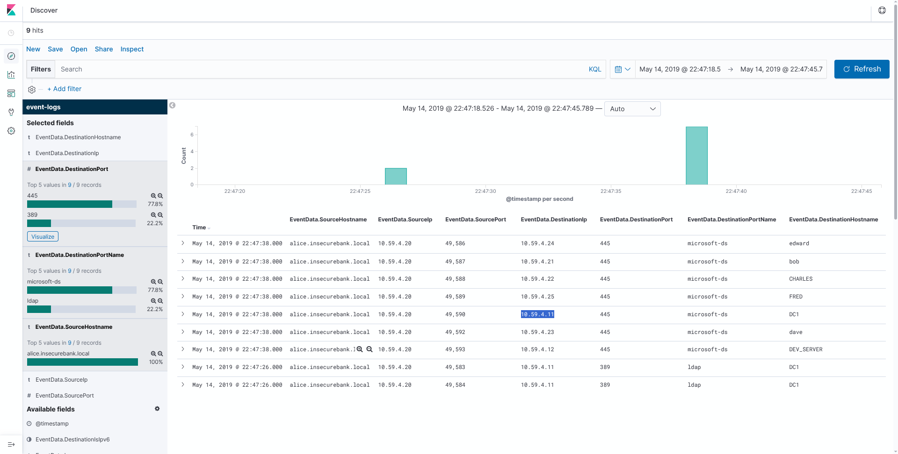
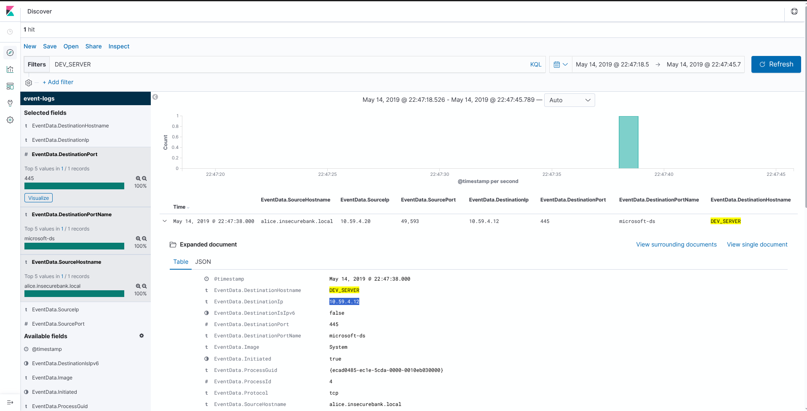

# Kibana: Windows Event Logs II — Walkthrough

> **Platform:** INE Skill Dive  
> **Category:** Cyber Security  
> **Difficulty:** Novice  
> **Estimated Time:** 30 minutes  
> **Credits:** 3 CPE  
> **Tool:** Kibana / Elasticsearch  
> **Log Source:** EVTX-ATTACK-SAMPLES

---

## 📌 Lab Overview

This lab provides Windows Event Logs indexed in **Elasticsearch** and analyzed through the **Kibana Discover** interface.

The objective is to investigate network-related Windows event logs and identify:

1. The IP address of a machine listening on two different file-sharing ports.
2. The number of distinct file-sharing servers the host machine connected to.
3. The IP address of the machine with the hostname `DEV_SERVER`.

---

## 🎯 Objectives

By completing this lab, we will practice:

- Searching Windows Event Logs in Kibana.
- Filtering events using **KQL (Kibana Query Language)**.
- Analyzing source and destination IP addresses.
- Identifying destination ports and services.
- Correlating hostnames with IP addresses.
- Investigating SMB (`445`) and LDAP (`389`) network activity.

---

## 🧰 Environment

The lab environment contains:

- **Kibana**
- **Elasticsearch**
- Windows Event Logs
- Index: `event-logs`

Important fields used during the investigation:

```text
EventData.SourceHostname
EventData.SourceIp
EventData.SourcePort
EventData.DestinationHostname
EventData.DestinationIp
EventData.DestinationPort
EventData.DestinationPortName
```

---

# 🔎 Flag 1 — Identify the Machine Listening on Two File-Sharing Ports

## Step 1 — Open Kibana Discover

After launching the lab, open the provided Kibana instance and navigate to **Discover**.

Select the `event-logs` data view.

Set the appropriate time range covering the available events.

---

## Step 2 — Investigate File-Sharing Traffic

Windows file-sharing activity commonly uses **SMB**, which operates on TCP port:

```text
445
```

In Kibana, inspect:

```text
EventData.DestinationPort
EventData.DestinationPortName
EventData.DestinationHostname
EventData.DestinationIp
```

A useful KQL filter is:

```kql
EventData.DestinationPort: 445
```

The resulting events show multiple machines communicating over the `microsoft-ds` service.

---

## Step 3 — Inspect the Destination Host

One of the records contains:

```text
EventData.DestinationHostname: DEV_SERVER
EventData.DestinationIp: 10.59.4.12
EventData.DestinationPort: 445
EventData.DestinationPortName: microsoft-ds
```

### Evidence

<!-- IMAGE PLACEHOLDER: First flag screenshot showing DEV_SERVER and 10.59.4.12 -->



The destination IP associated with `DEV_SERVER` is:

```text
10.59.4.12
```

### ✅ Flag 1 Answer

```text
10.59.4.12
```

---

# 🔎 Flag 2 — Determine How Many File-Sharing Servers the Host Connected To

## Step 1 — Examine the Network Events

The source host shown in the records is:

```text
alice.insecurebank.local
```

with source IP:

```text
10.59.4.20
```

The relevant SMB events use destination port:

```text
445
```

---

## Step 2 — Identify Unique Destination Hosts

The Kibana results show the following destinations:

| Destination IP | Destination Hostname | Port |
|---|---|---:|
| `10.59.4.24` | `edward` | 445 |
| `10.59.4.21` | `bob` | 445 |
| `10.59.4.22` | `CHARLES` | 445 |
| `10.59.4.25` | `FRED` | 445 |
| `10.59.4.11` | `DC1` | 445 |
| `10.59.4.23` | `dave` | 445 |
| `10.59.4.12` | `DEV_SERVER` | 445 |

This gives **seven distinct file-sharing servers**.

### Evidence

<!-- IMAGE PLACEHOLDER: Second screenshot showing the 9 Kibana results and the seven SMB destinations -->


The two additional records in the results use port `389` (`ldap`) and therefore are not counted as file-sharing servers.

### Calculation

```text
SMB destinations:
1. edward
2. bob
3. CHARLES
4. FRED
5. DC1
6. dave
7. DEV_SERVER

Total = 7
```

### ✅ Flag 2 Answer

```text
7
```

---

# 🔎 Flag 3 — Identify the IP Address of DEV_SERVER

## Step 1 — Search for the Hostname

In Kibana, filter for:

```kql
EventData.DestinationHostname: "DEV_SERVER"
```

The result contains the following information:

```text
EventData.DestinationHostname: DEV_SERVER
EventData.DestinationIp: 10.59.4.12
EventData.DestinationPort: 445
EventData.DestinationPortName: microsoft-ds
```

---

## Step 2 — Correlate Hostname and IP

The hostname:

```text
DEV_SERVER
```

maps to:

```text
10.59.4.12
```

### Evidence

<!-- IMAGE PLACEHOLDER: Screenshot showing DEV_SERVER highlighted with destination IP 10.59.4.12 -->



### ✅ Flag 3 Answer

```text
10.59.4.12
```

---

# 🧠 Investigation Summary

The investigation started by examining Windows network event logs in Kibana.

The important fields were:

```text
SourceHostname
SourceIp
DestinationHostname
DestinationIp
DestinationPort
DestinationPortName
```

The SMB service was identified through:

```text
DestinationPort: 445
DestinationPortName: microsoft-ds
```

The source machine:

```text
alice.insecurebank.local
```

with IP:

```text
10.59.4.20
```

was observed communicating with seven distinct SMB/file-sharing servers.

Among those systems was:

```text
DEV_SERVER
```

which resolved to:

```text
10.59.4.12
```

---

# 🏁 Final Answers

| Question | Answer |
|---|---|
| IP address of the machine listening on the file-sharing port | **10.59.4.12** |
| Number of distinct file-sharing servers connected to | **7** |
| IP address of `DEV_SERVER` | **10.59.4.12** |

---

# 🛡️ Key SOC Takeaways

### 1. Port 445

TCP port `445` is commonly associated with **SMB / Microsoft-DS** and is an important port to monitor during Windows network investigations.

### 2. Hostname-to-IP Correlation

Security analysts frequently need to correlate:

```text
Hostname → IP address → Port → Service
```

This can help identify the systems involved in suspicious or unusual network activity.

### 3. Filtering in Kibana

KQL makes it possible to quickly narrow a large collection of Windows events.

Examples:

```kql
EventData.DestinationPort: 445
```

```kql
EventData.DestinationHostname: "DEV_SERVER"
```

```kql
EventData.DestinationPortName: "microsoft-ds"
```

### 4. Distinguishing Services

Not every network event in the same time window represents file sharing.

For example:

```text
445 → microsoft-ds → SMB
389 → ldap → LDAP
```

Therefore, filtering by both port and service helps avoid incorrectly counting unrelated network connections.

---

# 📚 References

- INE Skill Dive — **Kibana: Windows Event Logs II**
- Log source: **EVTX-ATTACK-SAMPLES**
- Kibana Discover / KQL
- Windows Event Log network telemetry

---

## 📝 Notes

This walkthrough documents the investigation performed in the INE lab environment and the evidence observed through Kibana Discover.

> **Lab completed:** 3 / 3 flags captured ✅
