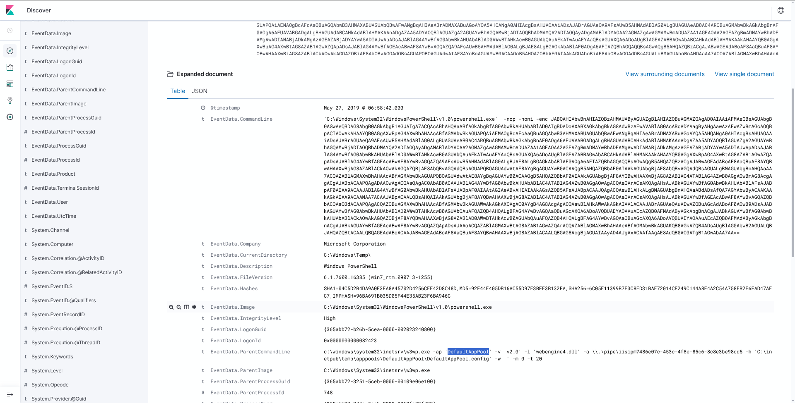
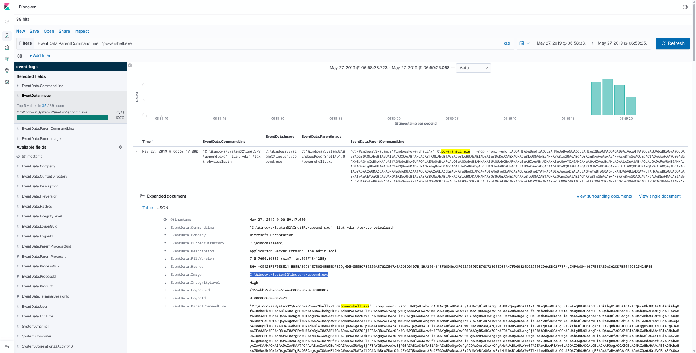

# Kibana: Windows Event Logs III — Walkthrough

> **Platform:** INE Skill Dive  
> **Category:** Cyber Security  
> **Difficulty:** Novice  
> **Estimated Time:** 30 minutes  
> **Credits:** 3 CPE  
> **Tool:** Kibana / Elasticsearch  
> **Log Source:** EVTX-ATTACK-SAMPLES  

---

## 📌 Lab Overview

This lab provides Windows Event Logs indexed in **Elasticsearch** and analyzed through the **Kibana Discover** interface.

The objective is to investigate a Base64-encoded malicious PowerShell payload executed on the server and identify:

1. The application pool associated with the IIS worker process that executed the payload.
2. The key used for further decrypting the payload before execution.
3. The image name associated with the process spawned by the payload.

---

## 🎯 Objectives

By completing this lab, we will practice:

- Searching Windows Event Logs in Kibana.
- Filtering process creation events using **KQL (Kibana Query Language)**.
- Analyzing `EventData.Image` and `EventData.ParentImage`.
- Investigating IIS worker process activity.
- Decoding Base64-encoded PowerShell.
- Identifying an embedded XOR decryption key.
- Correlating parent and child processes.

---

## 🧰 Environment

The lab environment contains:

- **Kibana**
- **Elasticsearch**
- Windows Event Logs
- Index: `event-logs`

Important fields used during the investigation:

```text
EventData.Image
EventData.ParentImage
EventData.ParentCommandLine
EventData.CommandLine
EventData.ParentProcessId
EventData.ProcessId
```

---

# 🔎 Flag 1 — Identify the Application Pool

## Step 1 — Open Kibana Discover

After launching the lab, open the provided Kibana instance and navigate to **Discover**.

Select the `event-logs` data view and set the appropriate time range covering the events.

## Step 2 — Search for the IIS Worker Process

The malicious PowerShell process is associated with an IIS worker process:

```text
C:\Windows\System32\inetsrv\w3wp.exe
```

A useful KQL filter is:

```kql
EventData.ParentImage: "C:\Windows\System32\inetsrv\w3wp.exe"
```

The relevant event shows the parent command line:

```text
c:\windows\system32\inetsrv\w3wp.exe -ap 'DefaultAppPool' -v 'v2.0' -l 'webengine4.dll' -a \\.\pipe\iisipm7486e07c-453c-4f8e-85c6-8c8e3be98cd5 -h 'C:\inetpub\temp\apppools\DefaultAppPool\DefaultAppPool.config' -w '' -m 0 -t 20
```

The important argument is:

```text
-ap 'DefaultAppPool'
```

This identifies the IIS application pool associated with the worker process.

### Evidence

<!-- IMAGE PLACEHOLDER: Kibana Windows Event Logs III lab overview -->



### ✅ Flag 1 Answer

```text
DefaultAppPool
```

---

# 🔎 Flag 2 — Identify the Key Used to Decrypt the Payload

## Step 1 — Locate the PowerShell Event

In Kibana, inspect the process creation event where the child image is:

```text
C:\Windows\System32\WindowsPowerShell\v1.0\powershell.exe
```

The event contains a long Base64-encoded PowerShell command in:

```text
EventData.ParentCommandLine
```

The encoded payload begins with:

```text
JABQAHIAbwBnAHIAZQBzAHMAUAByAGUAZgBlAHIAZQBuAGMAZQ...
```

## Step 2 — Decode the Base64 Payload

The Base64 data represents a PowerShell script encoded as UTF-16LE/Unicode text.

On Kali Linux, the payload can be decoded with:

```bash
echo 'BASE64_PAYLOAD' | base64 -d | iconv -f UTF-16LE -t UTF-8
```

The decoded PowerShell contains:

```powershell
$key=[System.Text.Encoding]::UTF8.GetBytes('8d969eef6ecad3c29a3a629280e686cf0c3f5d5a86aff3ca12020c923adc6c92');
```

Therefore, the key used by the payload is:

```text
8d969eef6ecad3c29a3a629280e686cf0c3f5d5a86aff3ca12020c923adc6c92
```

## Step 3 — Understand How the Key Is Used

The script reads the encrypted module and application code:

```powershell
$enc_module=[System.IO.File]::ReadAllBytes($path_in_module)
$enc_app_code=[System.IO.File]::ReadAllBytes($path_in_app_code)
```

It then XOR-decrypts the data using the key:

```powershell
$dec_module[$i] = $enc_module[$i] -bxor $key[$i % $key.Length]
$dec_app_code[$i] = $enc_app_code[$i] -bxor $key[$i % $key.Length]
```

The decrypted bytes are converted back to UTF-8 strings:

```powershell
$dec_module=[System.Text.Encoding]::UTF8.GetString($dec_module)
$dec_app_code=[System.Text.Encoding]::UTF8.GetString($dec_app_code)
```

Finally, the decrypted code is executed:

```powershell
($dec_module+$dec_app_code)|iex
```

### ✅ Flag 2 Answer

```text
8d969eef6ecad3c29a3a629280e686cf0c3f5d5a86aff3ca12020c923adc6c92
```

---

# 🔎 Flag 3 — Identify the Image Name Associated with the Spawned Process

## Step 1 — Examine the Process Fields

In the expanded Kibana event, compare:

```text
EventData.Image
EventData.ParentImage
```

The event shows:

```text
EventData.Image:
C:\Windows\System32\inetsrv\appcmd.exe
```

The parent process is:

```text
EventData.ParentImage:
C:\Windows\System32\WindowsPowerShell\v1.0\powershell.exe
```

This distinction is important. `powershell.exe` is the parent process, while the process created from it is `appcmd.exe`.

### Evidence

<!-- IMAGE PLACEHOLDER: Kibana expanded process event -->



### Process Relationship

```text
C:\Windows\System32\inetsrv\w3wp.exe
             |
             | spawns
             v
C:\Windows\System32\WindowsPowerShell\v1.0\powershell.exe
             |
             | spawns
             v
C:\Windows\System32\inetsrv\appcmd.exe
```

### ✅ Flag 3 Answer

```text
C:\Windows\System32\inetsrv\appcmd.exe
```
---

# 🧠 Investigation Summary

The investigation started by examining Windows process creation events in Kibana.

The parent process was the IIS worker process:

```text
C:\Windows\System32\inetsrv\w3wp.exe
```

Its command line revealed:

```text
-ap 'DefaultAppPool'
```

The child process was:

```text
C:\Windows\System32\WindowsPowerShell\v1.0\powershell.exe
```

Its command line contained a Base64-encoded PowerShell payload.

After decoding the payload, the embedded key was identified as:

```text
8d969eef6ecad3c29a3a629280e686cf0c3f5d5a86aff3ca12020c923adc6c92
```

The key was used for byte-level XOR decryption before the resulting code was executed with `IEX`.

This payload eventually spawned the `appcmd.exe` process:

```text
C:\Windows\System32\inetsrv\appcmd.exe
```
---

# 🏁 Final Answers

| Question | Answer |
|---|---|
| Application pool associated with the IIS worker process | **DefaultAppPool** |
| Key used for further decrypting the payload | **8d969eef6ecad3c29a3a629280e686cf0c3f5d5a86aff3ca12020c923adc6c92** |
| Image name associated with the spawned process | **C:\Windows\System32\inetsrv\appcmd.exe** |

---

# 🛡️ Key SOC Takeaways

### 1. Parent and Child Process Analysis

`EventData.Image` identifies the process in the event, while `EventData.ParentImage` identifies its parent process.

In this investigation:

```text
w3wp.exe → powershell.exe → appcmd.exe
```

### 2. IIS Worker Process Monitoring

`w3wp.exe` is the IIS worker process. PowerShell execution originating from an IIS worker process is important telemetry to investigate because it connects web-server activity with command execution.

### 3. Encoded PowerShell

A long Base64 string inside a PowerShell command line can conceal the actual script content.

Decoding the string exposes the PowerShell logic and can reveal hard-coded values such as encryption/decryption keys.

### 4. XOR Decryption

The payload uses the `-bxor` operator with the extracted key:

```powershell
$enc_module[$i] -bxor $key[$i % $key.Length]
```

This provides a useful indicator when analyzing similar PowerShell payloads.

---

# 📚 References

- INE Skill Dive — **Kibana: Windows Event Logs III**
- Log source: **EVTX-ATTACK-SAMPLES**
- Kibana Discover / KQL
- Windows Event Log process creation telemetry

---

## 📝 Notes

This walkthrough documents the investigation performed in the INE lab environment and the evidence observed through Kibana Discover.

> **Lab completed:** 3 / 3 flags captured ✅
