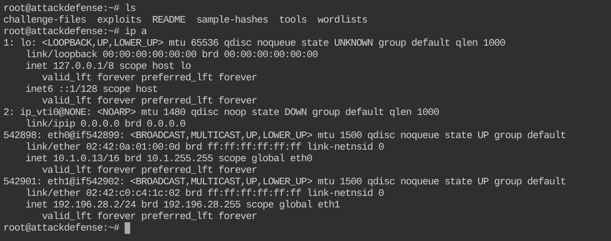
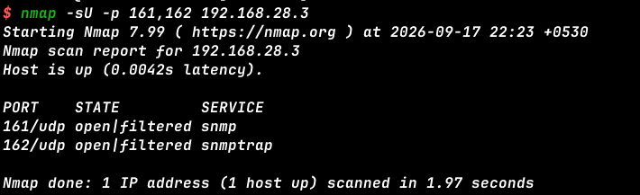
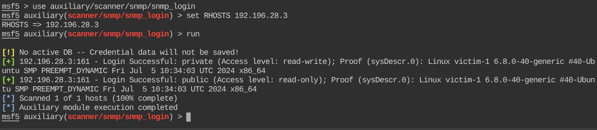

# SNMP Recon: Basics --- INE Lab Walkthrough

> **Lab:** SNMP Recon: Basics\
> **Platform:** INE / AttackDefense\
> **Category:** Network Reconnaissance / Enumeration\
> **Target:** `192.196.28.3`\
> **Attacker interface:** `eth1`\
> **SNMP:** UDP/161
>
> This walkthrough documents the commands, reasoning, output, and
> answers obtained during the authorized lab.

------------------------------------------------------------------------

## 1. Introduction

### What is SNMP?

**SNMP (Simple Network Management Protocol)** is an application-layer
protocol used to monitor and manage network-connected devices.

SNMP can expose useful information such as:

-   System information
-   Running processes
-   Network interfaces
-   Interface status
-   Device configuration information
-   Other management data stored in the MIB

SNMP commonly uses:

  Port    Protocol   Purpose
  ------- ---------- -----------------------------
  `161`   UDP        SNMP requests and responses
  `162`   UDP        SNMP traps

SNMP enumeration is therefore useful during authorized security
assessments because a poorly configured SNMP service can disclose
information about the target.

Reference:\
https://www.geeksforgeeks.org/ethical-hacking/snmp-enumeration/

------------------------------------------------------------------------

# 2. Lab Network Identification

Before scanning the target, identify the network interfaces on the
AttackDefense machine.

### Command

``` bash
ip a
```

### Important output

The lab machine has:

``` text
eth0  -> 10.1.0.13/16
eth1  -> 192.196.28.2/24
```

The target is:

``` text
192.196.28.3
```

Therefore, `eth1` must be used when communicating with the target.

### Why `-e eth1` is used

Nmap's `-e` option specifies the network interface to use.

``` bash
-e eth1
```

This is useful when the machine has multiple network interfaces and we
need to ensure that the scan goes through the correct lab network.

### Screenshot Placeholder



*Caption: AttackDefense machine network interfaces showing eth1 as 192.196.28.2/24.*

------------------------------------------------------------------------

# 3. Step 1 --- Discover SNMP Ports

The first step is to determine whether SNMP is available on the target.

SNMP uses UDP, so we perform a UDP scan.

### Command

``` bash
nmap -sU -p 161,162 192.168.28.3
```

> **Note:** This screenshot was captured during the initial scan. For
> the actual INE target used throughout the lab, the target is
> `192.196.28.3` and the lab interface is `eth1`.

### Observed result

``` text
161/udp  open|filtered  snmp
162/udp  open|filtered  snmptrap
```

This indicates that the target may be exposing SNMP services.

### Screenshot Placeholder



*Caption: Initial UDP scan identifying SNMP ports 161 and 162.*

### Key concept

-   **UDP/161** → SNMP queries and responses
-   **UDP/162** → SNMP traps

According to the GeeksforGeeks SNMP enumeration reference, UDP/161 is
used for SNMP queries and UDP/162 is used for traps.

------------------------------------------------------------------------

# 4. Step 2 --- Identify Running Processes with Nmap

Nmap provides an NSE script called `snmp-processes` that can query the
target through SNMP and enumerate running processes.

### Command

``` bash
nmap -e eth1 -sU -p 161 --script snmp-processes 192.196.28.3
```

### Important output

``` text
1:
    Name: sh
    Path: /bin/sh
    Params: -c "/startup.sh"

7:
    Name: startup.sh
    Path: /bin/bash
    Params: /startup.sh

10:
    Name: snmpd
    Path: snmpd

11:
    Name: supervisord
    Path: /usr/bin/python
    Params: /usr/bin/supervisord -n
```

### Enumerated processes

``` text
sh
startup.sh
snmpd
supervisord
```

### What we learned

The SNMP service is running as `snmpd`, and the system also has
`supervisord` and a startup script.

### Screenshot Placeholder


*Caption: Nmap SNMP process enumeration showing sh, startup.sh, snmpd and supervisord.*

------------------------------------------------------------------------

# 5. Step 3 --- Enumerate Processes Using snmpwalk

The same information can be obtained directly through SNMP using
`snmpwalk`.

The following OID belongs to the Host Resources MIB and is used to
enumerate running software/process names.

### Command

``` bash
snmpwalk -v2c -c public 192.196.28.3 1.3.6.1.2.1.25.4.2.1.2
```

### Explanation

``` text
-v2c
```

Uses SNMP version 2c.

``` text
-c public
```

Uses the SNMP community string `public`.

``` text
192.196.28.3
```

Specifies the target.

``` text
1.3.6.1.2.1.25.4.2.1.2
```

Specifies the OID containing process/software names.

### Output

``` text
HOST-RESOURCES-MIB::hrSWRunName.1 = STRING: "sh"
HOST-RESOURCES-MIB::hrSWRunName.7 = STRING: "startup.sh"
HOST-RESOURCES-MIB::hrSWRunName.10 = STRING: "snmpd"
HOST-RESOURCES-MIB::hrSWRunName.11 = STRING: "supervisord"
```

### Screenshot Placeholder


*Caption: snmpwalk querying the Host Resources MIB for running process names.*

### Key takeaway

`snmpwalk` allows us to query a hierarchy of SNMP objects starting from
a specified OID. This makes it useful for systematic SNMP enumeration.

------------------------------------------------------------------------

# 6. Step 4 --- Brute-Force SNMP Community Strings

SNMPv1 and SNMPv2c use **community strings** as a form of access
control.

Common default or weak community strings include:

``` text
public
private
```

Nmap provides the `snmp-brute` NSE script to test community strings.

### Command

``` bash
nmap -e eth1 -sU -p 161 --script snmp-brute 192.196.28.3
```

### Output

``` text
| snmp-brute:
|   public - Valid credentials
|_  private - Valid credentials
```

### Result

Both community strings are valid:

``` text
public
private
```

### Screenshot Placeholder


*Caption: Nmap snmp-brute identifying public and private as valid community strings.*

### Why this matters

A weak or default SNMP community string can expose management
information to unauthorized users.

The GeeksforGeeks reference describes community strings such as `public`
and `private` as acting similarly to a password for SNMP access.

------------------------------------------------------------------------

# 7. Step 5 --- Validate Community Strings with Metasploit

Nmap identified `public` and `private`. We can validate them using the
Metasploit Framework.

Start Metasploit:

``` bash
msfconsole
```

Select the SNMP login scanner:

``` text
use auxiliary/scanner/snmp/snmp_login
```

Set the target:

``` text
set RHOSTS 192.196.28.3
```

Run the module:

``` text
run
```

### Important output

``` text
[+] 192.196.28.3:161 - Login Successful: private
    (Access level: read-write)

[+] 192.196.28.3:161 - Login Successful: public
    (Access level: read-only)
```

### Final finding

``` text
public (read-only access)
private (read-write access)
```

### Screenshot Placeholder



*Caption: Metasploit snmp_login module validating public and private community strings and their access levels.*

### Understanding the difference

  Community String   Access
  ------------------ ------------
  `public`           Read-only
  `private`          Read-write

This distinction is important. Read-only access allows information
retrieval, while read-write access can potentially permit modification
of supported SNMP-managed values.

------------------------------------------------------------------------

# 8. Step 6 --- Enumerate Network Interfaces with Nmap

After identifying valid SNMP credentials, we can enumerate network
interfaces.

Nmap's `snmp-interfaces` NSE script is useful for this purpose.

### Command

``` bash
nmap -e eth1 -sU -p 161 --script snmp-interfaces 192.196.28.3
```

### Important output

``` text
lo
    IP address: 127.0.0.1
    Netmask: 255.0.0.0
    Type: softwareLoopback
    Status: up

ip_vti0
    Type: tunnel
    Status: down

eth0
    MAC address: 02:42:c0:c4:1c:03
    Type: ethernetCsmacd
    Status: up
```

### Interfaces discovered

``` text
lo
ip_vti0
eth0
```

### Screenshot Placeholder


*Caption: Nmap SNMP interface enumeration showing lo, ip_vti0 and eth0.*

### Interesting observation

The attacking machine communicates with the target through its own
`eth1`, but the target's SNMP enumeration exposes the target's
interfaces:

``` text
lo
ip_vti0
eth0
```

This is a good example of why enumeration should not assume that the
attacker's interface names will match the target's interface names.

------------------------------------------------------------------------

# 9. Step 7 --- Enumerate Interface Descriptions with snmpwalk

We can verify the interface names directly through SNMP.

The following OID corresponds to `ifDescr`, which contains interface
descriptions.

### Command

``` bash
snmpwalk -v2c -c public 192.196.28.3 1.3.6.1.2.1.2.2.1.2
```

### Output

``` text
IF-MIB::ifDescr.1 = STRING: lo
IF-MIB::ifDescr.2 = STRING: ip_vti0
IF-MIB::ifDescr.542903 = STRING: eth0
```

### Enumerated interfaces

``` text
lo
ip_vti0
eth0
```

### Screenshot Placeholder


*Caption: snmpwalk querying IF-MIB::ifDescr to enumerate the target's network interfaces.*

### Why the last index looks unusual

The final entry is:

``` text
ifDescr.542903
```

The numeric index is an SNMP interface index. It does not need to match
a simple sequence such as `1`, `2`, `3`.

The important information for the lab is the returned interface
description:

``` text
eth0
```

------------------------------------------------------------------------

# 10. Lab Questions and Answers

## Question 1

**Which ports are associated with SNMP?**

``` text
161/UDP and 162/UDP
```

-   `161/UDP` → SNMP requests/responses
-   `162/UDP` → SNMP traps

------------------------------------------------------------------------

## Question 2

**Which processes were identified using SNMP process enumeration?**

``` text
sh
startup.sh
snmpd
supervisord
```

------------------------------------------------------------------------

## Question 3

**Which processes were returned using the Host Resources MIB?**

``` text
sh
startup.sh
snmpd
supervisord
```

------------------------------------------------------------------------

## Question 4

**Which SNMP community strings were valid?**

``` text
public
private
```

------------------------------------------------------------------------

## Question 5

**List valid community strings and their access levels using the
Metasploit `snmp_login` module.**

``` text
public (read-only access) and private (read-write access)
```

------------------------------------------------------------------------

## Question 6

**Which network interfaces were discovered?**

``` text
lo
ip_vti0
eth0
```

Answer format used in the lab:

``` text
lo,ip_vti0,eth0
```

------------------------------------------------------------------------

## Question 7

**Which interface descriptions were returned by `ifDescr`?**

``` text
lo
ip_vti0
eth0
```

Answer format used in the lab:

``` text
lo,ip_vti0,eth0
```

------------------------------------------------------------------------

# 11. Complete Command Reference

For quick revision, the important commands from this lab are:

### Identify interfaces

``` bash
ip a
```

### Scan SNMP ports

``` bash
nmap -sU -p 161,162 192.168.28.3
```

### Enumerate processes with Nmap

``` bash
nmap -e eth1 -sU -p 161 --script snmp-processes 192.196.28.3
```

### Enumerate processes with snmpwalk

``` bash
snmpwalk -v2c -c public 192.196.28.3 1.3.6.1.2.1.25.4.2.1.2
```

### Discover community strings

``` bash
nmap -e eth1 -sU -p 161 --script snmp-brute 192.196.28.3
```

### Validate community strings with Metasploit

``` text
msfconsole
use auxiliary/scanner/snmp/snmp_login
set RHOSTS 192.196.28.3
run
```

### Enumerate interfaces with Nmap

``` bash
nmap -e eth1 -sU -p 161 --script snmp-interfaces 192.196.28.3
```

### Enumerate interfaces with snmpwalk

``` bash
snmpwalk -v2c -c public 192.196.28.3 1.3.6.1.2.1.2.2.1.2
```

------------------------------------------------------------------------

# 12. What We Learned

This lab demonstrated a practical SNMP enumeration workflow:

``` text
Identify network
      ↓
Discover SNMP
      ↓
Identify UDP/161
      ↓
Enumerate processes
      ↓
Discover community strings
      ↓
Validate access with Metasploit
      ↓
Enumerate network interfaces
      ↓
Query specific MIB/OID data
```

The important lesson is that **SNMP can disclose a surprising amount of
system information when it is poorly configured**.

In this lab, SNMP allowed us to discover:

-   Running processes
-   SNMP community strings
-   Community-string access levels
-   Network interfaces
-   Interface descriptions
-   Target system information through Metasploit's proof output

------------------------------------------------------------------------

# 13. Security Recommendations

For a real production environment:

### 1. Avoid default community strings

Do not use predictable values such as:

``` text
public
private
```

### 2. Restrict SNMP access

Only trusted monitoring systems should be allowed to communicate with
SNMP services.

### 3. Prefer SNMPv3

SNMPv3 provides authentication and security features that are not
available in the same way with SNMPv1/v2c.

### 4. Restrict UDP/161 and UDP/162

Firewall SNMP traffic so that it is accessible only where required.

### 5. Monitor SNMP activity

Unexpected SNMP queries can indicate reconnaissance or unauthorized
monitoring activity.

------------------------------------------------------------------------

# 14. Reference

Primary learning reference:

**GeeksforGeeks --- SNMP Enumeration**

https://www.geeksforgeeks.org/ethical-hacking/snmp-enumeration/

The reference covers SNMP enumeration concepts, UDP/161 and UDP/162,
community strings, `snmpwalk`, `nmap` SNMP NSE scripts, MIB/OID
concepts, and defensive measures.

------------------------------------------------------------------------

# 15. Conclusion

The **SNMP Recon: Basics** lab demonstrated how an authorized security
tester can use Nmap, `snmpwalk`, and Metasploit to systematically
enumerate an SNMP-enabled target.

The most important practical workflow to remember is:

``` text
Nmap
  ↓
SNMP discovery
  ↓
NSE enumeration
  ↓
snmpwalk
  ↓
Community-string discovery
  ↓
Metasploit validation
  ↓
MIB/OID enumeration
```

This forms a useful foundation for deeper network enumeration and
vulnerability assessment.
