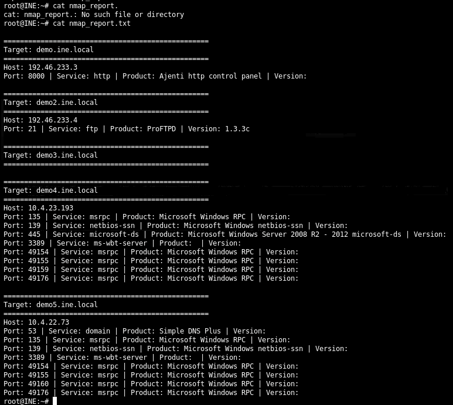
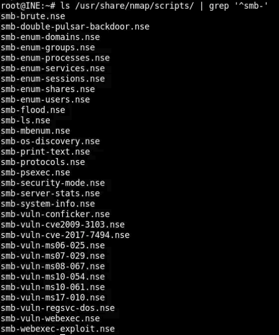
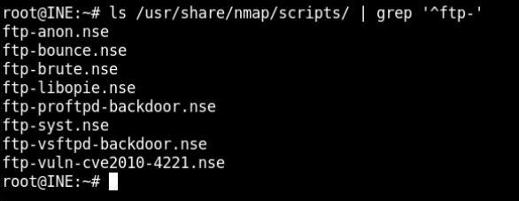
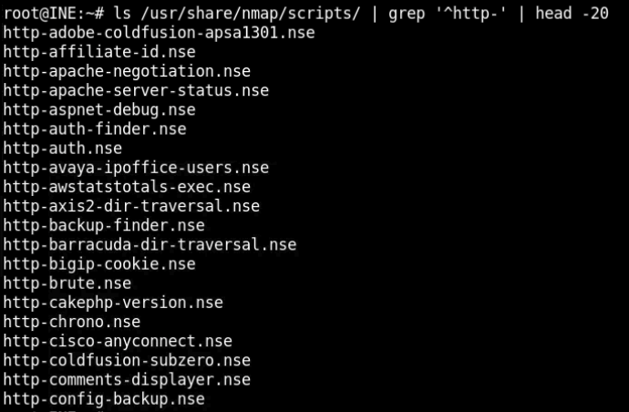
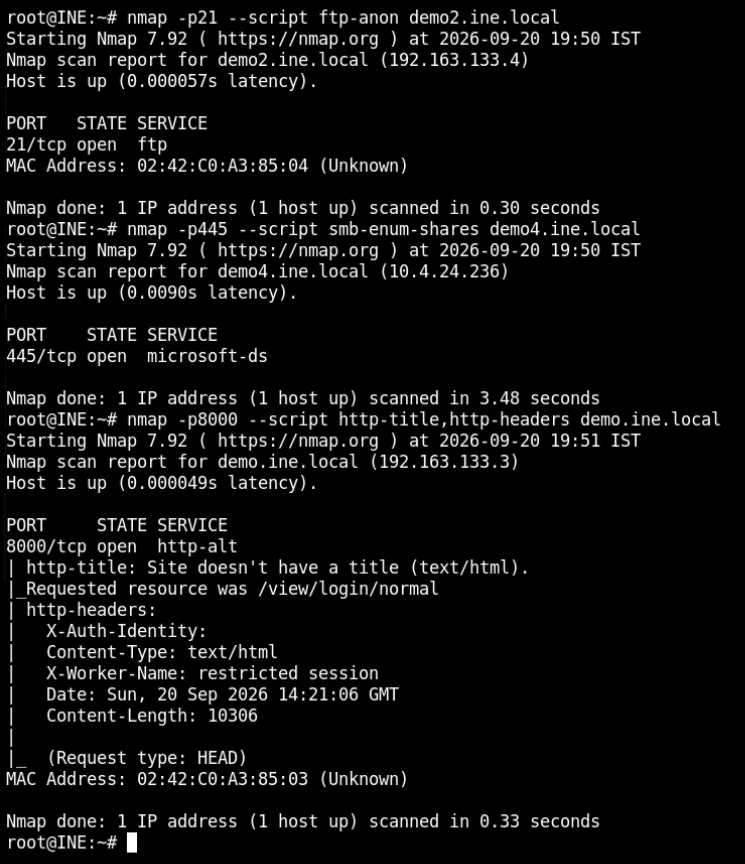
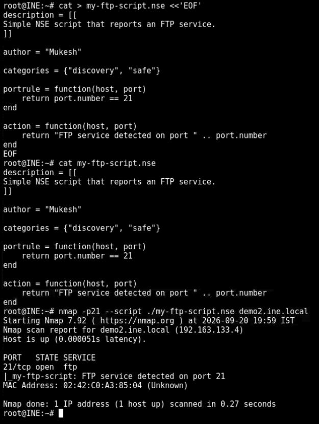
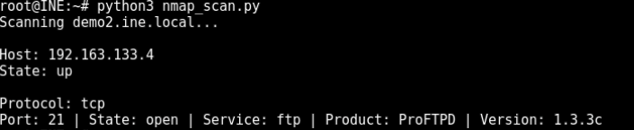
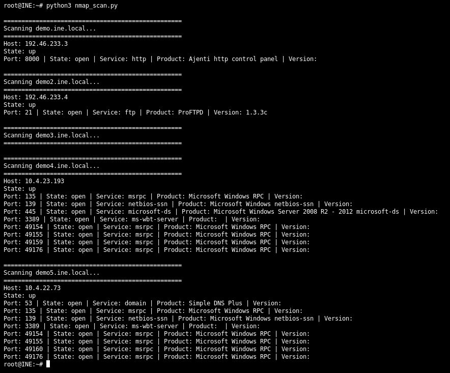

# Service Discovery and Fingerprinting with Nmap --- Detailed Walkthrough

## 📌 Lab Information

**Platform:** INE Skill Dive\
**Lab:** Service Discovery and Fingerprinting with Nmap\
**Category:** Cyber Security / Professional\
**Estimated Time:** 30 minutes\
**Primary Tools:** Nmap, NSE, Lua, Python

------------------------------------------------------------------------

## 🎯 Lab Objective

The objective of this lab is to learn how to discover network services,
identify running software and versions, use Nmap Scripting Engine (NSE)
scripts, write a simple custom NSE script, and automate Nmap scans with
Python.

### Learning objectives

-   Perform basic and specific Nmap scans
-   Discover open ports
-   Perform service and version fingerprinting
-   Use Nmap NSE scripts
-   Understand the structure of an NSE script
-   Write and execute a custom NSE script
-   Automate Nmap scanning with Python
-   Generate a simple reconnaissance report

------------------------------------------------------------------------

# 1. Lab Environment

The lab provides several target machines:

``` text
demo.ine.local
demo2.ine.local
demo3.ine.local
demo4.ine.local
demo5.ine.local
```

> **Note:** The lab environment can dynamically assign different IP
> addresses when the lab is restarted. Therefore, the IP addresses shown
> in this walkthrough are the addresses observed during this lab
> session.

------------------------------------------------------------------------

# 2. Target Discovery and Hostname Resolution

Before scanning the targets, we checked whether the lab hostnames
resolved correctly.

### Command

``` bash
for host in demo demo2 demo3 demo4 demo5; do
    echo "===== $host.ine.local ====="
    getent hosts "$host.ine.local"
done
```

This helps map:

``` text
Hostname → IP address
```

During the session, the targets resolved to addresses such as:

``` text
demo.ine.local   → 192.46.233.3
demo2.ine.local  → 192.46.233.4
demo3.ine.local  → 10.x.x.x
demo4.ine.local  → 10.4.23.193
demo5.ine.local  → 10.4.22.73
```

The exact IP addresses may change when the INE lab environment is
restarted.

### Why this matters

In a penetration test, hostname resolution is an important early
reconnaissance step. It establishes which IP address should be scanned
and helps keep scan results associated with the correct target.

------------------------------------------------------------------------

# 3. Basic Nmap Service Discovery

Nmap can be used to identify open ports and the services associated with
them.

A basic scan can be performed with:

``` bash
nmap <target>
```

For example:

``` bash
nmap demo.ine.local
```

A basic scan tells us which commonly used TCP ports are open.

The general workflow is:

``` text
Target
  ↓
Nmap scan
  ↓
Open ports
  ↓
Identify services
```

------------------------------------------------------------------------

# 4. Service and Version Detection with `-sV`

After identifying the targets, we performed service and version
detection.

### Command

``` bash
nmap -sV demo.ine.local demo2.ine.local demo3.ine.local demo4.ine.local demo5.ine.local
```

The `-sV` option enables **service/version detection**.

Instead of only reporting:

``` text
21/tcp open ftp
```

Nmap attempts to determine the actual software:

``` text
21/tcp open ftp ProFTPD 1.3.3c
```

This is called **service fingerprinting**.

------------------------------------------------------------------------

## 4.1 Fingerprinting Results

### `demo.ine.local`

``` text
8000/tcp open http Ajenti http control panel
```

An HTTP service was found on port `8000`, running an Ajenti control
panel.

------------------------------------------------------------------------

### `demo2.ine.local`

``` text
21/tcp open ftp ProFTPD 1.3.3c
```

An FTP service was found on port `21`, and Nmap identified the software
as ProFTPD version `1.3.3c`.

------------------------------------------------------------------------

### `demo3.ine.local`

No usable service result was returned during the scan.

This does **not** automatically mean the machine does not exist. It
means that the scan did not receive usable results at that time.

------------------------------------------------------------------------

### `demo4.ine.local`

Important ports identified included:

``` text
135/tcp   MSRPC
139/tcp   NetBIOS
445/tcp   Microsoft-DS / SMB
3389/tcp  RDP
49154+    MSRPC
```

Nmap identified the host as a Windows system and reported Windows Server
information for SMB.

------------------------------------------------------------------------

### `demo5.ine.local`

Important services included:

``` text
53/tcp    DNS / Simple DNS Plus
135/tcp   MSRPC
139/tcp   NetBIOS
3389/tcp  RDP
49154+    MSRPC
```

Nmap identified Simple DNS Plus on port `53` and several Windows-related
services.

------------------------------------------------------------------------

## 📸 Screenshot --- Service and Version Detection

**Placeholder:**



------------------------------------------------------------------------

# 5. Understanding Why Service Fingerprinting Matters

A port number alone does not always tell us what software is actually
running.

For example:

``` text
8000/tcp → HTTP
```

Port `8000` is not the standard HTTP port, but Nmap identified an HTTP
service there.

Similarly:

``` text
21/tcp → FTP → ProFTPD 1.3.3c
```

The version information can help a security tester determine what
further enumeration or security testing may be appropriate.

The reconnaissance process can therefore be viewed as:

``` text
Open port
    ↓
Service identification
    ↓
Software identification
    ↓
Version detection
    ↓
Targeted enumeration
```

------------------------------------------------------------------------

# 6. Nmap Scripting Engine (NSE)

Nmap includes the **Nmap Scripting Engine (NSE)**.

NSE allows Nmap to perform additional tasks using scripts written
primarily in **Lua**.

NSE scripts can be used for tasks such as:

-   Service enumeration
-   Authentication checks
-   Information gathering
-   Protocol-specific enumeration
-   Configuration checks
-   Vulnerability detection

Nmap stores its NSE scripts in:

``` bash
/usr/share/nmap/scripts/
```

------------------------------------------------------------------------

# 7. Exploring NSE Scripts

We checked the available SMB scripts:

``` bash
ls /usr/share/nmap/scripts/ | grep '^smb-'
```

Examples included:

``` text
smb-enum-domains.nse
smb-enum-groups.nse
smb-enum-processes.nse
smb-enum-services.nse
smb-enum-shares.nse
smb-enum-users.nse
smb-os-discovery.nse
smb-protocols.nse
smb-system-info.nse
```

There were also SMB vulnerability-checking scripts.

### 📸 Screenshot --- SMB NSE Scripts



------------------------------------------------------------------------

## 7.1 FTP NSE Scripts

We checked FTP-related scripts:

``` bash
ls /usr/share/nmap/scripts/ | grep '^ftp-'
```

Examples:

``` text
ftp-anon.nse
ftp-bounce.nse
ftp-brute.nse
ftp-libopie.nse
ftp-proftpd-backdoor.nse
ftp-syst.nse
ftp-vsftpd-backdoor.nse
ftp-vuln-cve2010-4221.nse
```

### 📸 Screenshot --- FTP NSE Scripts



------------------------------------------------------------------------

## 7.2 HTTP NSE Scripts

We also inspected HTTP-related scripts:

``` bash
ls /usr/share/nmap/scripts/ | grep '^http-' | head -20
```

Examples included:

``` text
http-auth.nse
http-auth-finder.nse
http-backup-finder.nse
http-bigip-cookie.nse
http-brute.nse
http-comments-displayer.nse
http-config-backup.nse
```

### 📸 Screenshot --- HTTP NSE Scripts



------------------------------------------------------------------------

# 8. Using NSE for FTP Enumeration

The `demo2.ine.local` target exposed FTP on port `21`.

We used the `ftp-anon` NSE script:

``` bash
nmap -p21 --script ftp-anon demo2.ine.local
```

### Purpose of `ftp-anon`

The `ftp-anon` script checks whether an FTP server permits anonymous
authentication.

The result showed:

``` text
21/tcp open ftp
```

No anonymous-login message was returned.

Therefore, based on this scan, we **did not confirm anonymous FTP
access**.

### Important lesson

An NSE script not returning a finding does not necessarily mean that a
service is secure. It means that this particular check did not report
the condition it was designed to detect.

------------------------------------------------------------------------

# 9. Using NSE for SMB Enumeration

The `demo4.ine.local` target exposed SMB on port `445`.

We tested share enumeration with:

``` bash
nmap -p445 --script smb-enum-shares demo4.ine.local
```

The scan confirmed:

``` text
445/tcp open microsoft-ds
```

No share listing was returned by this check.

Again, the correct interpretation is:

> The selected NSE check did not return share information during this
> scan.

### 📸 Screenshot --- NSE Enumeration



------------------------------------------------------------------------

# 10. Using NSE for HTTP Enumeration

The `demo.ine.local` target exposed HTTP on port `8000`.

We used:

``` bash
nmap -p8000 --script http-title,http-headers demo.ine.local
```

The result provided useful information:

``` text
8000/tcp open http-alt
```

Nmap also reported:

``` text
http-title: Site doesn't have a title (text/html).
Requested resource was /view/login/normal
```

The HTTP headers included information such as:

``` text
Content-Type: text/html
X-Worker-Name: restricted session
Content-Length: 10306
```

This demonstrates how NSE can provide information that is not obvious
from the port number alone.

------------------------------------------------------------------------

# 11. Understanding an Existing NSE Script

To understand how NSE works internally, we inspected:

``` bash
cat /usr/share/nmap/scripts/ftp-anon.nse
```

The script imports Nmap libraries such as:

``` lua
local ftp = require "ftp"
local nmap = require "nmap"
local shortport = require "shortport"
local stdnse = require "stdnse"
```

------------------------------------------------------------------------

## 11.1 Script Description

The script contains:

``` lua
description = [[
Checks if an FTP server allows anonymous logins.
]]
```

This describes the purpose of the script.

------------------------------------------------------------------------

## 11.2 Script Categories

The script contains:

``` lua
categories = {"default", "auth", "safe"}
```

These categories help Nmap classify the script.

------------------------------------------------------------------------

## 11.3 `portrule`

One of the most important sections is:

``` lua
portrule = shortport.port_or_service({21,990}, {"ftp","ftps"})
```

This tells Nmap when the script should run.

In simple terms:

> Run the script when the target appears to provide FTP/FTPS,
> particularly on the relevant ports.

------------------------------------------------------------------------

## 11.4 `action`

The main work is performed by:

``` lua
action = function(host, port)
```

The script connects to the FTP service and attempts anonymous
authentication.

Conceptually:

``` text
Connect to FTP
      ↓
Try anonymous authentication
      ↓
Login successful?
   /          \
 Yes           No
  ↓             ↓
List files     Stop
  ↓
Check permissions
  ↓
Display results
```

------------------------------------------------------------------------

## 11.5 Anonymous Authentication

The script attempts:

``` lua
ftp.auth(socket, buffer, "anonymous", "IEUser@")
```

This represents the anonymous FTP authentication check.

If successful, the script reports that anonymous FTP login is allowed.

------------------------------------------------------------------------

## 11.6 Directory Listing

If authentication succeeds, the script can request a directory listing
using:

``` text
LIST
```

It then processes the returned directory information.

------------------------------------------------------------------------

## 11.7 Permission Checking

The script also examines the directory listing for writable entries.

If it identifies a writable item, it can append:

``` text
[NSE: writeable]
```

This shows how an NSE script can combine authentication testing with
additional enumeration.

------------------------------------------------------------------------

# 12. Writing a Custom NSE Script

To understand NSE scripting practically, we created a small custom
script.

### Create the script

``` bash
cat > my-ftp-script.nse <<'EOF'
description = [[
Simple NSE script that reports an FTP service.
]]

author = "Mukesh"

categories = {"discovery", "safe"}

portrule = function(host, port)
    return port.number == 21
end

action = function(host, port)
    return "FTP service detected on port " .. port.number
end
EOF
```

------------------------------------------------------------------------

## 12.1 Review the Script

``` bash
cat my-ftp-script.nse
```

The script contains three important ideas:

### Description

``` lua
description = [[
Simple NSE script that reports an FTP service.
]]
```

Explains what the script does.

### Port Rule

``` lua
portrule = function(host, port)
    return port.number == 21
end
```

The script only runs when the port number is `21`.

### Action

``` lua
action = function(host, port)
    return "FTP service detected on port " .. port.number
end
```

Returns a message containing the detected port.

------------------------------------------------------------------------

## 12.2 Run the Custom NSE Script

We executed:

``` bash
nmap -p21 --script ./my-ftp-script.nse demo2.ine.local
```

The result included:

``` text
21/tcp open ftp
|_my-ftp-script: FTP service detected on port 21
```

This confirmed that the custom NSE script executed successfully.

### 📸 Screenshot --- Custom NSE Script



------------------------------------------------------------------------

# 13. NSE Script Structure --- Quick Summary

A simple NSE script can be understood as:

``` text
NSE Script
   │
   ├── Metadata
   │
   ├── portrule
   │      └── When should the script run?
   │
   └── action
          └── What should the script do?
```

The most important concept is:

> **`portrule` decides when the script runs; `action` defines what it
> does.**

------------------------------------------------------------------------

# 14. Python Automation with `python-nmap`

The lab also includes automation with Python.

We first checked the installed Python version:

``` bash
python3 --version
```

The lab environment returned:

``` text
Python 3.9.9
```

Then we checked the Python Nmap library:

``` bash
python3 -c "import nmap; print(nmap.__version__)"
```

The installed `python-nmap` version was:

``` text
0.6.1
```

This allowed us to control Nmap from Python.

------------------------------------------------------------------------

# 15. Basic Python Nmap Automation

We created:

``` text
nmap_scan.py
```

The script uses:

``` python
import nmap
```

and creates an Nmap scanner:

``` python
scanner = nmap.PortScanner()
```

We then scanned:

``` python
target = "demo2.ine.local"
```

using:

``` python
scanner.scan(target, arguments="-sV")
```

The script parsed the returned Nmap information and displayed:

``` text
Host
State
Protocol
Port
State
Service
Product
Version
```

### Example result

``` text
Host: 192.163.133.4
State: up

Protocol: tcp
Port: 21 | State: open | Service: ftp | Product: ProFTPD | Version: 1.3.3c
```

### 📸 Screenshot --- Python Nmap Scan



------------------------------------------------------------------------

# 16. Automating All Lab Targets

The script was then expanded to process the complete target list:

``` python
targets = [
    "demo.ine.local",
    "demo2.ine.local",
    "demo3.ine.local",
    "demo4.ine.local",
    "demo5.ine.local"
]
```

A loop processes each target:

``` python
for target in targets:
    scanner.scan(target, arguments="-sV")
```

This removes the need to manually run Nmap against each target.

### Run the automation

``` bash
python3 nmap_scan.py
```

The script produced service information for the targets that returned
scan results.

### 📸 Screenshot --- Automated Python Scan



------------------------------------------------------------------------

# 17. Automated Scan Findings

The automated scan produced the following findings during this lab
session.

  Target                Port Service         Product / Information
  ------------------- ------ --------------- ---------------------------
  `demo.ine.local`      8000 HTTP            Ajenti HTTP control panel
  `demo2.ine.local`       21 FTP             ProFTPD 1.3.3c
  `demo3.ine.local`      --- ---             No usable result returned
  `demo4.ine.local`      135 MSRPC           Microsoft Windows RPC
  `demo4.ine.local`      139 NetBIOS         Microsoft Windows NetBIOS
  `demo4.ine.local`      445 Microsoft-DS    Windows SMB
  `demo4.ine.local`     3389 MS-WBT-Server   RDP
  `demo5.ine.local`       53 DNS             Simple DNS Plus
  `demo5.ine.local`      135 MSRPC           Microsoft Windows RPC
  `demo5.ine.local`      139 NetBIOS         Microsoft Windows NetBIOS
  `demo5.ine.local`     3389 MS-WBT-Server   RDP

Additional dynamic MSRPC ports were also detected on the Windows
targets.

------------------------------------------------------------------------

# 18. Generating a Reconnaissance Report

To make the automation more useful, we created:

``` text
nmap_report.py
```

The script performs the scan and writes the results to:

``` text
nmap_report.txt
```

The report contains sections such as:

``` text
==================================================
Target: demo.ine.local
==================================================
Host: 192.46.233.3
Port: 8000 | Service: http | Product: Ajenti http control panel
```

and:

``` text
==================================================
Target: demo2.ine.local
==================================================
Host: 192.46.233.4
Port: 21 | Service: ftp | Product: ProFTPD | Version: 1.3.3c
```

### View the report

``` bash
cat nmap_report.txt
```

### 📸 Screenshot --- Generated Nmap Report


------------------------------------------------------------------------

# 19. Reconnaissance Workflow

The complete workflow used in this lab was:

``` text
                 Target Discovery
                       │
                       ▼
                 Port Scanning
                       │
                       ▼
            Service Identification
                       │
                       ▼
          Version Fingerprinting
                       │
                       ▼
              NSE Enumeration
                       │
             ┌─────────┴─────────┐
             ▼                   ▼
       Existing NSE         Custom NSE
          scripts              script
             │                   │
             └─────────┬─────────┘
                       ▼
                Python Automation
                       │
                       ▼
              Report Generation
```

------------------------------------------------------------------------

# 20. Important Commands Used

### Hostname resolution

``` bash
getent hosts demo.ine.local
```

### Service/version detection

``` bash
nmap -sV demo.ine.local
```

### Scan multiple targets

``` bash
nmap -sV demo.ine.local demo2.ine.local demo3.ine.local demo4.ine.local demo5.ine.local
```

### FTP anonymous enumeration

``` bash
nmap -p21 --script ftp-anon demo2.ine.local
```

### SMB share enumeration

``` bash
nmap -p445 --script smb-enum-shares demo4.ine.local
```

### HTTP enumeration

``` bash
nmap -p8000 --script http-title,http-headers demo.ine.local
```

### View NSE scripts

``` bash
ls /usr/share/nmap/scripts/
```

### Search for service-specific scripts

``` bash
ls /usr/share/nmap/scripts/ | grep '^ftp-'
ls /usr/share/nmap/scripts/ | grep '^smb-'
ls /usr/share/nmap/scripts/ | grep '^http-'
```

### Inspect an NSE script

``` bash
cat /usr/share/nmap/scripts/ftp-anon.nse
```

### Run a custom NSE script

``` bash
nmap -p21 --script ./my-ftp-script.nse demo2.ine.local
```

### Check Python

``` bash
python3 --version
```

### Check python-nmap

``` bash
python3 -c "import nmap; print(nmap.__version__)"
```

### Run Python automation

``` bash
python3 nmap_scan.py
```

### View generated report

``` bash
cat nmap_report.txt
```

------------------------------------------------------------------------

# 21. Key Concepts Learned

## Nmap

Nmap is used for network discovery and security auditing. In this lab,
it was used to identify open ports and services.

## Service Fingerprinting

Service fingerprinting attempts to identify the software and version
behind an open port.

``` bash
nmap -sV <target>
```

## NSE

Nmap Scripting Engine extends Nmap with Lua-based scripts for additional
enumeration and security checks.

## `portrule`

Determines when an NSE script should run.

## `action`

Contains the main logic executed by the NSE script.

## Python Automation

`python-nmap` allows Python programs to execute Nmap scans and process
the results programmatically.

## Report Generation

The scan results can be converted into structured output and saved for
later analysis or documentation.

------------------------------------------------------------------------

# 22. Final Takeaways

The most important lesson from this lab is that reconnaissance is a
process rather than a single command.

A useful workflow is:

``` text
1. Identify targets
2. Discover open ports
3. Identify services
4. Fingerprint versions
5. Select relevant NSE scripts
6. Perform targeted enumeration
7. Automate repetitive tasks
8. Save and analyze the results
```

The lab also demonstrated how Nmap can be extended beyond normal
command-line scanning through:

``` text
NSE + Lua
```

and:

``` text
Python + python-nmap
```

This makes Nmap useful not only as a scanner but also as a component of
a larger reconnaissance workflow.

------------------------------------------------------------------------


# 📝 Conclusion

This lab provided practical experience with Nmap from basic service
discovery through automation.

The final workflow combined:

``` text
Nmap
  +
NSE
  +
Lua
  +
Python
  +
Report Generation
```

The most useful progression was:

> **Discover → Fingerprint → Enumerate → Automate → Document**

This workflow can be applied to authorized penetration-testing and lab
environments to systematically collect information about exposed
services.
