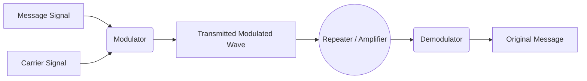

# 📅 2026-08-17 — Session 05

> **Course:** Cybersecurity
> **Week:** Week 02 | **Session:** 05

---

## 📌 Topics Covered
- Wireless Pentesting & Vulnerability Statistics
- IoT Botnets & Network Sniffing
- The Electromagnetic Spectrum (EMS)
- Physics of Wireless: Frequency, Wavelength, Bandwidth, Amplitude
- Modulation (Message & Carrier Signals) & Repeaters
- Types of FM and Uses
- Microwaves, Faraday Cages, EMP, Infrared, UV, Laser
- Radio Frequency Bands (LF, MF, HF, VHF, UHF, SHF, EHF)
- Common Wireless Tech (Bluetooth, Cellular, Zigbee, NFC, RFID, TVWS, V2X)
- Wi-Fi Technology & IEEE 802.11 Framework
- Wi-Fi Standards, Frequencies, and Pentest Weaknesses

---

## 📊 Wireless Vulnerabilities & Statistics

Wireless networks are uniquely vulnerable because the transmission medium is open air. An attacker does not need physical access to a building or a network cable; they only need to be within radio range.

**Key Vulnerability Statistics:**
- Over **70% of public Wi-Fi networks** have weak or no encryption, making them susceptible to Man-in-the-Middle (MitM) attacks.
- Weak passwords remain the #1 cause of WPA2 handshakes being cracked.
- Legacy protocols (WEP and WPA1) are still found in ~5% of industrial/IoT environments, which can be cracked in minutes.

### 🤖 IoT Botnets
Because IoT devices (smart cameras, thermostats) often rely on wireless networks and are notoriously insecure (default passwords, no patching), they are prime targets.
- **Botnet:** A network of hijacked devices used to launch Distributed Denial of Service (DDoS) attacks.
- **Example (Mirai Botnet):** Infected hundreds of thousands of IoT devices by scanning for default Telnet passwords over wireless and wired networks, taking down major sections of the internet.

### 🕵️‍♂️ Network Sniffing (Wireless)
Sniffing a wireless network requires putting your Wi-Fi adapter into **Monitor Mode**.
- **Promiscuous Mode (Wired):** Captures all traffic on the local network segment.
- **Monitor Mode (Wireless):** Captures *all* wireless traffic in the air on a specific channel, even if the packets are not destined for your machine and you are not connected to the network.

---

## 🌊 The Physics of Wireless Signals

To hack wireless, you must understand how radio waves work.

### Core Concepts
| Term | Definition |
|------|------------|
| **Frequency** | The number of waves that pass a fixed point in one second. Measured in Hertz (Hz). |
| **Wavelength** | The physical distance between two consecutive peaks of a wave. Higher frequency = shorter wavelength. |
| **Amplitude** | The height of the wave (indicates the strength/power of the signal). |
| **Bandwidth** | The range of frequencies within a given band used for transmitting a signal. (Wider bandwidth = more data). |
| **Message Signal** | The actual data you want to send (e.g., your voice, a digital file). |
| **Carrier Signal** | A high-frequency blank wave used to carry the message signal through the air over long distances. |
| **Modulation** | The process of modifying the Carrier Signal with the Message Signal (e.g., altering its amplitude or frequency). |
| **Repeater** | A device that receives a weak signal, amplifies it, and retransmits it to extend range. |

### Types of FM (Frequency Modulation) & Uses
FM varies the frequency of the carrier wave while keeping the amplitude constant.
- **Narrowband FM (NFM):** Uses a small bandwidth. Excellent for voice communication. **Uses:** Police/Fire radios, walkie-talkies.
- **Wideband FM (WFM):** Uses a large bandwidth. Great for high-quality audio. **Uses:** Commercial FM radio broadcasting (music).

---

## 🌈 The Electromagnetic Spectrum (EMS)

The EMS covers all types of electromagnetic radiation.

| Spectrum Type | Characteristics & Pentest Relevance | Purpose / Uses |
|---------------|-------------------------------------|----------------|
| **Radio (RF)** | Penetrates walls well. Long range. | Wi-Fi, Cellular, Radio, Bluetooth, RFID. |
| **Microwaves** | Line-of-sight required. Absorbed by water. | Radar, Satellite comms, 5GHz Wi-Fi, Microwave ovens. |
| **Infrared (IR)**| Blocked by walls. Very short range. | TV remotes, night vision, thermal imaging. |
| **Ultraviolet** | Harmful to biology. Blocked by glass. | Forensics (detecting bodily fluids/counterfeit money), sterilization. |
| **Laser Comms** | Point-to-point light beam. Extremely fast. | Inter-satellite links, highly secure ground comms (cannot be sniffed without physically blocking the beam). |

### 🛡️ Defending Against EMS: Faraday Cages & EMP
- **Faraday Sheets/Cages:** An enclosure formed by conductive material (copper mesh) that blocks external static and non-static electric fields. **Use:** Pentesters use Faraday bags to block phones from wiping themselves remotely via cellular networks after seizure.
- **EMP (Electromagnetic Pulse):** A massive burst of electromagnetic energy that fries electronic circuits.

---

## 📻 Types of Radio Frequencies (RF)

| Band | Name | Range | Uses & Characteristics |
|------|------|-------|------------------------|
| **LF** | Low Frequency | 30 - 300 kHz | Submarine comms, RFID (125 kHz), AM Radio. Very long wavelength, penetrates water. |
| **MF** | Medium Frequency | 300 - 3000 kHz | AM broadcasting, maritime radio. |
| **HF** | High Frequency | 3 - 30 MHz | Amateur radio, shortwave broadcast. Bounces off the ionosphere for global range. |
| **VHF**| Very High Frequency | 30 - 300 MHz | FM Radio, old TV, air traffic control. |
| **UHF**| Ultra High Frequency | 300 - 3000 MHz | **Most common for pentesting.** Wi-Fi (2.4 GHz), Cellular (LTE), Bluetooth, GPS. |
| **SHF**| Super High Frequency | 3 - 30 GHz | 5GHz Wi-Fi, modern 5G cellular, satellite links, radar. |
| **EHF**| Extremely High Frequency | 30 - 300 GHz | Millimeter wave 5G, radio astronomy. Blocked by rain/air. |

---

## 📡 Common Wireless Technologies

| Tech | Freq Band | Pros | Cons | Pentest Target |
|------|-----------|------|------|----------------|
| **Bluetooth** | 2.4 GHz | Low power, universal. | Short range (10m). | Bluejacking, Bluesnarfing. |
| **Wi-Fi** | 2.4 / 5 / 6 GHz | High bandwidth, cheap. | High power, interference. | WPA2 cracking, Evil Twin attacks. |
| **Cellular (4G/5G)**| 700 MHz - 39 GHz | Global coverage. | Centralized, expensive. | IMSI catching (Stingrays), SS7 flaws. |
| **Zigbee** | 2.4 GHz (915 MHz) | Mesh network, very low power (IoT). | Low bandwidth, easily jammed. | Smart home hubs (sniffing keys). |
| **NFC** | 13.56 MHz | Extremely secure via proximity (4cm). | Almost zero range. | Cloning keycards, skimming payments. |
| **RFID** | LF, HF, UHF | Passive (no battery needed). | Easily cloned/sniffed from feet away. | Stealing building access badges. |
| **TVWS** | VHF / UHF | "White Space" uses empty TV channels. Huge range/penetration. | Requires FCC database checks. | N/A (Emerging rural broadband). |
| **V2X** | 5.9 GHz | Vehicle-to-Everything (Autonomous cars). | Complex infrastructure. | Spoofing traffic signals to cause crashes. |

---

## 📶 Wi-Fi Technology & IEEE 802.11

### What is IEEE?
The **Institute of Electrical and Electronics Engineers (IEEE)** is a global organization that defines standards for networking.
- **IEEE 802.3:** Ethernet (Wired)
- **IEEE 802.11:** Wireless LANs (Wi-Fi)
- **IEEE 802.15:** Wireless PANs (Bluetooth, Zigbee)

### Wi-Fi Standards, Versions, and Weaknesses

| Standard | Wi-Fi Version | Freq Band | Max Speed (Theoretical) | Key Features | Pentest Weakness |
|----------|---------------|-----------|-------------------------|--------------|------------------|
| **802.11b** | Wi-Fi 1 | 2.4 GHz | 11 Mbps | The original mass-market standard. | WEP encryption (crackable in 2 mins). |
| **802.11a** | Wi-Fi 2 | 5 GHz | 54 Mbps | Introduced 5GHz, poor wall penetration. | Still relied on WEP. |
| **802.11g** | Wi-Fi 3 | 2.4 GHz | 54 Mbps | Faster 2.4GHz speeds. | WPA1 introduction (TKIP is vulnerable). |
| **802.11n** | Wi-Fi 4 | 2.4 / 5 GHz | 600 Mbps | Introduced MIMO (multiple antennas). | WPA2 is strong, but WPS (Wi-Fi Protected Setup) PINs are easily brute-forced (Reaver). |
| **802.11ac** | Wi-Fi 5 | 5 GHz | 3.5 Gbps | Wider channels, standard for modern routers. | Deauthentication attacks (flooding management frames to kick users off). |
| **802.11ax** | Wi-Fi 6 | 2.4 / 5 / 6 GHz | 9.6 Gbps | OFDMA (better in crowded stadiums/airports). | WPA3 introduced. Mitigation requires downgrade attacks to WPA2 to crack handshakes. |

---

## 🎯 Interview Q&A

**Q: What is the difference between Promiscuous Mode and Monitor Mode?**
> Promiscuous mode captures all traffic on a *wired* network that reaches the NIC. Monitor mode captures all *wireless* traffic in the air on a specific channel, regardless of the destination MAC address, without needing to be connected to the Wi-Fi network.

**Q: How does a Faraday Cage work?**
> It is an enclosure made of conductive material (like a copper mesh) that distributes external electromagnetic fields across its exterior, preventing RF signals from entering or exiting. Pentesters use Faraday bags to prevent seized mobile devices from receiving remote wipe commands.

**Q: What is the primary vulnerability in IEEE 802.11ac (Wi-Fi 5) and earlier?**
> Management frames (like Deauth packets) are unencrypted and unauthenticated. An attacker can easily spoof a router's MAC address and send Deauth frames to a client, kicking them off the network to capture a WPA2 4-way handshake when they reconnect. (This is fixed in WPA3 via PMF - Protected Management Frames).

**Q: Explain Modulation.**
> Modulation is the process of altering a high-frequency carrier wave (which travels well over long distances) by mixing it with a message signal (the actual data). In FM (Frequency Modulation), the frequency of the carrier changes based on the message, while the amplitude stays the same.

---

## 📝 Summary / TL;DR

Today focused on **Wireless Pentesting**. We explored the physics of the **Electromagnetic Spectrum**, detailing how **Frequency, Wavelength, and Modulation** transport data across the air. We broke down RF bands (from submarine **LF** to 5G **EHF**) and compared wireless technologies like **Bluetooth, Zigbee, RFID, and Cellular**. We introduced **IEEE 802.11**, tracing the evolution from crackable WEP on **802.11b** to Deauth-vulnerable WPA2 on **802.11ac**, up to modern WPA3 on **Wi-Fi 6**. Critically, we learned that wireless security relies on the fact that anyone in physical proximity can capture packets by placing a Wi-Fi adapter into **Monitor Mode**.
